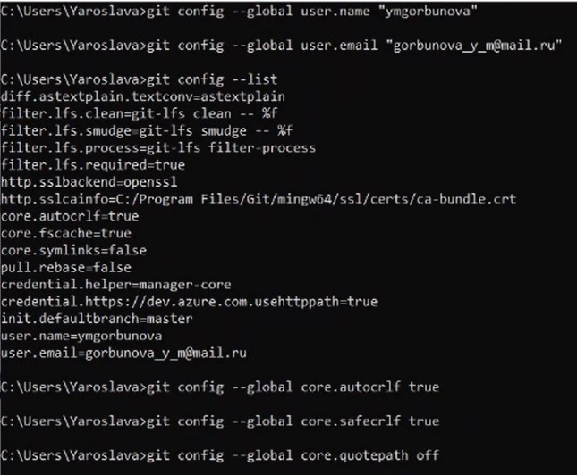
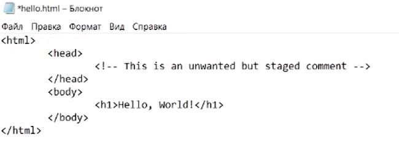
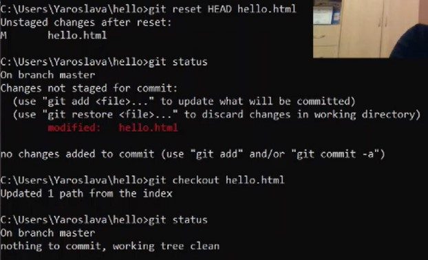
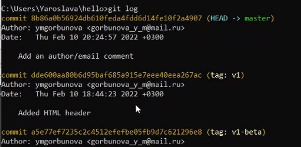
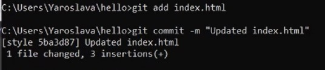
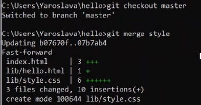
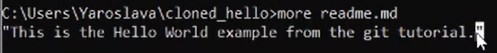
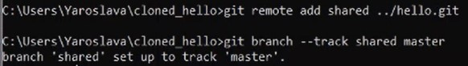
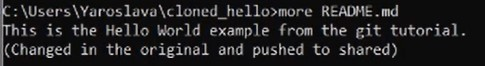

**РОССИЙСКИЙ УНИВЕРСИТЕТ ДРУЖБЫ НАРОДОВ** 
**Факультет физико-математических и естественных наук** 
**Кафедра прикладной информатики и теории вероятностей** 
   

**ОТЧЁТ** 
по лабораторной работе № 1 
на тему: Git. Markdown 
*дисциплина: Математическое моделирование*
   

Преподаватель: Демидова Анастасия Вячеславовна 
Студентка: Горбунова Ярослава Михайловна 
Группа: НФИбд-01-19 
 

МОСКВА 
2022 г.

# Цель работы

Цель данной работы состоит в следующем: 
- Изучить распределённую систему управления версиями Git, научиться работать с ней
- Познакомиться с основными возможностями языка разметки Markdown, научиться применять полученные знания на практике

# Задание

Выполнить две части лабораторной работы:
* Работа с Git ([git.pdf](documents/git.pdf "Задание по Git"))
* Работа с Markdown ([markdown.pdf](documents/markdown.pdf "Задание по markdown"))

# Выполнение лабораторной работы

## 1 Работа с git
### 1.1 Подготовка
#### 1.1.1 Установка имени и электронной почты
Если Git до этого у вас не был установлен, следует начать выполнение работы с установки Git с официального сайта <https://git-scm.com/downloads>. Затем выполните следующие команды, чтобы git узнал ваше имя и электронную почту (Рис.1).

    git config --global user.name "Your Name" 
    git config --global user.email "your_email@whatever.com"

#### 1.1.2 Параметры установки окончаний строк

Настройка core.autocrlf с параметрами true и input делает все переводы строк текстовых файлов в главном репозитории одинаковы. core.autocrlf true- git автоматически конвертирует CRLF->LF при коммите и обратно LF->CRLF при выгрузке кода из репозитория на файловую систему (используют в Windows). core.autocrlf input- конвертация CRLF в LF только при коммитах (используют в Mac/Linux). Если core.safecrlf установлен в true или warm, git проверяет, если преобразование является обратимым для текущей настройки core.autocrlf. core.safecrlf true - отвержение необратимого преобразования lf<->crlf. Полезно, когда специфические бинарники похожие на текстовые файлы. core.safecrlf warn- печать только предупреждение, но принимает необратимый переход (Рис.1).

Для пользователей Unix/Mac: 

    git config --global core.autocrlf input 
    git config --global core.safecrlf true

Для пользователей Windows (как в моём случае): 

    git config --global core.autocrlf true 
    git config --global core.safecrlf true

#### 1.1.3 Установка отображения unicode

По умолчанию, git будет печатать не-ASCII символов в именах файлов в виде
восьмеричных последовательностей \nnn. Что бы избежать нечитаемых строк,
установите соответствующий флаг (Рис.1).

    git config --global core.quotepath off

Примечание! Все изображения подписаны, информацию о них можно узнать, если навести курсором на желалаемое изображение.

 Рис.1. Пункты 1.1.1-1.1.3

### 1.2 Создание проекта
#### 1.2.1 Создайте страницу «Hello, World»

Начните работу в пустом рабочем каталоге с создания пустого каталога с именем hello, затем войдите в него и создайте там файл с именем hello.html (Рис.2).

    mkdir hello 
    cd hello 
    touch hello.html 
    echo "Hello, World!" > hello.html 

 Рис.2. Пункт 1.2.1

#### 1.2.2 Создание репозитория
Чтобы создать git репозиторий из этого каталога, выполните команду git init (Рис.3).

    git init

#### 1.2.3 Добавление файла в репозиторий
Добавим файл в репозиторий (см. Рис.3).

    git add hello.html
    git commit -m "Initial Commit"

#### 1.2.4 Проверка состояние репозитория
Используйте команду git status, чтобы проверить текущее состояние репозитория (Рис.3).

    git status
 
Команда проверки состояния сообщит, что коммитить нечего. Это означает, что в репозитории хранится текущее состояние рабочего каталога, и нет никаких изменений, ожидающих записи.

 Рис.3. Пункты 1.2.2-1.2.4

### 1.3 Внесение изменений
#### 1.3.1 Измените страницу «Hello, World»
Добавим кое-какие HTML-теги к нашему приветствию. Измените содержимое файла hello.html на (Рис.4):

    <h1>Hello, World!</h1>

Проверьте состояние рабочего каталога (Рис.4).

    git status

 Рис.4. Пункт 1.3.1

git знает, что файл hello.htmlбыл изменен, но при этом эти изменения еще не зафиксированы в репозитории.
Также обратите внимание на то, что сообщение о состоянии дает вам подсказку о том, что нужно делать  дальше. Если вы хотите добавить эти изменения в репозиторий, используйте команду git add. В противном случае используйте команду git сheckoutдля отмены изменений.

### 1.4 Индексация изменений
Теперь выполните команду git, чтобы проиндексировать изменения. Проверьте состояние (Рис.5).

    git add hello.html
    git status

 Рис.5. Пункт 1.4

Изменения файла hello.html были проиндексированы. Это означает, что git теперь знает об изменении, но изменение пока не записано в репозиторий. Следующий коммит будет включать в себя проиндексированные изменения. 
Если вы решили, что не хотите коммитить изменения, команда состояния на помнит вам о том, что с помощью команды git reset можно снять индексацию этих изменений. 
Отдельный шаг индексации в gitпозволяет вам продолжать вносить изменения в рабочий каталог, а затем, в момент, когда вы захотите взаимодействовать с версионным контролем, gitпозволит записать изменения в малых коммитах, которые фиксируют то, что вы сделали. 
Разделяя индексацию и коммит, вы имеете возможность с легкостью настроить,
что идет в какой коммит.

#### 1.4.1 Коммит изменений

Когда вы ранее использовали git commitдля коммита первоначальной версии файла hello.htmlв репозиторий, вы включили метку -m, которая делает комментарий в командной строке. Команда commitпозволит вам интерактивно редактировать комментарии для коммита. Теперь давайте это проверим.  
Если вы опустите метку -m из командной строки, git перенесет вас в редактор по вашему выбору. Редактор выбирается из следующего списка (в порядке приоритета):

• переменная среды GIT_EDITOR
• параметр конфигурации core.editor
• переменная среды VISUAL
• переменная среды EDITOR

Сделайте коммит и проверьте состояние (Рис.5, Рис.6).

    git commit

 Рис.6. Пункт 1.4.1

Откроется редактор.
В первой строке введите комментарий: «Added h1 tag». Сохраните файл и выйдите из редактора (для этого в редакторе по-умолчанию (Vim) вам нужно нажать клавишу ESC, ввести :wq и нажать Enter).
Теперь еще раз проверим состояние (Рис.9).

    git status

Рабочий каталог чистый, можно продолжить работу.

#### 1.4.2 Добавьте стандартные теги страницы
Измените страницу «Hello, World», чтобы она содержала стандартные теги <html> и <body> (Рис.7).

    <html>
      <body>
        <h1>Hello, World!</h1>
      </body>
    </html>

 Рис.7. Пункт 1.4.2

Теперь добавьте это изменение в индекс git (Рис.9).

    git add hello.html

Теперь добавьте заголовки HTML (секцию <head>) к странице «Hello, World» (Рис.8).

    <html>
      <head>
      </head>
      <body>
        <h1>Hello, World!</h1>
      </body>
    </html>

 Рис.8. Пункт 1.4.2

Проверьте текущий статус (Рис.9):

    git status

 Рис.9. Пункт 1.4.2
  
Обратите внимание на то, что hello.html указан дважды в состоянии. Первое изменение (добавление стандартных тегов) проиндексировано и готово к коммиту. Второе изменение (добавление заголовков HTML) является непроиндексированным. Если бы вы делали коммит сейчас, заголовки не были бы сохранены
в репозиторий.
Произведите коммит проиндексированного изменения (значение по умолчанию), а затем еще раз проверьте состояние.

    git commit -m "Added standard HTML page tags"
    git status

 Рис.10. Пункт 1.4.2

  Состояние команды говорит о том, что hello.htmlимеет незафиксированные изменения, но уже не в буферной зоне.
Теперь добавьте второе изменение в индекс, а затем проверьте состояние с
помощью команды git status (Рис.11).

    git add .
    git status

В качестве файла для добавления, мы использовали текущий каталог (.). Это краткий и удобный путьдля добавления всех изменений в файлытекущего каталога и его подкаталоги. Но поскольку он добавляет все, не лишним будет проверить состояние перед запуском add, просто чтобы убедиться, что вы не добавили какой-
то файл, который добавлять было не нужно.
Второе изменение было проиндексировано и готово к коммиту.
Сделайте коммит второго изменения (Рис.11).

    git commit -m "Added HTML header"

 Рис.11. Пункт 1.4.2

#### 1.4.3 История
Получим список произведенных изменений:

    git log

 Рис.12. Пункт 1.4.3
  
Однострочный формат истории (Рис.13):

    git log --pretty=oneline

Есть много вариантов отображения лога.

    git log --pretty=oneline --max-count=2

 Рис.13. Пункт 1.4.3  

    git log --pretty=oneline --author=<your name>  

 Рис.14. Пункт 1.4.3

    git log --pretty=oneline --all

 Рис.15. Пункт 1.4.3

    git log --pretty=oneline --since='5 minutes ago'
    git log --pretty=oneline --until='5 minutes ago'

 Рис.16. Пункт 1.4.3

Справочная страница:

    man git-log
  
Инструмент gitkполезен в изучении истории изменений.

#### 1.4.4 Получение старых версий
Возвращаться назад в историю очень просто. Команда checkout скопирует любой снимок из репозитория в рабочий каталог. Получите хэши предыдущих версий.

    git log

Изучите данные лога и найдите хэш для первого коммита. Он должен быть в последней строке данных. Используйте этот хэш-код (достаточно первых 7 знаков) в команде  ниже. Затем проверьте содержимое файла hello.html.

    git checkout <hash>

 Рис.17. Пункт 1.4.4

    cat hello.html

 Рис.18. Пункт 1.4.4

Вернитесь к последней версии в ветке master

    git checkout master
    cat hello.html

 Рис.19. Пункт 1.4.4

master— имя ветки по умолчанию. Переключая имена веток, вы попадаете на последнюю версию выбранной ветки.

#### 1.4.5 Создание тегов версий
Давайте назовем текущую версию страницы helloпервой (v1).
Создайте тег первой версии

    git tag v1

 Рис.20. Пункт 1.4.5

Теперь текущая версия страницы называется v1.
Теги для предыдущих версий Давайте создадим тег для версии, которая идет
перед текущей версией и назовем его v1-beta. В первую очередь нам надо пере-
ключиться на предыдущую версию. Вместо поиска до хэш, мы будем использовать
^, обозначающее «родитель v1». Вместо обозначения v1^ можно использовать
v1~1. Это обозначение можно определить как «первую версию предшествующую
v1» (Рис.21).

    git checkout v1^
    cat hello.html

Это версия c тегами <html>и <body>, но еще пока без <head>. Давайте сделаем
ее версией v1-beta (Рис.21).

    git tag v1-beta

#### 1.4.6 Переключение по имени тега
Теперь попробуйте попереключаться между двумя отмеченными версиями (Рис.21).

    git checkout v1
    git checkout v1-beta

 Рис.21. Пункты 1.4.5-1.4.6

#### 1.4.7 Просмотр тегов с помощью команды tag
Вы можете увидеть, какие теги доступны, используя команду git tag (Рис.22).

    git tag

Вы также можете посмотреть теги в логе (Рис.22).

    git log master --all

 Рис.22. Пункт 1.4.7

Вы можете видеть теги (v1и v1-beta) в логе вместе с именем ветки (master). Кроме того HEAD показывает коммит, на который вы переключились (на данный
момент это v1-beta).

### 1.5 Отмена локальных изменений (до индексации)
#### 1.5.1 Переключитесь на ветку master
Убедитесь, что вы находитесь на последнем коммите ветки master, прежде чем
продолжить работу (Рис.23).

    git checkout master

#### 1.5.2 Измените hello.html
Иногда случается, что вы изменили файл в рабочем каталоге, и хотите отменить
последние коммиты. С этим справится команда git checkout.
Внесите изменение в файл hello.htmlв виде нежелательного комментария (Рис.23).

    <html>
      <head>
      </head>
      <body>
        <h1>Hello, World!</h1>
        <!-- This is a bad comment. We want to revert it. -->
      </body>
    </html>

 Рис.23. Пункты 1.5.1-1.5.2

#### 1.5.3 Проверьте состояние
Сначала проверьте состояние рабочего каталога.

    git status

 Рис.24. Пункт 1.5.3

Мы видим, что файл hello.htmlбыл изменен, но еще не проиндексирован.

#### 1.5.4 Отмена изменений в рабочем каталоге
Используйте команду git checkout для переключения версии файла
hello.htmlв репозитории.

    git checkout hello.html
    git status
    cat hello.html

 Рис.25. Пункт 1.5.4

Команда git statusпоказывает нам, что не было произведено никаких изме-
нений, не зафиксированных в рабочем каталоге.

### 1.6 Отмена проиндексированных изменений (перед коммитом)
#### 1.6.1 Измените файл и проиндексируйте изменения
Внесите изменение в файл hello.htmlв виде нежелательного комментария.

    <html>
      <head>
        <!-- This is an unwanted but staged comment -->
      </head>
      <body>
        <h1>Hello, World!</h1>
      </body>
    </html>

 Рис.26. Пункт 1.6.1

Проиндексируйте это изменение (Рис.27).

    git add hello.html

#### 1.6.2 Проверьте состояние
Проверьте состояние нежелательного изменения (Рис.27).

    git status

 Рис.27. Пункты 1.6.1-1.6.2

Состояние показывает, что изменение было проиндексировано и готово к коммиту.

#### 1.6.3 Выполните сброс буферной зоны
К счастью, вывод состояния показывает нам именно то, что мы должны сделать для отмены индексации изменения.

    git reset HEAD hello.html

Команда git resetсбрасывает буферную зону к HEAD. Это очищает буферную зону от изменений, которые мы только что проиндексировали.
Команда git reset (по умолчанию) не изменяет рабочий каталог. Поэтому рабочий каталог все еще содержит нежелательный комментарий. Мы можем использовать команду git checkout, чтобы удалить нежелательные изменения в рабочем каталоге.

#### 1.6.4 Переключитесь на версию коммита

    git checkout hello.html
    git status

Наш рабочий каталог опять чист.

 Рис.28. Пункты 1.6.3-1.6.4

### 1.7 Отмена коммитов
#### 1.7.1 Отмена коммитов
Иногда вы понимаете, что новые коммиты являются неверными, и хотите их отменить. Есть несколько способов решения этого вопроса, здесь мы будем использовать самый безопасный.
Мы отменим коммит путем создания нового коммита, отменяющего нежелательные изменения.

#### 1.7.2 Измените файл и сделайте коммит
Измените файл hello.html на следующий.

    <html>
      <head>
      </head>
      <body>
        <h1>Hello, World!</h1>
        <!-- This is an unwanted but committed change -->
      </body>
    </html>

 Рис.29. Пункт 1.7.2

Выполните:

    git add hello.html
    git commit -m "Oops, we didn't want this commit"

 Рис.30. Пункт 1.7.2

#### 1.7.3 Сделайте коммит с новыми изменениями, отменяющими предыдущие
Чтобы отменить коммит, нам необходимо сделать коммит, который удаляет изменения, сохраненные нежелательным коммитом.

    git revert HEAD

 Рис.31. Пункт 1.7.3

Перейдите в редактор, где вы можете отредактировать коммит-сообщение по умолчанию или оставить все как есть. Сохраните и закройте файл.
Так как мы отменили самый последний произведенный коммит, мы смогли использовать HEAD в качестве аргумента для отмены. Мы можем отменить любой произвольной коммит в истории, указав его хэш-значение.

 Рис.32. Пункт 1.7.3

#### 1.7.4 Проверьте лог
Проверка лога показывает нежелательные и отмененные коммиты в наш репозиторий.

    git log

 Рис.33. Пункт 1.7.4

Эта техника будет работать с любым коммитом.

### 1.8 Удаление коммиттов из ветки
git revertявляется мощной командой, которая позволяет отменить любые ком-
миты в репозиторий. Однако, и оригинальный и «отмененный» коммиты видны в
истории ветки (при использовании команды git log).
Часто мы делаем коммит, и сразу понимаем, что это была ошибка. Было бы
неплохо иметь команду «возврата», которая позволила бы нам сделать вид, что
неправильного коммита никогда и не было. Команда «возврата» даже предотвра-
тила бы появление нежелательного коммита в истории git log.

#### 1.8.1 Команда git reset
При получении ссылки на коммит (т.е. хэш, ветка или имя тега), команда git reset:

• перепишет текущую ветку, чтобы она указывала на нужный коммит;
• опционально сбросит буферную зону для соответствия с указанным комми-
том;
• опционально сбросит рабочий каталог для соответствия с указанным комми-
том.

#### 1.8.2 Проверьте нашу историю
Давайте сделаем быструю проверку нашей истории коммитов. Выполните (Рис.33):

    git log

Мы видим, что два последних коммита в этой ветке — «Oops» и «Revert Oops». Давайте удалим их с помощью сброса.

#### 1.8.3 Для начала отметьте эту ветку
Но прежде чем удалить коммиты,давайте отметим последний коммиттегом,чтобы
потом можно было его найти.

    git tag oops

 Рис.34. Пункт 1.8.3

#### 1.8.4 Сброс коммитов к предшествующим коммиту Oops
Глядя на историю лога, мы видим, что коммит с тегом «v1» является коммитом, предшествующим ошибочному коммиту. Давайте сбросим ветку до этой точки. Поскольку ветка имеет тег, мы можем использовать имя тега в команде сброса (если она не имеет тега, мы можем использовать хэш-значение).

    git reset --hard v1
    git log

 Рис.35. Пункт 1.8.4

Наша ветка master теперь указывает на коммит v1, а коммитов Oops и Revert Oops в ветке уже нет. Параметр --hardуказывает, что рабочий каталог должен быть обновлен в соответствии с новым head ветки.

#### 1.8.5 Ничего никогда не теряется
Что же случается с ошибочными коммитами? Оказывается, что коммиты все еще находятся в репозитории. На самом деле, мы все еще можем на них ссылаться. Помните, в начале этого урока мы создали для отмененного коммита тег «oops». Давайте посмотрим на все коммиты.

    git log --all

 Рис.36. Пункт 1.8.5

Мы видим, что ошибочные коммиты не исчезли. Они все еще находятся в репозитории. Просто они отсутствуют в ветке master. Если бы мы не отметили их тегами, они попрежнему находились бы в репозитории, но не было бы никакой возможности ссылаться на них, кроме как при помощи их хэш имен. Коммиты, на которые нет ссылок, остаются в репозитории до тех пор, пока не будет запущен сборщик мусора.

1.8.6 Опасность сброса
Сброс в локальных ветках, как правило, безопасен. Последствия любой «аварии»
как правило, можно восстановить простым сбросом с помощью нужного коммита.
Однако, если ветка «расшарена» на удаленных репозиториях, сброс может сбить с
толку других пользователей ветки.

### 1.9 Удаление тега oops
#### 1.9.1 Удаление тега oops
Тег oops свою функцию выполнил. Давайте удалим его и коммиты, на которые он ссылался, сборщиком мусора.

    git tag -d oops
    git log --all

 Рис.37. Пункт 1.9.1

Тег «oops» больше не будет отображаться в репозитории.

### 1.10 Внесение изменений в коммиты
#### 1.10.1 Измените страницу, а затем сделайте коммит
Добавьте в страницу комментарий автора (вставьте свою фамилию).
    <!-- Author: Dmitry S. Kulyabov -->
    <html>
      <head>
      </head>
      <body>
        <h1>Hello, World!</h1>
      </body>
    </html>

 Рис.38. Пункт 1.10.1

Выполните:

    git add hello.html
    git commit -m "Add an author comment"

 Рис.39. Пункт 1.10.1

#### 1.10.2 Необходим email
После совершения коммита вы понимаете, что любой хороший комментарий должен включать электронную почту автора. Обновите страницу hello, включив в нее email.

    <!-- Author: <Your name> (<Your email>) -->
    <html>
      <head>
      </head>
      <body>
        <h1>Hello, World!</h1>
      </body>
    </html>

 Рис.40. Пункт 1.10.2

#### 1.10.3 Измените предыдущий коммит
Мы действительно не хотим создавать отдельный коммиттолько ради электронной почты. Давайте изменим предыдущий коммит, включив в него адрес электронной почты.
Выполните:

    git add hello.html
    git commit --amend -m "Add an author/email comment"

 Рис.41. Пункт 1.10.3

#### 1.10.4 Просмотр истории
Выполните:

    git log

 Рис.42. Пункт 1.10.4

Мы можем увидеть, что оригинальный коммит «автор» заменен коммитом «автор/email». Этого же эффекта можно достичь путем сброса последнего коммита в ветке, и повторного коммита новых изменений.

### 1.11 Перемещение файлов
#### 1.11.1 Переместите файл hello.htmlв каталог lib
Сейчас мы собираемся создать структуру нашего репозитория. Давайте перенесем страницу в каталог lib.

    mkdir lib
    git mv hello.html lib
    git status

 Рис.43. Пункт 1.11.1

Перемещая файлы с помощью git mv, мы информируем gitо 2 вещах:
• Что файл hello.htmlбыл удален.
• Что файл lib/hello.htmlбыл создан.
• Оба эти факта сразу же проиндексированы и готовы к коммиту. Команда git statusсообщает, что файл был перемещен.

### 1.12 Второй способ перемещения файлов
Положительной чертой gitявляется то, что вы можете забыть о версионном контроле до того момента, когда вы готовы приступить к коммиту кода. Что бы случилось, если бы мы использовали командную строку операционной системы для перемещения файлов вместо команды git?
Следующий набор команд идентичен нашим последним действиям. Работы здесь побольше, но результат тот же.
Мы могли бы выполнить:
    mkdir lib
    mv hello.html lib
    git add lib/hello.html
    git rm hello.html

#### 1.12.1 Коммит в новый каталог
Давайте сделаем коммит этого перемещения:

    git commit -m "Moved hello.html to lib"

 Рис.44. Пункт 1.12.1

### 1.13 Подробнее о структуре
#### 1.13.1 Добавление index.html
Добавим файл index.htmlв наш репозиторий

    <html>
      <body>
        <iframe src="lib/hello.html" width="200" height="200" />
      </body>
    </html>

 Рис.45. Пункт 1.13.1

Добавьте файл и сделайте коммит.

    git add index.html
    git commit -m "Added index.html."

 Рис.46. Пункт 1.13.1

Теперь при открытии index.html, вы должны увидеть кусок страницы hello в
маленьком окошке.

 Рис.47. Пункт 1.13.1

### 1.14 Git внутри: Каталог .git
#### 1.14.1 Каталог .git
Выполните:

    ls -C .git

 Рис.48. Пункт 1.14.1

Это каталог, в котором хранится вся информация git.

#### 1.14.2 База данных объектов
Выполните:

    ls -C .git/objects

 Рис.49. Пункт 1.14.2

Вы должны увидеть набор каталогов, имена которых состоят из 2 символов. Имена каталогов являются первыми двумя буквами хэша sha1 объекта, хранящегося в git.

#### 1.14.3 Углубляемся в базу данных объектов
Выполните:

    ls -C .git/objects/<dir>

 Рис.50. Пункт 1.14.3

Смотрим в один из каталогов с именем из 2 букв. Вы увидите файлы с именами из 38 символов. Это файлы, содержащие объекты, хранящиеся в git. Они сжаты и закодированы, поэтому просмотр их содержимого нам мало чем поможет.

#### 1.14.4 Config File
Выполните:

    cat .git/config

 Рис.51. Пункт 1.14.4

Это файл конфигурации, создающийся для каждого конкретного проекта. Записи в этом файле будут перезаписывать записи в файле .gitconfigвашего главного каталога, по крайней мере в рамках этого проекта.

#### 1.14.5 Ветки и теги
Выполните:

    ls .git/refs
    ls .git/refs/heads

 Рис.52. Пункт 1.14.5

    ls .git/refs/tags
    cat .git/refs/tags/v1

 Рис.53. Пункт 1.14.5

Вы должны узнавать файлы в подкаталоге тегов. Каждый файл соответствует тегу, ранее созданному с помощью команды git tag. Его содержание — это всего лишь хэш коммита, привязанный к тегу.
Каталог headsпрактически аналогичен, но используется для веток, а не тегов. На данный момент у нас есть только одна ветка, так что все, что вы увидите в этом
каталоге – это ветка master.

#### 1.14.6 Файл HEAD
Выполните:

    cat .git/HEAD

 Рис.54. Пункт 1.14.6

Файл HEAD содержит ссылку на текущую ветку, в данный момент это должна
быть ветка master.

### 1.15 Работа непосредственно с объектами git
#### 1.15.1 Поиск последнего коммита
Выполните:

    git log --max-count=1

 Рис.55. Пункт 1.15.1

Эта команда должна показать последний коммит в репозиторий. SHA1 хэш в вашей системе, вероятно, отличается от моего, но вы увидите что-то наподобие этого.

#### 1.15.2 Вывод последнего коммита с помощью SHA1 хэша
Выполните (Рис.56):

    git cat-file -t <hash>
    git cat-file -p <hash>

#### 1.15.3 Поиск дерева
Мы можем вывести дерево каталогов, ссылка на который идет в коммите. Это должно быть описание файлов (верхнего уровня) в нашем проекте (для конкретного коммита). Используйте SHA1 хэш из строки «дерева», из списка выше.
Выполните (Рис.56):

    git cat-file -p <treehash>

#### 1.15.4 Вывод каталога lib
Выполните (Рис.56):

    git cat-file -p <libhash>

 Рис.56. Пункты 1.15.2-1.15.4

#### 1.15.5 Вывод файла hello.html
Выполните:

    git cat-file -p <hellohash>

 Рис.57. Пункт 1.15.5

#### 1.15.6 Исследуйте самостоятельно
Исследуйте git репозиторий вручную самостоятельно. Смотрите, удастся ли вам найти оригинальный файл hello.html с самого первого коммита вручную по ссылкам SHA1 хэша в последнем коммите.

#### 1.16 Создание ветки
Пора сделать наш hello world более выразительным. Так как это может занять некоторое время, лучше переместить эти изменения в отдельную ветку, чтобы изолировать их от изменений в ветке master.

#### 1.16.1 Создайте ветку
Давайте назовем нашу новую ветку «style».
Выполните:

    git checkout -b style
    git status

 Рис.58. Пункт 1.16.1

git checkout -b <имя_ветки> является шорткатом для git branch <имя_ветки>за которым идет git checkout <имя_ветки>. Обратите внимание, что команда git statusсообщает о том, что вы находитесь в ветке «style».

#### 1.16.2 Добавьте файл стилей style.css
Выполните:

    touch lib/style.css

Файл lib/style.css:

    h1 {
    color: red;
    }

Выполните:

    git add lib/style.css
    git commit -m "Added css stylesheet"

 Рис.59. Пункт 1.16.2

#### 1.16.3 Измените основную страницу
Обновите файл hello.html, чтобы использовать стили style.css.

    <!-- Author: Dmitry S. Kulyabov (kulyabov-ds@rudn.ru) -->
    <html>
      <head>
        <link type="text/css" rel="stylesheet" media="all" href="style.css" />
      </head>
      <body>
        <h1>Hello, World!</h1>
      </body>
    </html>

 Рис.60. Пункт 1.16.3

Выполните:
    git add lib/hello.html
    git commit -m "Hello uses style.css"

 Рис.61. Пункт 1.16.3

#### 1.16.4 Измените index.html
Обновите файл index.html, чтобы он тоже использовал style.css
    <html>
      <head>
        <link type="text/css" rel="stylesheet" media="all" href="lib/style.css" />
      </head>
      <body>
        <iframe src="lib/hello.html" width="200" height="200" />
      </body>
    </html>

 Рис.62. Пункт 1.16.4

Выполните:
    git add index.html
    git commit -m "Updated index.html"

 Рис.63. Пункт 1.16.4

### 1.17 Навигация по веткам
Теперь в вашем проекте есть две ветки:
Выполните:
    git log --all

 Рис.64. Пункт 1.17

#### 1.17.1 Переключение на ветку master
Используйте команду git checkoutдля переключения между ветками:

    git checkout master
    cat lib/hello.html

 Рис.65. Пункт 1.17.1

Сейчас мы находимся на ветке master. Это заметно по тому, что файл hello.htmlне использует стили style.css.

#### 1.17.2 Вернемся к ветке style
Выполните:

    git checkout style
    cat lib/hello.html

 Рис.66. Пункт 1.17.2

Содержимое lib/hello.htmlподтверждает, что мы вернулись на ветку style.

### 1.18 Изменения в ветке master
Пока вы меняли ветку style, кто-то решил обновить ветку master. Они добавили файл README.md.

#### 1.18.1 Создайте файл READMEв ветке master
Выполните:

    git checkout master

Создайте файл README.md

    echo "This is the Hello World example from the git tutorial." > README.md

 Рис.67. Пункт 1.18.1

### 1.19 Сделайте коммит изменений README.mdв ветку master.
Выполните:

    git add README.md
    git commit -m "Added README"

 Рис.68. Пункт 1.19

#### 1.19.1 Просмотр отличающихся веток
#### 1.19.2 Просмотрите текущие ветки
Теперь у нас в репозитории есть две отличающиеся ветки. Используйте следующую логкоманду для просмотра веток и их отличий.
Выполните:

    git log --graph --all

 Рис.69. Пункт 1.19.2

Добавление опции --graphв git logвызывает построение дерева коммитов с помощью простых ASCII символов. Мы видим обе ветки (style и master), и то, что ветка master является текущей HEAD. Общим предшественником обеих веток является коммит «Added index.html».
Опция --allгарантированно означает, что мы видим все ветки. По умолчанию
показывается только текущая ветка.

### 1.20 Слияние
#### 1.20.1 Слияние веток
Слияние переносит изменения из двух веток в одну. Давайте вернемся к ветке styleи сольем masterс style.
Выполните:

    git checkout style
    git merge master

 Рис.70. Пункт 1.20.1

    git log --graph --all

 Рис.71. Пункт 1.20.1

Путем периодического слияния ветки master с веткой styleвы можете переносить из masterлюбые изменения и поддерживать совместимость изменений styleс изменениями в основной ветке.
Но что если изменения в ветке masterконфликтуют с изменениями в style?

### 1.21 Создание конфликта
#### 1.21.1 Вернитесь в masterи создайте конфликт
Вернитесь в ветку masterи внесите следующие изменения:

    git checkout master

 Рис.72. Пункт 1.21.1

Файл lib/hello.html

    <!-- Author: Dmitry S. Kulyabov (dskulyabov@rudn.ru) -->
    <html>
      <head>
        <!-- no style -->
      </head>
      <body>
        <h1>Hello, World! Life is great!</h1>
      </body>
    </html>

 Рис.73. Пункт 1.21.1

Выполните:

    git add lib/hello.html
    git commit -m 'Life is great'

 Рис.74. Пункт 1.21.1

#### 1.21.2 Просмотр веток
Выполните:

    git log --graph --all

 Рис.75. Пункт 1.21.2

После коммита «Added README» ветка master была объединена с веткой style, но в настоящее время в master есть дополнительный коммит, который не был слит с style.
Последнее изменение в master конфликтует с некоторыми изменениями в style. На следующем шаге мы решим этот конфликт.

### 1.22 Разрешение конфликтов
#### 1.22.1 Слияние masterс веткой style
Теперь вернемся к ветке style и попытаемся объединить ее с новой веткой master.
Выполните:

    git checkout style
    git merge master

 Рис.76. Пункт 1.22.1

Если вы откроете lib/hello.html, вы увидите:

    <!-- Author: Dmitry S. Kulyabov (dskulyabov@rudn.ru) -->
    <html>
      <head>
    <<<<<<< HEAD
      <link type="text/css" rel="stylesheet" media="all" href="style.css" />
    =======
      <!-- no style -->
    >>>>>>> master
      </head>
      <body>
        <h1>Hello,World! Life is great!</h1>
      </body>
    </html>

 Рис.77. Пункт 1.22.1

Первый раздел — версия текущей ветки (style). Второй раздел — версия ветки
master.

#### 1.22.2 Решение конфликта
Вам необходимо вручную разрешить конфликт.Внесите изменения в lib/hello.html для достижения следующего результата.

    <!-- Author: Dmitry S. Kulyabov (dskulyabov@rudn.ru) -->
    <html>
      <head>
        <link type="text/css" rel="stylesheet"
        media="all" href="style.css" />
      </head>
      <body>
        <h1>Hello, World! Life is great!</h1>
      </body>
    </html>

#### 1.22.3 Сделайте коммит решения конфликта
Выполните:

    git add lib/hello.html
    git commit -m "Merged master fixed conflict."

 Рис.78. Пункт 1.22.3

#### 1.22.4 Перебазирование как альтернатива слиянию
Рассмотрим различия между слиянием и перебазированием. Для того, чтобы это сделать, нам нужно вернуться в репозиторий в момент до первого слияния, а затем повторить те же действия, но с использованием перебазирования вместо слияния. Мы будем использовать команду reset для возврата веток к предыдущему состоянию.

### 1.23 Сброс ветки style
#### 1.23.1 Сброс ветки style
Вернемся на ветке styleк точке перед тем, как мы слили ее с веткой master. Мы можем сбросить ветку к любому коммиту. По сути, это изменение указателя ветки на любую точку дерева коммитов.
В этом случае мы хотим вернуться в ветке styleв точку перед слиянием с master.
Нам необходимо найти последний коммит перед слиянием.
Выполните:

    git checkout style
    git log --graph

 Рис.79. Пункт 1.23.1

Мы видим, что коммит «Updated index.html» был последним на ветке style перед слиянием. Давайте сбросим ветку styleк этому коммиту.
Выполните:

    git reset --hard <hash>

#### 1.23.2 Проверьте ветку.
Поищите лог ветки style. У нас в истории больше нет коммитов слияний.
Выполните:

    git log --graph --all

 Рис.80. Пункт 1.23.1

### 1.24 Сброс ветки master
#### 1.24.1 Сброс ветки master
Добавив интерактивный режим в ветку master, мы внесли изменения, конфликтующие с изменениями в ветке style. Давайте вернемся в ветке masterв точку перед внесением конфликтующих  изменений. Это позволяет нам продемонстрировать работу команды git rebase, не беспокоясь о конфликтах.
Выполните:

    git checkout master
    git log --graph

 Рис.81. Пункт 1.24.1

Коммит «Added README» идет непосредственно перед коммитом конфликтующего интерактивного режима. Мы сбросим ветку master к коммиту «Added README».
Выполните:

    git reset --hard <hash>
    git log --graph --all

 Рис.82. Пункт 1.24.1

Просмотрите лог. Он должен выглядеть, как будто репозиторий был перемотан назад во времени к точке до какого-либо слияния.

### 1.25 Перебазирование
Используем команду rebaseвместо команды merge. Мы вернулись в точку до первого слияния и хотим перенести изменения из ветки masterв нашу ветку style. На этот раз для переноса изменений из ветки master мы будем использовать команду git rebaseвместо слияния.
Выполните:

    git checkout style
    git rebase master
    git log --graph

 Рис.83. Пункт 1.25

#### 1.25.1 Слияние VS перебазирование
Конечный результат перебазирования очень похож на результат слияния. Ветка styleв настоящее время содержит все свои изменения, а также все изменения ветки master. Однако, дерево коммитов значительно отличается. Дерево коммитов ветки styleбыло переписано таким образом, что ветка master является частью истории коммитов. Это делает цепь коммитов линейной и гораздо более читабельной.
Не используйте перебазирование:

• если ветка является публичной и расшаренной, поскольку переписывание общих веток будет мешать работе других членов команды;
• когда важна точная история коммитов ветки, так как команда rebase переписывает историю коммитов;

Учитывая приведенные выше рекомендации, рекомендуется использовать git rebaseдля кратковременных, локальных веток, а слияние для веток в публичном репозитории.

1.26 Слияние в ветку master
Мы поддерживали соответствие ветки style с веткой master (с помощью rebase), теперь давайте сольем изменения style в ветку master.

1.26.1 Слияние style в master
Выполните:

    git checkout master
    git merge style

 Рис.84. Пункт 1.26.1

Поскольку последний коммит ветки masterпрямо предшествует последнему коммиту ветки style, gitможет выполнить ускоренное слияние-перемотку. При быстрой перемотке вперед gitпросто передвигает указатель вперед, таким образом указывая на тот же коммит, что и ветка style. При быстрой перемотке конфликтов быть не может.

1.26.2 Просмотрите логи
Выполните:

    git log

Теперь ветки styleи masterидентичны.

### 1.27 Клонирование репозиториев
#### 1.27.1 Перейдите в рабочий каталог
Перейдите в рабочий каталог и сделайте клон вашего репозитория hello.
Выполните:

    cd ..
    pwd
    ls

Сейчас мы находимся в рабочем каталоге.
В этот момент вы должны находиться в «рабочем» каталоге. Здесь должен быть единственный репозиторий под названием «hello».

#### 1.27.2 Создайте клон репозитория hello
Создадим клон репозитория.
Выполните:

    git clone hello cloned_hello
    ls

 Рис.85. Пункт 1.27.2

В вашем рабочем каталоге теперь должно быть два репозитория: оригинальный репозиторий «hello» и клонированный репозиторий «cloned_hello»

### 1.28 Просмотр клонированного репозитория
#### 1.28.1 Давайте взглянем на клонированный репозиторий.
Выполните:

    cd cloned_hello
    ls

 Рис.86. Пункт 1.28.1

Вы увидите список всех файлов на верхнем уровне оригинального репозитория README.md, index.htmlи lib.

#### 1.28.2 Просмотрите историю репозитория
Выполните:

    git log --all

 Рис.87. Пункт 1.28.2

Вы увидите список всех коммитов в новый репозиторий, и он должен (более или менее) совпадать с историей коммитов в оригинальном репозитории. Единственная разница должна быть в названиях веток.

#### 1.28.3 Удаленные ветки
Вы увидите ветку master (HEAD) в списке истории. Вы также увидите ветки со странными именами (origin/master, origin/style и origin/HEAD).

### 1.29 Что такое origin?
Выполните:

    git remote

 Рис.88. Пункт 1.29

Мы видим, что клонированный репозиторий знает об имени по умолчанию удаленного репозитория. Давайте посмотрим, можем ли мы получить более подробную информацию об имени по умолчанию:
Выполните:

    git remote show origin

Удаленные репозитории обычно размещаются на отдельной машине, возможно, централизованном сервере. Однако, как мы видим здесь, они могут с тем же успехом указывать на репозиторий на той же машине. Нет ничего особенного в имени «origin», однако существует традиция использовать «origin» в качестве имени первичного централизованного репозитория (если таковой имеется).

### 1.30 Удаленные ветки
Давайте посмотрим на ветки, доступные в нашем клонированном репозитории.
Выполните:

git branch

Как мы видим, в списке только ветка master. Где ветка style? Команда git branchвыводит только список локальных веток по умолчанию.

#### 1.30.1 Список удаленных веток
Для того, чтобы увидеть все ветки, попробуйте следующую команду:

    git branch -a

Git выводит все коммиты в оригинальный репозиторий, но ветки в удаленном репозитории не рассматриваются как локальные.Если мы хотим собственную ветку style, мы должны сами ее создать. Через минуту вы увидите, как это делается.

 Рис.89. Пункт 1.30

### 1.31 Изменение оригинального репозитория
Внесите некоторые изменения в оригинальный репозиторий, чтобы затем попы-
таться извлечь и слить изменения из удаленной ветки в текущую

#### 1.31.1 Внесите изменения в оригинальный репозиторий hello
Выполните:

    cd ../hello

Примечание: Сейчас мы находимся в репозитории hello Внесите следующие изменения в файл README.md:

    This is the Hello World example from the git tutorial.

Теперь добавьте это изменение и сделайте коммит
Выполните:

    git add README
    git commit -m "Changed README in original repo"

 Рис.90. Пункт 1.31.1

Теперь в оригинальном репозитории есть более поздние изменения, которых нет в клонированной версии. Далее мы извлечем и сольем эти изменения в клонированный репозиторий.

#### 1.31.2 Извлечение изменений
Научиться извлекать изменения из удаленного репозитория. 
Выполните:

    cd ../cloned_hello
    git fetch
    git log --all

 Рис.91. Пункт 1.31.2

 Рис.92. Пункт 1.31.2

Сейчас мы находимся в репозитории cloned_hello.
На данный момент в репозитории есть все коммиты из оригинального репозитория, но они не интегрированы в локальные ветки клонированного репозитория. В истории выше найдите коммит «Changed README in original repo». Обратитевнимание, что коммит включает в себя коммиты «origin/master» и «origin/HEAD». Теперь давайте посмотрим на коммит «Updated index.html». Вы увидите, что локальная ветка master указывает на этот коммит, а не на новый коммит, который
мы только что извлекли. Выводом является то, что команда git fetchбудет извлекать новые коммиты из удаленного репозитория, но не будет сливать их с вашими наработками в
локальных ветках.

####  1.31.3 Проверьте README.md
Мы можем продемонстрировать, что клонированный файл README.mdне изменился.
Выполните:
    cat README

 Рис.93. Пункт 1.31.3

### 1.32 Слияние извлеченных изменений
#### 1.32.1 Слейте извлеченные изменения в локальную ветку master
Выполните:
    git merge origin/master

#### 1.32.2 Еще раз проверьте файл README.md
Сейчас мы должны увидеть изменения.
Выполните:

    cat README.md

 Рис.94. Пункты 1.32.1-1.32.2

Хотя команда git fetchне сливает изменения, мы можем вручную слить изменения из удаленного репозитория.
Теперь давайте рассмотрим объединение fetchи mergeв одну команду. Выполнение:

    git pull

эквивалентно двум следующим шагам:

    git fetch
    git merge origin/master

### 1.33 Добавление ветки наблюдения
Ветки, которые начинаются с remotes/originявляются ветками оригинального репозитория.Обратите внимание,что у вас больше нет ветки под названием style, но система контроля версий знает, что в оригинальном репозитории ветка style была.

#### 1.33.1 Добавьте локальную ветку, которая отслеживает удаленную ветку
Выполните:

    git branch --track style origin/style
    git branch -a

 Рис.95. Пункт 1.33.1

Теперь мы можем видеть ветку styleв списке веток и логе.

### 1.34 Чистые репозитории
Чистые репозитории (без рабочих каталогов) обычно используются для расшаривания. Обычный git-репозиторий подразумевает, что вы будете использовать его как рабочую директорию, поэтому вместе с файлами проекта в актуальной версии, git хранит все служебные, «чисто-репозиториевские» файлы в поддиректории .git. В удаленных репозиториях нет смысла хранить рабочие файлы на диске (как это делается в рабочих копиях), а все что им действительно нужно — это дельты изменений и другие бинарные данные репозитория. Вот это и есть «чистый репозиторий».

### 1.35 Создайте чистый репозиторий
    cd ..
    git clone --bare hello hello.git
    ls hello.git

 Рис.96. Пункт 1.35

Сейчас мы находимся в рабочем каталоге
Как правило, репозитории, оканчивающиеся на .gitявляются чистыми репозиториями. Мы видим, что в репозитории hello.git нет рабочего каталога. По сути, это есть не что иное, как каталог .git нечистого репозитория. 

### 1.36 Добавление удаленного репозитория
Давайте добавим репозиторий hello.git к нашему оригинальному репозиторию.

    cd hello
    git remote add shared ../hello.git

 Рис.97. Пункт 1.36

### 1.37 Отправка изменений
Так как чистые репозитории, как правило, расшариваются на каком-нибудь сетевом сервере, нам необходимо отправить наши изменения в другие репозитории.
Начнем с создания изменения для отправки. Отредактируйте файл README.md и сделайте коммит
Файл README.md:

    This is the Hello World example from the git tutorial.
    (Changed in the original and pushed to shared)

 Рис.98. Пункт 1.37

Выполните:

    git checkout master
    git add README
    git commit -m "Added shared comment to readme"

 Рис.99. Пункт 1.37

Теперь отправьте изменения в общий репозиторий.
Выполните:

    git push shared master

Общим называется репозиторий, получающий отправленные нами изменения.

### 1.38 Извлечение общих изменений
Научиться извлекать изменения из общего репозитория. Быстро переключитесь в клонированный репозиторий и извлеките изменения, только что отправленные в общий репозиторий.
Выполните:

    cd ../cloned_hello

Сейчас мы находимся в репозитории cloned_hello.
Выполните:

    git remote add shared ../hello.git
    git branch --track shared master
    git pull shared master
    cat README.md

 Рис.100. Пункт 1.38

 Рис.101. Пункт 1.38

 Рис.102. Пункт 1.38

### Результат выполнения работы с Git

Результат выполнения работы можно увидеть, перейдя по ссылке <https://github.com/chpuff/hello>
_________

## 2 Работа с языком Markdown
* Изучаем базовые сведения о Markdown
* Составляем подробный отчёт и презентацию, используя знания, полученные о языке Markdown

# Выводы
- Изучили распределённую систему управления версиями Git, научились работать с ней
- Познакомились с основными возможностями языка разметки Markdown, научились применять полученные знания на практике
- Выполнили две части лабораторной работы:
  * Работа с Git ([git.pdf](documents/git.pdf "Задание по Git"))
  * Работа с Markdown ([markdown.pdf](documents/markdown.pdf "Задание по markdown"))
