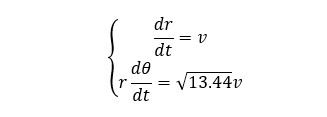
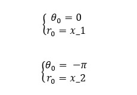
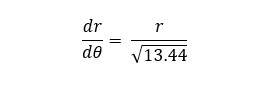
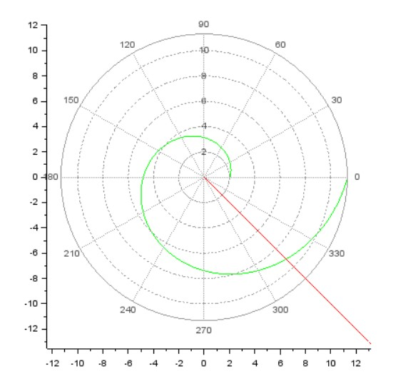
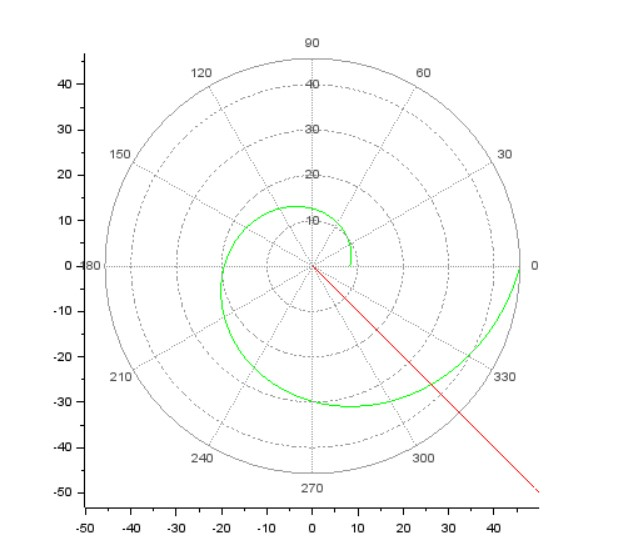

**РОССИЙСКИЙ УНИВЕРСИТЕТ ДРУЖБЫ НАРОДОВ** 
**Факультет физико-математических и естественных наук** 
**Кафедра прикладной информатики и теории вероятностей** 
   

# Лабораторная работа № 2 на тему: Задача о погоне
*дисциплина: Математическое моделирование*
   

Выполнила: Горбунова Ярослава Михайловна, группа: НФИбд-01-19 
 

МОСКВА 
2022 г.
   
1/11

-----------------------------

# Содержание
 

* Прагматика 
  - Задача о погоне 
  - Постановка задачи 
* Цели и задачи 
* Выполнение 
* Результаты 
* Список литературы

           
2/11

-----------------------------

# Прагматика
##  Задача о погоне
 

Пусть A_0 — точка старта объекта преследования, а P_0 — стартовая точка преследователя. Пусть точка A движется равномерно со скоростью V = const в каком-нибудь определённом направлении, а точка P движется со скоростью W=const, всегда направленной к точке A. Траектория точки P является простой кривой погони.

Кривая погони — кривая, представляющая собой решение задачи о «погоне», которая ставится следующим образом. Пусть точка M равномерно движется по некоторой заданной кривой. Требуется найти траекторию равномерного движения точки N такую, что касательная, проведённая к траектории в любой момент движения, проходила бы через соответствующее этому моменту положение точки M.
       

3/11

-----------------------------
# Прагматика
## Постановка задачи
 

Задача о погоне (Вариант 23): на море в тумане катер береговой охраны преследует лодку браконьеров. Через определенный промежуток времени туман рассеивается, и лодка обнаруживается на расстоянии 9,8 км от катера. Затем лодка снова скрывается в тумане и уходит прямолинейно в неизвестном направлении. Известно, что скорость катера в 3,8 раза больше скорости браконьерской лодки.

          

4/11

-----------------------------

# Цели и задачи
 

1. Рассмотреть задачу о погоне
2. Записать уравнение, описывающее движение катера, с начальными условиями для двух случаев (в зависимости от расположения катера относительно лодки в начальный момент времени)
3. Построить траекторию движения катера и лодки для двух случаев
4. Найти точку пересечения траектории катера и лодки

       

5/11

---------------------------------------------
# Выполнение
- Примем за t_0=0, x_л0=0 - место нахождения лодки браконьеров в момент обнаружения, x_k0=9,8 - место нахождения катера береговой охраны относительно лодки браконьеров в момент обнаружения лодки [1].
- Введем полярные координаты. Считаем, что полюс - это точка обнаружения лодки браконьеров x_л0 (θ = x_л0 = 0), а полярная ось r проходит через точку нахождения катера береговой охраны.

- Находим расстояние после которого катер начнет двигаться вокруг полюса (x_1 = k/4.8 и x_2 = k/2.8, где k=9,8 км)

       

6/11

-------------------------------------------

# Выполнение
- Раскладываем скорость катера после того, как он начнет двигаться вокруг полюса удаляясь от него со скоростью лодки v, на радиальную и тангенциальную составляющие

 

- Получаем систему из двух дифференциальных уравнений с начальными условиями для двух случаев

  

- Упрощаем систему уравнений, начальные условия остаются теми же

 

7/11

-----------------------------
# Результаты
Результатом написания кода для решения задачи для первого случая получаем траекторию движения катера и лодки.
Катер береговой охраны и браконьерская лодка пересекутся на расстоянии 9.2 км от полюса.

8/11

-------------------------------
# Результаты
Результатом написания кода для решения задачи для второго случая получаем траекторию движения катера и лодки.
Катер береговой охраны и браконьерская лодка пересекутся на расстоянии 37 км от полюса.

 

9/11

-------------------------------
# Результаты
 

1. Рассмотрена задача о погоне
2. Записано уравнение, описывающее движение катера, с начальными условиями для двух случаев (в зависимости от расположения катера относительно лодки в начальный момент времени)
3. Построена траектория движения катера и лодки для двух случаев
4. Найдены точки пересечения траектории катера и лодки для двух случаев

          

10/11

-----------------------------

# Список литературы
1. Методические материалы курса
2. Документация по системе SciLab (<http://www.scilab.org/support/documentation>)
3. Кривая погони (<https://dic.academic.ru/dic.nsf/ruwiki/1527602http:/dic.academic.ru/dic.nsf/ruwiki/146736>)
4. Дифференциальные уравнения 1-го порядка (<https://portal.tpu.ru/SHARED/n/NOVOSELOVA/Page_2/Tab1/DU_1por.pdf>)

           
11/11

---------------------------------------------
