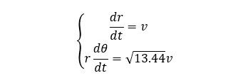
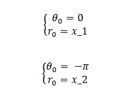
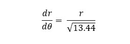
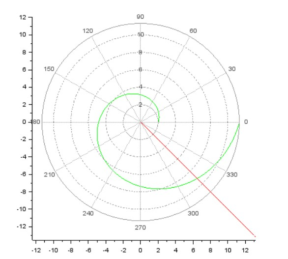

---
# Front matter
title: "Отчет по лабораторной работе №2"
subtitle: "Задача о погоне"
author: "Горбунова Ярослава Михайловна"
group: НФИбд-01-19
institute: РУДН, Москва, РФ

# Generic otions
lang: ru-RU
toc-title: "Содержание"

# Bibliography
csl: pandoc/csl/gost-r-7-0-5-2008-numeric.csl

# Pdf output format
toc: true # Table of contents
toc_depth: 2
lof: true # List of figures
fontsize: 12pt
linestretch: 1.5
papersize: a4
documentclass: scrreprt
### Fonts
mainfont: PT Serif
romanfont: PT Serif
sansfont: PT Sans
monofont: PT Mono
mainfontoptions: Ligatures=TeX
romanfontoptions: Ligatures=TeX
sansfontoptions: Ligatures=TeX,Scale=MatchLowercase
monofontoptions: Scale=MatchLowercase,Scale=0.9
## Biblatex
biblatex: true
biblio-style: "gost-numeric"
biblatexoptions:
  - parentracker=true
  - backend=biber
  - hyperref=auto
  - language=auto
  - autolang=other*
  - citestyle=gost-numeric
## Misc options
indent: true
header-includes:
  - \linepenalty=10 # the penalty added to the badness of each line within a paragraph (no associated penalty node) Increasing the value makes tex try to have fewer lines in the paragraph.
  - \interlinepenalty=0 # value of the penalty (node) added after each line of a paragraph.
  - \hyphenpenalty=50 # the penalty for line breaking at an automatically inserted hyphen
  - \exhyphenpenalty=50 # the penalty for line breaking at an explicit hyphen
  - \binoppenalty=700 # the penalty for breaking a line at a binary operator
  - \relpenalty=500 # the penalty for breaking a line at a relation
  - \clubpenalty=150 # extra penalty for breaking after first line of a paragraph
  - \widowpenalty=150 # extra penalty for breaking before last line of a paragraph
  - \displaywidowpenalty=50 # extra penalty for breaking before last line before a display math
  - \brokenpenalty=100 # extra penalty for page breaking after a hyphenated line
  - \predisplaypenalty=10000 # penalty for breaking before a display
  - \postdisplaypenalty=0 # penalty for breaking after a display
  - \floatingpenalty = 20000 # penalty for splitting an insertion (can only be split footnote in standard LaTeX)
  - \raggedbottom # or \flushbottom
  - \usepackage{float} # keep figures where there are in the text
  - \floatplacement{figure}{H} # keep figures where there are in the text
---
# Цель работы
1. Рассмотреть задачу о погоне
2. Записать уравнение, описывающее движение катера, с начальными условиями для двух случаев (в зависимости от расположения катера относительно лодки в начальный момент времени)
3. Построить траекторию движения катера и лодки для двух случаев
4. Найти точку пересечения траектории катера и лодки

# Задание
### Постановка задачи. Задача о погоне (Вариант 23)
Задача о преследовании браконьеров береговой охраной: на море в тумане катер береговой охраны преследует лодку браконьеров. Через определенный промежуток времени туман рассеивается, и лодка обнаруживается на расстоянии 9,8 км от катера. Затем лодка снова скрывается в тумане и уходит прямолинейно в неизвестном направлении. Известно, что скорость катера в 3,8 раза больше скорости браконьерской лодки [1].

# Теоретическое введение
Задача лабораторной работы заключается в описании математической модели задачи о погоне, которую мы рассматриваем на примере задаи о преследовании браконьеров береговой охраной. Для этого будут рассмотрен вывод математического аппарата для решения поставленной задачи, построение графического представления движения браконьерской лодки и катера береговой охраны. Для этого рассмотрим теоретические аспекты для достижения цели работы.
Кривая погони — кривая, представляющая собой решение задачи о «погоне», которая ставится следующим образом. Пусть точка M равномерно движется по некоторой заданной кривой. Требуется найти траекторию равномерного движения точки N такую, что касательная, проведённая к траектории в любой момент движения, проходила бы через соответствующее этому моменту положение точки M [3].
Для достижения цели работы при решении задачи необходимо будет описать и решить дифференциальное уравнение первого порядка с заданными начальными условиями (для двух случаев). Дифференциальное уравнение - уравнение, содержащее известную функцию F, независимую переменную x, её функцию y и производные (или дифференциалы) функции y(х). Решением дифференциального уравнения называют всякую n раз непрерывно дифференцируемую на интервале (а,b) функцию, при подстановке которой уравнение превращается в тождество, верное для любого х, пренадлежащего промежутку (а,b) [4].
Точка пересечения траектории катера и лодки - точка на графике, в которой пересекаются две линии (траектории), одна из которых обозначает траекторию движения катера, вторая - лодки.

# Выполнение лабораторной работы
1. Примем за t_0=0, x_л0=0 - место нахождения лодки браконьеров в момент обнаружения, x_k0=9,8 - место нахождения катера береговой охраны относительно лодки браконьеров в момент обнаружения лодки [1].
2. Введем полярные координаты. Считаем, что полюс - это точка обнаружения лодки браконьеров x_л0 (θ = x_л0 = 0), а полярная ось r проходит через точку нахождения катера береговой охраны (рис.2.1).

 
Рис.2.1. Положение катера и лодки в начальный момент времени

3. Траектория катера должна быть такой, чтобы и катер, и лодка все время были на одном расстоянии от полюса θ, только в этом случае траектория катера пересечется с траекторией лодки.
Поэтому для начала катер береговой охраны должен двигаться некоторое время прямолинейно, пока не окажется на том же расстоянии от полюса, что и лодка браконьеров. После этого катер береговой охраны должен двигаться вокруг полюса удаляясь от него с той же скоростью, что и лодка браконьеров.
4. Чтобы найти расстояние x (расстояние после которого катер начнет двигаться вокруг полюса), необходимо составить простое уравнение. Пусть через время t катер и лодка окажутся на одном расстоянии x от полюса. За это время лодка пройдет x, а катер k-x (или k+x, в зависимости от начального положения катера относительно полюса). Время, за которое они пройдут это расстояние, вычисляется как x/v или (k-x)/3.8v (во втором случае (k+x)/3.8v). Так как время одно и то же, то эти величины одинаковы. Тогда неизвестное расстояниеx можно найти из следующего уравнения:
в первом случае (рис.4.1)

 
Рис.4.1. Формула для поиска расстояния х в первом случае

или во втором (рис.4.2)

 
Рис.4.2. Формула для поиска расстояния х во втором случае

Отсюда мы найдем два значения x_1 = k/4.8 и x_2 = k/2.8, задачу будем решать для двух случаев.
5. После того, как катер береговой охраны окажется на одном расстоянии от полюса, что и лодка, он должен сменить прямолинейную траекторию и начать двигаться вокруг полюса удаляясь от него со скоростью лодки v.
Для этого скорость катера раскладываем на две составляющие: v_r - радиальная скорость и v_t  - тангенциальная скорость (рис.5.1). Радиальная скорость - это скорость, с которой катер удаляется от полюса, v_r = dr/dt. Нам нужно, чтобы эта скорость была равна скорости лодки, поэтому полагаем dr/dt = v.
Тангенциальная скорость – это линейная скорость вращения катера относительно полюса. Она равна произведению угловой скорости dθ/dt на радиус r, v_t = r * dθ/dt.

 
Рис.5.1. Разложение скорости катера на тангенциальную и радиальную составляющие

Учитывая, что радиальная скорость равна v, из рисунка видно (рис.5.2)

 
Рис.5.2. Вывод тангенциальной скорости катера по теореме Пифагора

Тогда получаем следующее равенство (рис.5.3)

 
Рис.5.3. Уравнение тангенциальной скорости

6. Решение исходной задачи сводится к решению системы из двух дифференциальных уравнений (рис.6.1)

 
Рис.6.1. Система дифференциальных уравнений
    
с начальными условиями для двух случаев (рис.6.2): 

 
Рис.6.2. Начальные условия для двух случаев
    
Исключая из полученной системы производную по t, можно перейти к следующему уравнению (рис.6.3):

 
Рис.6.3. Упрощенное дифференциальное уравнение
    
Начальные условия остаются прежними. Решив это уравнение, мы получим траекторию движения катера в полярных координатах.
    
7. Написав код для решения задачи для первого случая в Scilab [2] (рис.7.1), получим следующие результаты (рис.7.2)

 
Рис.7.1. Код для решения первого случая в Scilab

 
Рис.7.2. Результаты для первого случая 
    
Глядя на график, можно сделать вывод, что катер береговой охраны и браконьерская лодка пересекутся на расстоянии 9.2 км от полюса.

8. Написав код для решения задачи для второго случая в Scilab [2] (рис.7.3), получим следующие результаты (рис.7.4)

 
Рис.7.3. Код для решения второго случая в Scilab

 
Рис.7.4. Результаты для второго случая 
    
Глядя на график, можно сделать вывод, что катер береговой охраны и браконьерская лодка пересекутся на расстоянии 37 км от полюса.

# Выводы
В ходе работы было выполнено следующее:
1. Рассмотрена задача о погоне
2. Записано уравнение, описывающее движение катера, с начальными условиями для двух случаев (в зависимости от расположения катера относительно лодки в начальный момент времени)
3. Построена траектория движения катера и лодки для двух случаев
4. Найдены точки пересечения траектории катера и лодки для двух случаев

# Список литературы
1. Методические материалы курса
2. Документация по системе SciLab (<http://www.scilab.org/support/documentation>)
3. Кривая погони (<https://dic.academic.ru/dic.nsf/ruwiki/1527602http:/dic.academic.ru/dic.nsf/ruwiki/146736>)
4. Дифференциальные уравнения 1-го порядка (<https://portal.tpu.ru/SHARED/n/NOVOSELOVA/Page_2/Tab1/DU_1por.pdf>)
