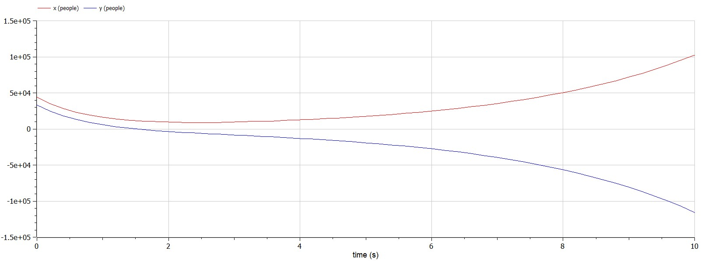
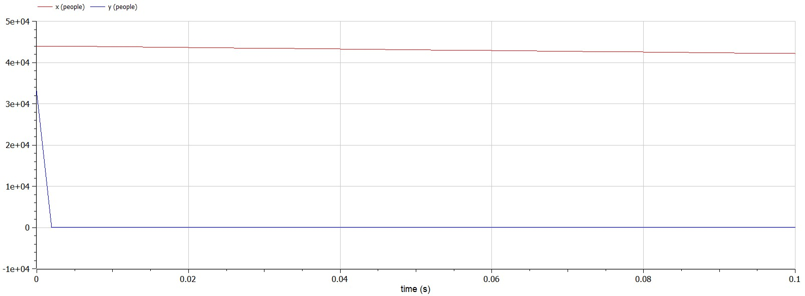

---
# Front matter
lang: ru-RU
title: Лабораторная работа № 3 на тему "Модель боевых действий"
author: "Горбунова Ярослава Михайловна"
group: NFIbd-01-19
institute: RUDN University, Moscow, Russian Federation
date: 2022 Feb 24th

# Formatting
toc: false
slide_level: 2
header-includes: 
 - \metroset{progressbar=frametitle,sectionpage=progressbar,numbering=fraction}
 - '\makeatletter'
 - '\beamer@ignorenonframefalse'
 - '\makeatother'
aspectratio: 43
section-titles: true
theme: metropolis

---

# Содержание
* Прагматика
  - Модель боевых действий
  - Постановка задачи
* Цели и задачи
* Выполнение
* Результаты
* Список литературы

# Прагматика. Модель боевых действий
**Модели Ланчестера** описывают поведение двух противоборствующих участников военного конфликта.

Рассмотрим три случая ведения боевых действий:

* Боевые действия между регулярными войсками
$$\dfrac{dx}{dt} = -a(t)x(t) - b(t)y(t) + P(t)$$
$$\dfrac{dy}{dt} = -c(t)x(t) - h(t)y(t) + Q(t)$$

* Боевые действия с участием регулярных войск и партизанских отрядов
$$\dfrac{dx}{dt} = -a(t)x(t) - b(t)y(t) + P(t)$$
$$\dfrac{dy}{dt} = -c(t)x(t)y(t) - h(t)y(t) + Q(t)$$

# Прагматика. Модель боевых действий
* Боевые действия между партизанскими отрядами
$$\dfrac{dx}{dt} = -a(t)x(t) - b(t)x(t)y(t) + P(t)$$
$$\dfrac{dy}{dt} = - h(t)y(t) -c(t)x(t)y(t) + Q(t)$$

# Прагматика. Модель боевых действий
Смысл коэффициентов и членов уравнений:

$-a(t)x(t)$ и $-h(t)y(t)$ - потери, не связанные с боевыми действиями

$-b(t)y(t)$ и $-c(t)x(t)$ - потери на поле боя

$b(t)$ и $c(t)$ - эффективность боевых действий со стороны у и х соответственно

$a(t)$ и $h(t)$ - степень влияния различных факторов на потери

$P(t)$, $Q(t)$ - функции, учитывающие возможность подхода подкрепления к войскам Х и У в течение одного дня

# Прагматика. Постановка задачи
*Вариант 23*:
Между страной Х и страной У идет война. Численность состава войск исчисляется от начала войны, и являются временными функциями $x(t)$ и $y(t)$. В начальный момент времени страна Х имеет армию численностью 44 000 человек, а в распоряжении страны У армия численностью в 33 000 человек. Для упрощения модели считаем, что коэффициенты a, b, c, h постоянны. Также считаем $P(t)$ и $Q(t)$ непрерывные функции.

# Прагматика. Постановка задачи
Постройте графики изменения численности войск армии Х и армии У для следующих случаев:

1. Модель боевых действий между регулярными войсками
$$\dfrac{dx}{dt} =  -0,55x(t) - 0,8y(t) + sin(t) + 1$$
$$\dfrac{dx}{dt} =  -0,8x(t) - 0,35y(t) + cos(2t)$$

2. Модель ведение боевых действий с участием регулярных войск и партизанских отрядов
$$\dfrac{dx}{dt} =  -0,43x(t) - 0,79y(t) + sin(2t) + 1$$
$$\dfrac{dx}{dt} =  -0,79x(t)y(t) - 0,23y(t) + cos(2t)$$

# Цели и задачи
1. Рассмотреть три простейшие модели боевых действий – модели Ланчестера
2. Рассмотреть три случая ведения боевых действий:
    1. Боевые действия между регулярными войсками
    2. Боевые действия с участием регулярных войск и партизанских отрядов
    3. Боевые действия между партизанскими отрядами
3. Построить графики изменения численности войск армии Х и армии У для случаев боевых действий между регулярными войсками и боевых действий с участием регулярных войск и партизанских отрядов

# Выполнение
Результаты симуляции в OpenModelica. В первом случае: с начальным временем 0 и конечным временем 10 с интервалом 0,2, во втором случае: с начальным временем 0 и конечным временем 0,1 с интервалом 0,002. Армия Y проиграет войну, когда time=1,5 (через полтора дня, после её начала)

 

# Выполнение
Результаты симуляциив OpenModelica. Во втором случае: с начальным временем 0 и конечным временем 0,1 с интервалом 0,002. Армия Y проиграет войну, когда time<0,005 (практически сразу, после начала войны)

# Результаты
1. Рассмотрены три простейшие модели боевых действий – модели Ланчестера
2. Рассмотрены три случая ведения боевых действий:
    1. Боевые действия между регулярными войсками
    2. Боевые действия с участием регулярных войск и партизанских отрядов
    3. Боевые действия между партизанскими отрядами
3. Построены графики изменения численности войск армии Х и армии У для случаев боевых действий между регулярными войсками и боевых действий с участием регулярных войск и партизанских отрядов

# Список литературы
1. Методические материалы курса
2. Определение жертв войн через ланчестерские (<https://www.socionauki.ru/journal/articles/130365/>)
3. Моделирование боевых действий (<https://w.histrf.ru/articles/article/show/modielirovaniie_boievykh_dieistvii>)