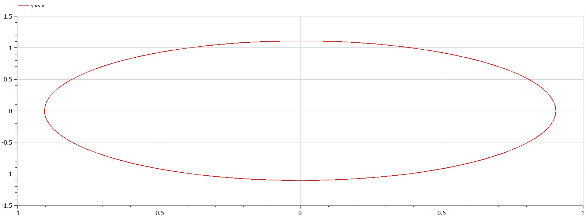
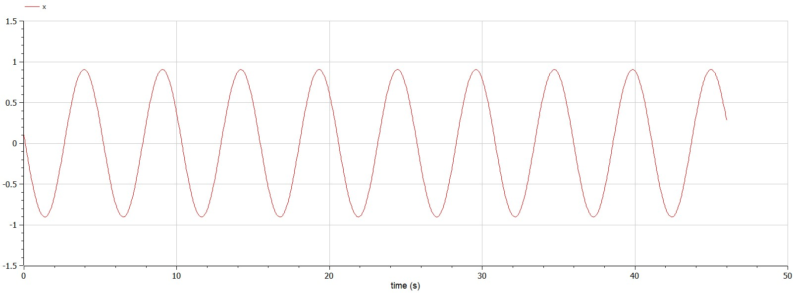
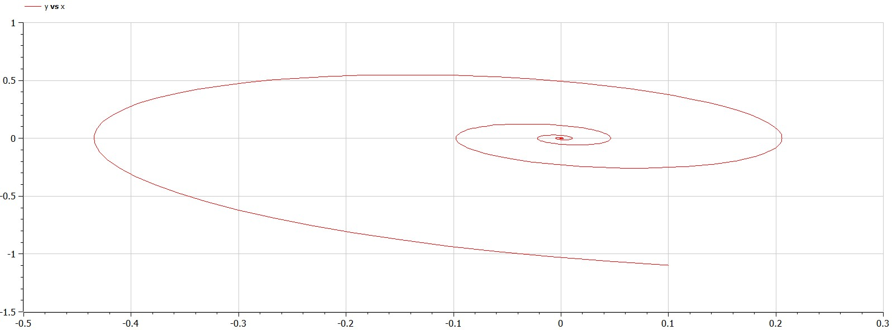
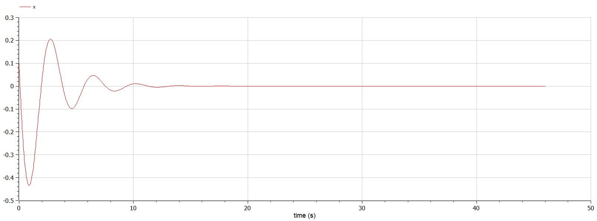
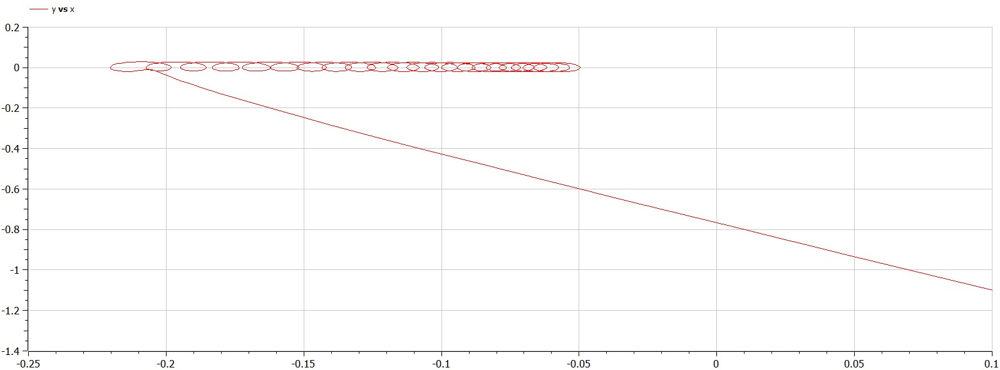
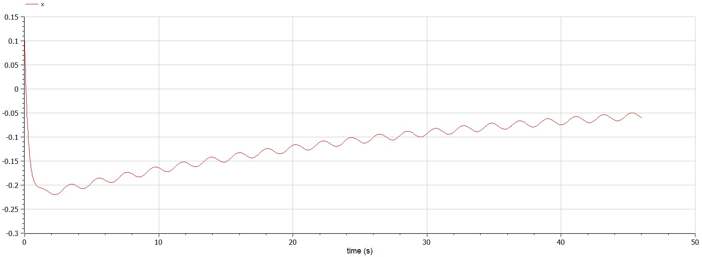

---
# Front matter
lang: ru-RU
title: Лабораторная работа № 4 на тему "Модель гармонических колебаний"
author: "Горбунова Ярослава Михайловна"
group: NFIbd-01-19
institute: RUDN University, Moscow, Russian Federation
date: 2022 Mar 4th

# Formatting
toc: false
slide_level: 2
header-includes: 
 - \metroset{progressbar=frametitle,sectionpage=progressbar,numbering=fraction}
 - '\makeatletter'
 - '\beamer@ignorenonframefalse'
 - '\makeatother'
aspectratio: 43
section-titles: true
theme: metropolis

---

# Содержание
* Прагматика
  - Модель гармонических колебаний
  - Постановка задачи
* Цели и задачи
* Выполнение
* Результаты
* Список литературы

# Прагматика
## Прагматика. Модель гармонических колебаний
**Осциллятор** (лат. oscillo — качаюсь) — система, совершающая колебания, то есть показатели которой периодически повторяются во времени.

**Фазовый портрет** - это геометрическое представление траекторий динамической системы в фазовой плоскости; все возможные траектории в системе. Каждый набор начальных условий представлен другой кривой, или точкой. 

Любое состояние системы изображается точкой. При эволюции системы происходит переход от дной точки фазового пространства к другой и получается **фазовая траектория**.

## Прагматика. Модель гармонических колебаний
Уравнение свободных колебаний гармонического осциллятора:

$$\ddot{x} + 2\gamma\dot{x} +\omega_0^2 x = 0\qquad$$ или $$\qquad\begin{cases}
   \dot x =y \\
   \dot y = -2\gamma y- \omega_0^2 x 
 \end{cases}$$

x – описывает состояние системы (смещение грузика, заряд конденсатора, др.) 
$\gamma$ – характеризует потери энергии (трение в механической системе, сопротивление в контуре) 
$\omega_0$ – собственная частота колебаний 
t – время

## Прагматика. Постановка задачи
*Вариант 23*: Постройте фазовый портрет гармонического осциллятора и решение уравнения гармонического осциллятора для следующих случаев:

1. Колебания гармонического осциллятора без затуханий и без действий внешней силы $\dot x + 1.5x = 0$
2. Колебания гармонического осциллятора c затуханием и без действий внешней силы $\ddot x + 0.8\dot x + 3x = 0$
3.  Колебания гармонического осциллятора c затуханием и под действием внешней силы $\ddot x + 3.3\dot x + 0.1x = 0.1sin(3t)$

На интервале $t \in [0; 46]$ (шаг 0.05) с начальными условиями $x_0=0.1, y_0 = -1.1$

# Цели и задачи
1. Изучить особенности моделей гармонических колебаний
2. Выполнить задание согласно варианту работы
3. Построить фазовые портреты гармонического осциллятора и решение уравнения гармонического осциллятора для заданных случаев

# Выполнение
## Выполнение. Колебания без затуханий и без действий внешней силы
 

## Выполнение. Колебания без затуханий и без действий внешней силы

## Выполнение. Колебания c затуханием и без действий внешней силы
 

## Выполнение. Колебания c затуханием и без действий внешней силы

## Выполнение. Колебания c затуханием и под действием внешней силы
 

## Выполнение. Колебания c затуханием и под действием внешней силы

# Результаты
1. Изучены особенности моделей гармонических колебаний
2. Построены фазовые портреты гармонического осциллятора и решения уравнений гармонического осциллятора для трёх случаев с заданными начальными условиями:
    * Колебания гармонического осциллятора без затуханий и без действий внешней силы
    * Колебания гармонического осциллятора c затуханием и без действий внешней силы
    * Колебания гармонического осциллятора c затуханием и под действием внешней силы 

# Список литературы
1. Методические материалы курса
2. Теория колебаний, Пятаков А. П. (<https://teach-in.ru/file/synopsis/pdf/oscillation-theory-pyatakov-M.pdf>)
3. Осциллятор (<https://ru.wikipedia.org/wiki/%D0%9E%D1%81%D1%86%D0%B8%D0%BB%D0%BB%D1%8F%D1%82%D0%BE%D1%80>)