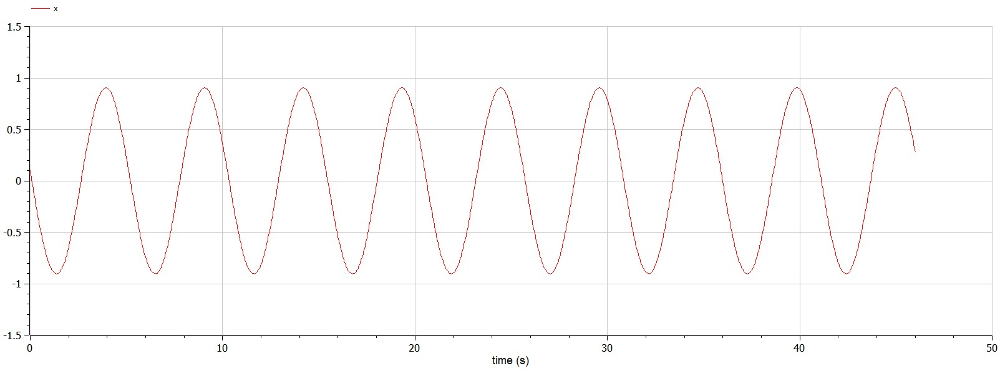
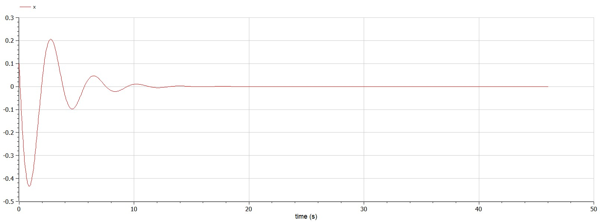

---
# Front matter
title: "Отчет по лабораторной работе №4"
subtitle: "Модель гармонических колебаний"
author: "Горбунова Ярослава Михайловна"
group: NFIbd-01-19
institute: RUDN University, Moscow, Russian Federation
date: 2022 Mar 4th

# Generic otions
lang: ru-RU
toc-title: "Содержание"

# Bibliography
csl: pandoc/csl/gost-r-7-0-5-2008-numeric.csl

# Pdf output format
toc: true # Table of contents
toc_depth: 2
lof: true # List of figures
lot: true # List of tables
fontsize: 12pt
linestretch: 1.5
papersize: a4
documentclass: scrreprt
### Fonts
mainfont: PT Serif
romanfont: PT Serif
sansfont: PT Sans
monofont: PT Mono
mainfontoptions: Ligatures=TeX
romanfontoptions: Ligatures=TeX
sansfontoptions: Ligatures=TeX,Scale=MatchLowercase
monofontoptions: Scale=MatchLowercase,Scale=0.9
## Biblatex
biblatex: true
biblio-style: "gost-numeric"
biblatexoptions:
  - parentracker=true
  - backend=biber
  - hyperref=auto
  - language=auto
  - autolang=other*
  - citestyle=gost-numeric
## Misc options
indent: true
header-includes:
  - \linepenalty=10 # the penalty added to the badness of each line within a paragraph (no associated penalty node) Increasing the value makes tex try to have fewer lines in the paragraph.
  - \interlinepenalty=0 # value of the penalty (node) added after each line of a paragraph.
  - \hyphenpenalty=50 # the penalty for line breaking at an automatically inserted hyphen
  - \exhyphenpenalty=50 # the penalty for line breaking at an explicit hyphen
  - \binoppenalty=700 # the penalty for breaking a line at a binary operator
  - \relpenalty=500 # the penalty for breaking a line at a relation
  - \clubpenalty=150 # extra penalty for breaking after first line of a paragraph
  - \widowpenalty=150 # extra penalty for breaking before last line of a paragraph
  - \displaywidowpenalty=50 # extra penalty for breaking before last line before a display math
  - \brokenpenalty=100 # extra penalty for page breaking after a hyphenated line
  - \predisplaypenalty=10000 # penalty for breaking before a display
  - \postdisplaypenalty=0 # penalty for breaking after a display
  - \floatingpenalty = 20000 # penalty for splitting an insertion (can only be split footnote in standard LaTeX)
  - \raggedbottom # or \flushbottom
  - \usepackage{float} # keep figures where there are in the text
  - \floatplacement{figure}{H} # keep figures where there are in the text

---

# Цель работы
1. Изучить особенности моделей гармонических колебаний
2. Выполнить задание согласно варианту работы
3. Построить фазовые портреты гармонического осциллятора и решение уравнения гармонического осциллятора для заданных случаев

# Задание
## Постановка задачи. Модель гармонических колебаний (Вариант 23)
Постройте фазовый портрет гармонического осциллятора и решение уравнения гармонического осциллятора для следующих случаев:

1. Колебания гармонического осциллятора без затуханий и без действий внешней $\dot x + 1.5x = 0$
2. Колебания гармонического осциллятора c затуханием и без действий внешней силы $\ddot x + 0.8\dot x + 3x = 0$
3.  Колебания гармонического осциллятора c затуханием и под действием внешней силы $\ddot x + 3.3\dot x + 0.1x = 0.1sin(3t)$

На интервале $t \in [0; 46]$ (шаг 0.05) с начальными условиями $x_0=0.1, y_0 = -1.1$

# Теоретическое введение
Движение грузика на пружинке, маятника, заряда в электрическом контуре, а также эволюция во времени многих систем в физике, химии, биологии и других науках при определенных предположениях можно описать одним и тем же дифференциальным уравнением, которое в теории колебаний выступает в качестве основной модели [1]. Эта модель называется линейным гармоническим осциллятором. Уравнение свободных колебаний гармонического осциллятора имеетследующий вид:

$$\ddot{x} + 2\gamma\dot{x} +\omega_0^2 x = 0\qquad\qquad\qquad\qquad\qquad(1)$$

где x – переменная, описывающая состояние системы (смещение грузика, заряд конденсатора и т.д.), $\gamma$– параметр, характеризующий потери энергии (трение в механической системе, сопротивление в контуре), $\omega_0$ – собственная частота колебаний, t – время. (Обозначения $\ddot{x}=\dfrac{\partial^2x}{\partial t}, \dot{x}=\dfrac{\partial x}{\partial t}$)

Уравнение (1) есть линейное однородное дифференциальное уравнение второго порядка и оно является примером линейной динамической системы. При отсутствии потерь в системе ($\gamma=0$) вместо уравнения (1) получаем уравнение консервативного осциллятора энергия колебания которого сохраняется во времени:

$$\ddot{x} + \omega_0^2 x = 0 \qquad\qquad\qquad\qquad\qquad\qquad(2)$$

Для однозначной разрешимости уравнения второго порядка (2) необходимо задать два начальных условия вида:

$$\begin{cases}
   x(t_0) = x_0 \\
   \dot x(t_0) = y_0
 \end{cases} \qquad\qquad\qquad\qquad\qquad\qquad(3)$$

Уравнение второго порядка (2) можно представить в виде системы двух уравнений первого порядка:

$$\begin{cases}
   \dot x =y \\
   \dot y = - \omega_0^2 x 
 \end{cases} \qquad\qquad\qquad\qquad\qquad\qquad(4)$$

Начальные условия (3) для системы (4) примут вид:

$$\begin{cases}
   x(t_0) = x_0 \\
   y(t_0) = y_0
 \end{cases} \qquad\qquad\qquad\qquad\qquad\qquad(5)$$

Независимые переменные x, y определяют пространство, в котором «движется» решение. Это фазовое пространство системы, поскольку оно двумерно будем называть его фазовой плоскостью. Значение фазовых координат x, y в любой момент времени полностью определяет состояние системы. Решению уравнения движения как функции времени отвечает гладкая кривая в фазовой плоскости. Она называется фазовой траекторией. Если множество различных решений (соответствующих различным начальным условиям) изобразить на одной фазовой плоскости, возникает общая картина поведения системы. Такую картину, образованную набором фазовых траекторий, называют фазовым портретом.

Осциллятор (лат. oscillo — качаюсь) — система, совершающая колебания, то есть показатели которой периодически повторяются во времени [3].

Фазовый портрет-это геометрическое представление траекторий динамической системы в фазовой плоскости; все возможные траектории в системе. Каждый набор начальных условий представлен другой кривой, или точкой [2]. 

Любое состояние системы изображается точкой. При эволюции системы происходит переход от дной точки фазового пространства к другой и получается фазовая траектория [2].

# Выполнение лабораторной работы
Выполнение работы будем проводить, используя OpenModelica.

1. Напишем программу для построения модели гармонических колебаний для первого случая: колебания гармонического осциллятора без затуханий и без действий внешней силы (рис.1)

Для первого случая фазовый портрет гармонического осциллятора (рис.2) и решение уравнения гармонического осциллятора (рис.3) выглядятследующим образом:

Колебания будут незатухающими, с постоянной амплитудой колебания.

2. Напишем программу для построения модели гармонических колебаний для второго случая: колебания гармонического осциллятора c затуханием и без действий внешней силы (рис.4)

Для второго случая фазовый портрет гармонического осциллятора (рис.5) и решение уравнения гармонического осциллятора (рис.6) выглядятследующим образом:

Колебания будут плавно затухать, амплитуда колебаний будет уменьшаться со временем.

3. Напишем программу для построения модели гармонических колебаний для третьего случая: колебания гармонического осциллятора c затуханием и под действием внешней силы (рис.7)

Для третьего случая фазовый портрет гармонического осциллятора (рис.8) и решение уравнения гармонического осциллятора (рис.9) выглядятследующим образом:

Колебания будут постоянно поддерживаться внешними силами, которые не дают осциллятору остановиться (прекратить колебания).

# Выводы
1. Изучены особенности моделей гармонических колебаний
2. Построены фазовые портреты гармонического осциллятора и решения уравнений гармонического осциллятора для трёх случаев с заданными начальными условиями:
    * Колебания гармонического осциллятора без затуханий и без действий внешней силы
    * Колебания гармонического осциллятора c затуханием и без действий внешней силы
    * Колебания гармонического осциллятора c затуханием и под действием внешней силы 

# Список литературы
1. Методические материалы курса
2. Теория колебаний, Пятаков А. П. (<https://teach-in.ru/file/synopsis/pdf/oscillation-theory-pyatakov-M.pdf>)
3. Осциллятор (<https://ru.wikipedia.org/wiki/%D0%9E%D1%81%D1%86%D0%B8%D0%BB%D0%BB%D1%8F%D1%82%D0%BE%D1%80>)
