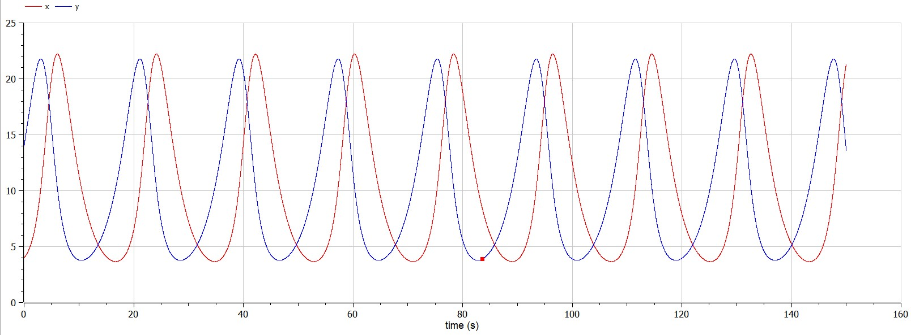
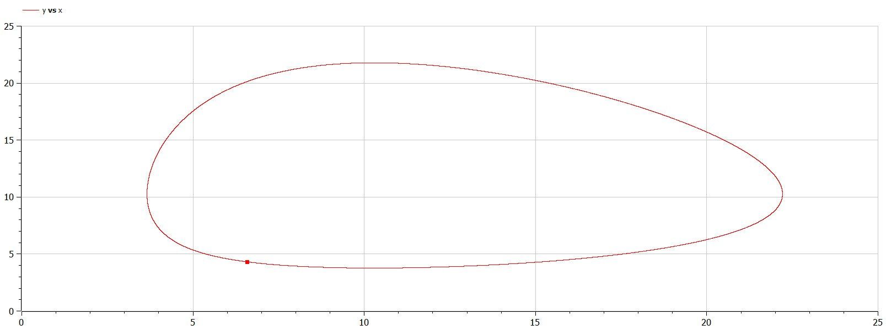
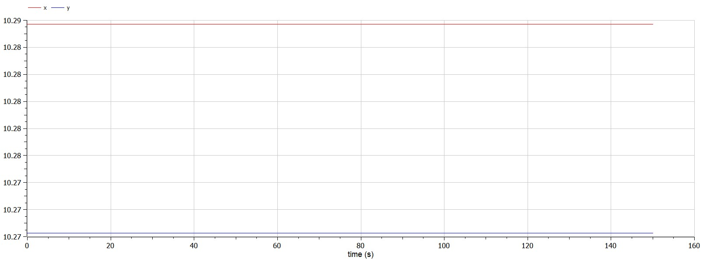

---
# Front matter
lang: ru-RU
title: Лабораторная работа № 5 на тему "Модель хищник-жертва"
author: "Горбунова Ярослава Михайловна"
group: NFIbd-01-19
institute: RUDN University, Moscow, Russian Federation

# Formatting
toc: false
slide_level: 2
header-includes: 
 - \metroset{progressbar=frametitle,sectionpage=progressbar,numbering=fraction}
 - '\makeatletter'
 - '\beamer@ignorenonframefalse'
 - '\makeatother'
aspectratio: 43
section-titles: true
theme: metropolis

---

# Содержание
* Прагматика
  - Модель хищник-жертва
  - Постановка задачи
* Цели и задачи
* Выполнение
* Результаты
* Список литературы

# Прагматика
## Прагматика. Модель хищник-жертва
Простейшая модель взаимодействия двух видов типа «хищник — жертва» - модель Лотки-Вольтерры. 

$$\dfrac{dx}{dt} = ax(t) - bx(t)y(t)$$
$$\dfrac{dy}{dt} = - cy(t) + dx(t)y(t)$$

## Прагматика. Модель хищник-жертва
$x$ – число жертв, $y$ - число хищников, 

$a$ описывает скорость естественного прироста числа жертв в отсутствие хищников, 

$с$ - естественное вымирание хищников, лишенных пищи в виде жертв. 

Каждый акт взаимодействия уменьшает популяцию жертв, но способствует увеличению популяции хищников (члены $-bxy$ и $dxy$ в правой части уравнения).

## Прагматика. Постановка задачи
*Вариант 23*: Для модели «хищник-жертва»:

$$\begin{cases}
   \dfrac{dx}{dt} = -0.38x(t) + 0.037x(t)y(t)\\
   \dfrac{dy}{dt} = 0.36y(t) - 0.035x(t)y(t)
 \end{cases}$$
 
Постройте график зависимости численности хищников от численности жертв, а также графики изменения численности хищников и численности жертв при следующих начальных условиях: $x_0 = 4, y_0 = 14$. Найдите стационарное состояние системы.

# Цели и задачи
1. Изучить особенности модели хищник-жертва
2. Построить график зависимости численности хищников от численности жертв при заданных начальных условиях
3. Построить график изменения численности хищников и численности жертв при заданных начальных условиях
4. Найти стационарное состояние системы

# Выполнение
## Выполнение

## Выполнение

## Выполнение

# Результаты
1. Изучены особенности модели хищник-жертва
2. Построен график зависимости численности хищников от численности жертв при заданных начальных условиях
3. Построен график изменения численности хищников и численности жертв при заданных начальных условиях
4. Найдено стационарное состояние системы

# Список литературы
1. Методические материалы курса
2. Задания к лабораторной работе № 5 (по вариантам)