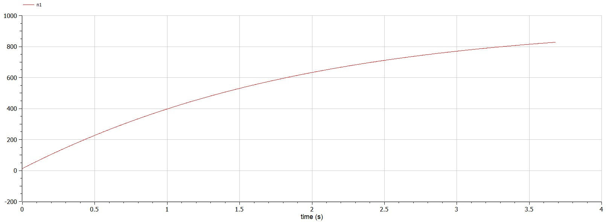
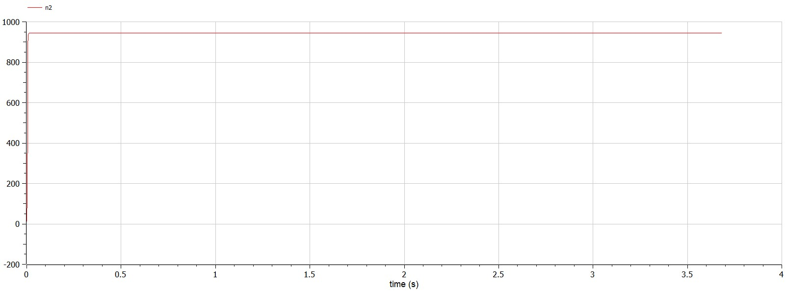
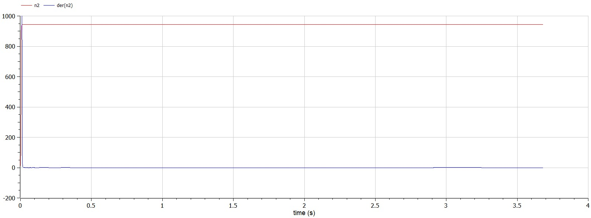
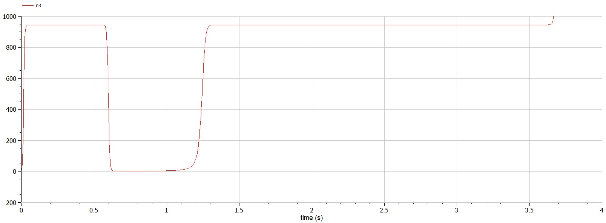

---
# Front matter
lang: ru-RU
title: Лабораторная работа № 7 на тему "Эффективность рекламы"
author: "Горбунова Ярослава Михайловна"
group: NFIbd-01-19
institute: RUDN University, Moscow, Russian Federation

# Formatting
toc: false
slide_level: 2
header-includes: 
 - \metroset{progressbar=frametitle,sectionpage=progressbar,numbering=fraction}
 - '\makeatletter'
 - '\beamer@ignorenonframefalse'
 - '\makeatother'
aspectratio: 43
section-titles: true
theme: metropolis

---

# Содержание
* Прагматика
  - Эффективность рекламы
  - Постановка задачи
* Цели и задачи
* Выполнение
* Результаты
* Список литературы

# Прагматика
## Прагматика. Эффективность рекламы
$dn/dt$ - скорость изменения со временем числа потребителей,
узнавших о товаре и готовых его купить

t - время, прошедшее с начала рекламной
кампании

n(t) - число уже информированных клиентов

 N - общее число потенциальных
платежеспособных покупателей

$\alpha_1(t)>0$ - характеризует интенсивность
рекламной кампании (зависит от затрат на рекламу в данный момент времени)

$\alpha_2(t)>0$ - характеризует интенсивность
рекламной кампании (зависит от распространения информации от человека к человеку)

## Прагматика. Эффективность рекламы
$$dn/dt = (\alpha_1(t) + \alpha_2(t)n(t))(N-n(t))$$, где

при $\alpha_1(t) \gg \alpha_2(t)$ - модель типа модели Мальтуса;

при $\alpha_1(t) \ll \alpha_2(t)$ - уравнение логистической кривой.

## Прагматика. Постановка задачи
*Вариант 23*: Постройте график распространения рекламы, математическая модель которой описывается следующим уравнением:

1. $\dfrac{dn}{dt} = (0.51 + 0.000099n(t))(N - n(t))$
2. $\dfrac{dn}{dt} = (0.000019 + 0.99n(t))(N - n(t))$
3. $\dfrac{dn}{dt} = (0.99t + 0.3cos(4t)n(t))(N - n(t))$

При этом объем аудитории $N = 945$, в начальный момент о товаре знает 13 человек. Для случая 2 определите, в какой момент времени скорость распространения рекламы будет иметь максимальное значение.

# Цели и задачи
1. Изучить задачу об эффективности рекламы
2. Построить графики распространения рекламы для трёх случаев
3. Для случая 2 определить, в какой момент времени скорость распространения рекламы будет иметь максимальное значение

# Выполнение
## Выполнение

## Выполнение

## Выполнение

## Выполнение

# Результаты
1. Изучена задача об эффективности рекламы
2. Построены графики распространения рекламы для трёх случаев
3. Для случая 2 определено, в какой момент времени скорость распространения рекламы будет иметь максимальное значение

# Список литературы
1. Методические материалы курса
2. Задания к лабораторной работе № 7 (по вариантам)