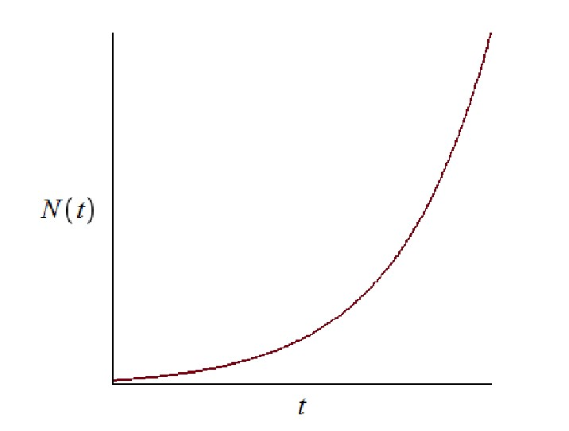
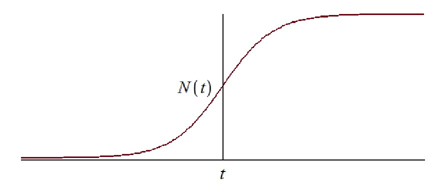
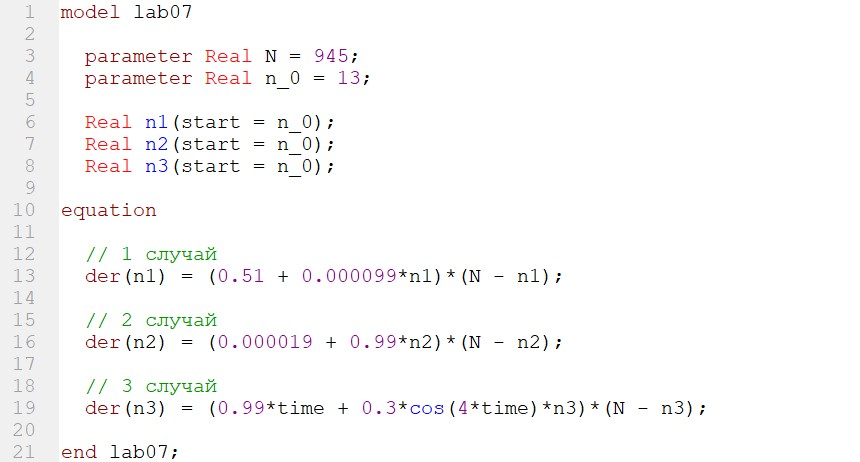

---
# Front matter
title: "Отчет по лабораторной работе №7"
subtitle: "Эффективность рекламы"
author: "Горбунова Ярослава Михайловна"
group: NFIbd-01-19
institute: RUDN University, Moscow, Russian Federation

# Generic otions
lang: ru-RU
toc-title: "Содержание"

# Bibliography
csl: pandoc/csl/gost-r-7-0-5-2008-numeric.csl

# Pdf output format
toc: true # Table of contents
toc_depth: 2
lof: true # List of figures
lot: true # List of tables
fontsize: 12pt
linestretch: 1.5
papersize: a4
documentclass: scrreprt
### Fonts
mainfont: PT Serif
romanfont: PT Serif
sansfont: PT Sans
monofont: PT Mono
mainfontoptions: Ligatures=TeX
romanfontoptions: Ligatures=TeX
sansfontoptions: Ligatures=TeX,Scale=MatchLowercase
monofontoptions: Scale=MatchLowercase,Scale=0.9
## Biblatex
biblatex: true
biblio-style: "gost-numeric"
biblatexoptions:
  - parentracker=true
  - backend=biber
  - hyperref=auto
  - language=auto
  - autolang=other*
  - citestyle=gost-numeric
## Misc options
indent: true
header-includes:
  - \linepenalty=10 # the penalty added to the badness of each line within a paragraph (no associated penalty node) Increasing the value makes tex try to have fewer lines in the paragraph.
  - \interlinepenalty=0 # value of the penalty (node) added after each line of a paragraph.
  - \hyphenpenalty=50 # the penalty for line breaking at an automatically inserted hyphen
  - \exhyphenpenalty=50 # the penalty for line breaking at an explicit hyphen
  - \binoppenalty=700 # the penalty for breaking a line at a binary operator
  - \relpenalty=500 # the penalty for breaking a line at a relation
  - \clubpenalty=150 # extra penalty for breaking after first line of a paragraph
  - \widowpenalty=150 # extra penalty for breaking before last line of a paragraph
  - \displaywidowpenalty=50 # extra penalty for breaking before last line before a display math
  - \brokenpenalty=100 # extra penalty for page breaking after a hyphenated line
  - \predisplaypenalty=10000 # penalty for breaking before a display
  - \postdisplaypenalty=0 # penalty for breaking after a display
  - \floatingpenalty = 20000 # penalty for splitting an insertion (can only be split footnote in standard LaTeX)
  - \raggedbottom # or \flushbottom
  - \usepackage{float} # keep figures where there are in the text
  - \floatplacement{figure}{H} # keep figures where there are in the text

---

# Цель работы
1. Изучить задачу об эффективности рекламы
2. Построить графики распространения рекламы для трёх случаев
3. Для случая 2 определить, в какой момент времени скорость распространения рекламы будет иметь максимальное значение

# Задание
## Постановка задачи. Эффективность рекламы (Вариант 23)
Постройте график распространения рекламы, математическая модель которой описывается следующим уравнением:

1. $\dfrac{dn}{dt} = (0.51 + 0.000099n(t))(N - n(t))$
2. $\dfrac{dn}{dt} = (0.000019 + 0.99n(t))(N - n(t))$
3. $\dfrac{dn}{dt} = (0.99t + 0.3cos(4t)n(t))(N - n(t))$

При этом объем аудитории $N = 945$, в начальный момент о товаре знает 13 человек. Для случая 2 определите, в какой момент времени скорость распространения рекламы будет иметь максимальное значение [2].

# Теоретическое введение

Организуется рекламная кампания нового товара или услуги. Необходимо,
чтобы прибыль будущих продаж с избытком покрывала издержки на рекламу.
Вначале расходы могут превышать прибыль, поскольку лишь малая часть
потенциальных покупателей будет информирована о новинке. Затем, при
увеличении числа продаж, возрастает и прибыль, и, наконец, наступит момент,
когда рынок насытиться, и рекламировать товар станет бесполезным [1].

Предположим, что торговыми учреждениями реализуется некоторая
продукция, о которой в момент времениt из числа потенциальных покупателейN
знает лишьn покупателей. Для ускорения сбыта продукции запускается реклама
по радио, телевидению и других средств массовой информации. После запуска
рекламной кампании информация о продукции начнет распространяться среди
потенциальных покупателей путем общения друг с другом. Таким образом, после
запуска рекламных объявлений скорость изменения числа знающих о продукции
людей пропорциональна как числу знающих о товаре покупателей, так и числу
покупателей о нем не знающих.

Модель рекламной кампании описывается следующими величинами.
Считаем, что $dn/dt$ - скорость изменения со временем числа потребителей,
узнавших о товаре и готовых его купить, t - время, прошедшее с начала рекламной
кампании, n(t) - число уже информированных клиентов. Эта величина
пропорциональна числу покупателей, еще не знающих о нем, это описывается
следующим образом: $\alpha_1(t)(N-n(t))$, где N - общее число потенциальных
платежеспособных покупателей, $\alpha_1(t)>0$ - характеризует интенсивность
рекламной кампании (зависит от затрат на рекламу в данный момент времени).
Помимо этого, узнавшие о товаре потребители также распространяют полученную
информацию среди потенциальных покупателей, не знающих о нем (в этом случае
работает т.н. сарафанное радио). Этот вклад в рекламу описывается величиной $\alpha_2(t)n(t)(N-n(t))$, эта величина увеличивается с увеличением потребителей
узнавших о товаре. Математическая модель распространения рекламы описывается
уравнением: 

$$dn/dt = (\alpha_1(t) + \alpha_2(t)n(t))(N-n(t))\qquad\qquad\qquad\qquad\qquad\qquad(1)$$

При $\alpha_1(t) \gg \alpha_2(t)$ получается модель типа модели Мальтуса, решение которой
имеет вид (рис.1):

В обратном случае, при $\alpha_1(t) \ll \alpha_2(t)$ получаем уравнение логистической
кривой (рис.2):

# Выполнение лабораторной работы
Выполнение работы будем проводить, используя OpenModelica.

Напишем программу для построения графиков распространения рекламы (рис.3).

Смоделируем график распространения рекламы для первого случая (рис.4).

Смоделируем график распространения рекламы и график изменения скорости распространения рекламы для второго случая (рис.5-6).

Cкорость распространения рекламы будет иметь максимальное значение сразу после начала рекламной кампании.

Смоделируем график распространения рекламы для третьего случая (рис.7).

# Выводы
1. Изучена задача об эффективности рекламы
2. Построены графики распространения рекламы для трёх случаев
3. Для случая 2 определено, в какой момент времени скорость распространения рекламы будет иметь максимальное значение

# Список литературы
1. Методические материалы курса
2. Задания к лабораторной работе № 7 (по вариантам)
