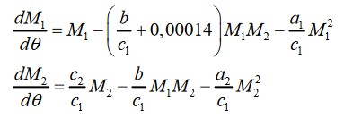
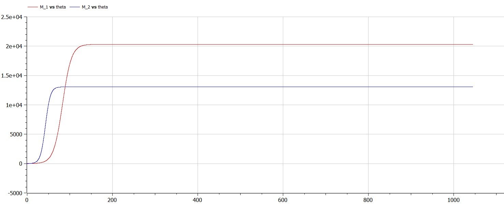

---
# Front matter
lang: ru-RU
title: Лабораторная работа № 8 на тему "Модель конкуренции двух фирм"
author: "Горбунова Ярослава Михайловна"
group: NFIbd-01-19
institute: RUDN University, Moscow, Russian Federation

# Formatting
toc: false
slide_level: 2
header-includes: 
 - \metroset{progressbar=frametitle,sectionpage=progressbar,numbering=fraction}
 - '\makeatletter'
 - '\beamer@ignorenonframefalse'
 - '\makeatother'
aspectratio: 43
section-titles: true
theme: metropolis

---

# Содержание
* Прагматика
  - Модель конкуренции двух фирм
  - Постановка задачи
* Цели и задачи
* Выполнение
* Результаты
* Список литературы

# Прагматика
## Прагматика. Эффективность рекламы
N – число потребителей производимого продукта

$\tau$ – длительность производственного цикла

p – рыночная цена товара

$\widetilde{p}$ - себестоимость продукта (переменные издержки на производство единицы продукции) 

q – максимальная потребность одного человека в продукте в единицу времени

$\theta = \dfrac{t}{c_1}$ - безразмерное время

M – оборотные средства предприятия

## Прагматика. Постановка задачи
*Вариант 23*
**Случай 1**. Конкурентная борьба ведётся только рыночными методами, конкуренты могут влиять друг на друга, изменяя параметры своего производства: себестоимость, время цикла; не могут прямо вмешиваться в ситуацию на рынке Введена нормировка $t=c_1\theta$

## Прагматика. Постановка задачи
**Случай 2**. Помимо рыночных методов в конкурентной борьбе используются социально-психологические факторы – формирование общественного предпочтения одного товара другому, не зависимо от их качества и цены.

## Прагматика. Постановка задачи
Начальные условия для случаев 1 и 2:

Замечание: Значения $p_{cr}, \widetilde{p}_{1,2}, N$ указаны в тысячах единиц, значения $M_{1,2}$ - в млн. единиц.

# Цели и задачи
1. Изучить задачу о конкуренции двух фирм
2. Построить графики изменения оборотных средств фирмы 1 и фирмы 2 без
учета постоянных издержек и с веденной нормировкой для случая 1.
2. Построить графики изменения оборотных средств фирмы 1 и фирмы 2 без
учета постоянных издержек и с веденной нормировкой для случая 2.

# Выполнение
## Выполнение

## Выполнение

# Результаты
1. Изучена задача о конкуренции двух фирм
2. Построены графики изменения оборотных средств фирмы 1 и фирмы 2 без
учета постоянных издержек и с веденной нормировкой для случая 1
2. Построены графики изменения оборотных средств фирмы 1 и фирмы 2 без
учета постоянных издержек и с веденной нормировкой для случая 2

# Список литературы
1. Методические материалы курса
2. Задания к лабораторной работе № 8 (по вариантам)