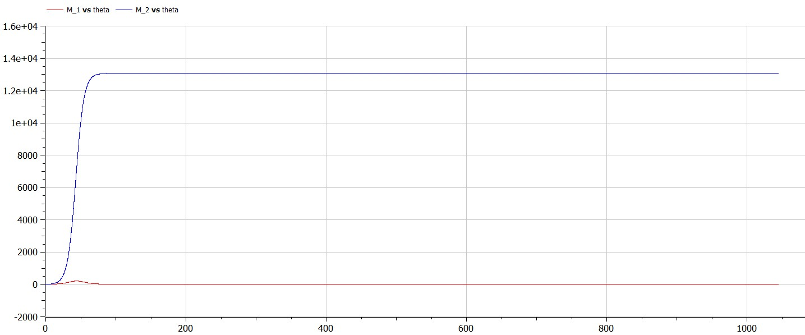

---
# Front matter
title: "Отчет по лабораторной работе №8"
subtitle: "Модель конкуренции двух фирм"
author: "Горбунова Ярослава Михайловна"
group: NFIbd-01-19
institute: RUDN University, Moscow, Russian Federation

# Generic otions
lang: ru-RU
toc-title: "Содержание"

# Bibliography
csl: pandoc/csl/gost-r-7-0-5-2008-numeric.csl

# Pdf output format
toc: true # Table of contents
toc_depth: 2
lof: true # List of figures
lot: true # List of tables
fontsize: 12pt
linestretch: 1.5
papersize: a4
documentclass: scrreprt
### Fonts
mainfont: PT Serif
romanfont: PT Serif
sansfont: PT Sans
monofont: PT Mono
mainfontoptions: Ligatures=TeX
romanfontoptions: Ligatures=TeX
sansfontoptions: Ligatures=TeX,Scale=MatchLowercase
monofontoptions: Scale=MatchLowercase,Scale=0.9
## Biblatex
biblatex: true
biblio-style: "gost-numeric"
biblatexoptions:
  - parentracker=true
  - backend=biber
  - hyperref=auto
  - language=auto
  - autolang=other*
  - citestyle=gost-numeric
## Misc options
indent: true
header-includes:
  - \linepenalty=10 # the penalty added to the badness of each line within a paragraph (no associated penalty node) Increasing the value makes tex try to have fewer lines in the paragraph.
  - \interlinepenalty=0 # value of the penalty (node) added after each line of a paragraph.
  - \hyphenpenalty=50 # the penalty for line breaking at an automatically inserted hyphen
  - \exhyphenpenalty=50 # the penalty for line breaking at an explicit hyphen
  - \binoppenalty=700 # the penalty for breaking a line at a binary operator
  - \relpenalty=500 # the penalty for breaking a line at a relation
  - \clubpenalty=150 # extra penalty for breaking after first line of a paragraph
  - \widowpenalty=150 # extra penalty for breaking before last line of a paragraph
  - \displaywidowpenalty=50 # extra penalty for breaking before last line before a display math
  - \brokenpenalty=100 # extra penalty for page breaking after a hyphenated line
  - \predisplaypenalty=10000 # penalty for breaking before a display
  - \postdisplaypenalty=0 # penalty for breaking after a display
  - \floatingpenalty = 20000 # penalty for splitting an insertion (can only be split footnote in standard LaTeX)
  - \raggedbottom # or \flushbottom
  - \usepackage{float} # keep figures where there are in the text
  - \floatplacement{figure}{H} # keep figures where there are in the text

---

# Цель работы
1. Изучить задачу о конкуренции двух фирм
2. Построить графики изменения оборотных средств фирмы 1 и фирмы 2 без
учета постоянных издержек и с веденной нормировкой для случая 1.
2. Построить графики изменения оборотных средств фирмы 1 и фирмы 2 без
учета постоянных издержек и с веденной нормировкой для случая 2.

# Задание
## Постановка задачи. Модель конкуренции двух фирм (Вариант 23)
**Случай 1** [2]. Рассмотрим две фирмы, производящие взаимозаменяемые товары
одинакового качества и находящиеся в одной рыночной нише. Считаем, что в рамках
нашей модели конкурентная борьба ведётся только рыночными методами. То есть,
конкуренты могут влиять на противника путем изменения параметров своего
производства: себестоимость, время цикла, но не могут прямо вмешиваться в
ситуацию на рынке («назначать» цену или влиять на потребителей каким-либо иным
способом). Будем считать, что постоянные издержки пренебрежимо малы, и в
модели учитывать не будем. В этом случае динамика изменения объемов продаж
фирмы 1 и фирмы 2 описывается следующей системой уравнений (усл. 1):

Также введена нормировка $t=c_1\theta$.

**Случай 2**. Рассмотрим модель, когда, помимо экономического фактора
влияния (изменение себестоимости, производственного цикла, использование
кредита и т.п.), используются еще и социально-психологические факторы –
формирование общественного предпочтения одного товара другому, не зависимо от
их качества и цены. В этом случае взаимодействие двух фирм будет зависеть друг
от друга, соответственно коэффициент перед $M_1M_2$ будет отличаться. Пусть в
рамках рассматриваемой модели динамика изменения объемов продаж фирмы 1 и
фирмы 2 описывается следующей системой уравнений (усл. 2):

Для обоих случаев рассмотрим задачу со следующими начальными условиями и параметрами (усл. 3):

Замечание: Значения $p_{cr}, \widetilde{p}_{1,2}, N$ указаны в тысячах
единиц, а значения $M_{1,2}$ указаны в млн. единиц.

Обозначения:
N – число потребителей производимого продукта. 
$\tau$ – длительность производственного цикла. 
p – рыночная цена товара. 
$\widetilde{p}$ - себестоимость продукта, то есть переменные издержки на производство единицы
продукции. 
q – максимальная потребность одного человека в продукте в единицу времени. 
$\theta = \dfrac{t}{c_1}$ - безразмерное время.

1. Постройте графики изменения оборотных средств фирмы 1 и фирмы 2 без
учета постоянных издержек и с веденной нормировкой для случая 1
2. Постройте графики изменения оборотных средств фирмы 1 и фирмы 2 без
учета постоянных издержек и с веденной нормировкой для случая 2

# Теоретическое введение
**Модель одной фирмы**
Для построения модели конкуренции хотя бы двух фирм необходимо
рассмотреть модель одной фирмы. Вначале рассмотрим модель фирмы,
производящей продукт долговременного пользования, когда цена его определяется
балансом спроса и предложения. Примем, что этот продукт занимает
определенную нишу рынка и конкуренты в ней отсутствуют  [1].

Обозначим:
$N$ – число потребителей производимого продукта.

$S$ – доходы потребителей данного продукта. Считаем, что доходы всех
потребителей одинаковы. Это предположение справедливо, если речь идет об
одной рыночной нише, т.е. производимый продукт ориентирован на определенный
слой населения.

$M$ – оборотные средства предприятия

$\tau$ – длительность производственного цикла

$p$ – рыночная цена товара

$\widetilde{p}$ – себестоимость продукта, то есть переменные издержки на производство
единицы продукции.

$\delta$ - доля оборотных средств, идущая на покрытие переменных издержек.

$κ$ – постоянные издержки, которые не зависят от количества выпускаемой продукции.

$Q(S/p)$ – функция спроса, зависящая от отношения дохода S к цене p. Она
равна количеству продукта, потребляемого одним потребителем в единицу
времени.

Функцию спроса товаров долговременного использования часто
представляют в простейшей форме (1):

")

где q – максимальная потребность одного человека в продукте в единицу времени.
Эта функция падает с ростом цены и при $p=p_{cr}$ (критическая стоимость продукта)
потребители отказываются от приобретения товара. Величина $p_{cr} = Sq/k$. Параметр k – мера эластичности функции спроса по цене. Таким образом, функция спроса в форме (1) является пороговой (то есть, $Q(S/p)=0$ при $p \ge p_{cr}$) и обладаетсвойствами насыщения.

Уравнения динамики оборотных средств можно записать в виде (2)

")

Уравнение для рыночной цены p представим в виде (3)

")

Первый член соответствует количеству поставляемого на рынок товара (то
есть, предложению), а второй член – спросу.

Параметр $\gamma$ зависит от скорости оборота товаров на рынке. Как правило,
время торгового оборота существенно меньше времени производственного цикла $\tau$.
При заданном M уравнение (3) описывает быстрое стремление цены к
равновесному значению цены, которое устойчиво.

В этом случае уравнение (3) можно заменить алгебраическим соотношением (4)

")

Из (4) следует, что равновесное значение цены p равно (5)

")

Уравнение (2) с учетом (5) приобретает вид (6)

")

Уравнение (6) имеет два стационарных решения, соответствующих
условию $dM/dt=0$ (7):

")

где (8)

")

Из (7) следует, что при больших постоянных издержках (в случае $a^2<4b$)
стационарных состояний нет. Это означает, что в этих условиях фирма не может
функционировать стабильно, то есть, терпит банкротство. Однако, как правило,
постоянные затраты малы по сравнению с переменными (то есть, $b \ll a^2$) и играют
роль, только в случае, когда оборотные средства малы. При $b \ll a$ стационарные
значения M равны (9)

")

Первое состояние $\widetilde{M}_+$ устойчиво и соответствует стабильному
функционированию предприятия. Второе состояние $\widetilde{M}_-$ неустойчиво, так, что
при $M<\widetilde{M}_-$ оборотные средства падают ($dM/dt<0$), то есть, фирма идет к
банкротству. По смыслу $\widetilde{M}_-$ соответствует начальному капиталу, необходимому
для входа в рынок.

В обсуждаемой модели параметр $\delta$ всюду входит в сочетании с $\tau$ Это значит,
что уменьшение доли оборотных средств, вкладываемых в производство,
эквивалентно удлинению производственного цикла. Поэтому мы в дальнейшем
положим: $\delta=1$, а параметр $\tau$ будем считать временем цикла, с учётом сказанного.

**Конкуренция двух фирм** 

**Случай 1**

Рассмотрим две фирмы, производящие взаимозаменяемые товары
одинакового качества и находящиеся в одной рыночной нише. Последнее означает,
что у потребителей в этой нише нет априорных предпочтений, и они приобретут
тот или иной товар, не обращая внимания на знак фирмы.
В этом случае, на рынке устанавливается единая цена, которая определяется
балансом суммарного предложения и спроса. Иными словами, в рамках нашей
модели конкурентная борьба ведётся только рыночными методами. То есть,
конкуренты могут влиять на противника путем изменения параметров своего
производства: себестоимость, время цикла, но не могут прямо вмешиваться в
ситуацию на рынке («назначать» цену или влиять на потребителей каким-
либо иным способом.)
Уравнения динамики оборотных средств запишем по аналогии с (2) в виде (10)

")

где использованы те же обозначения, а индексы 1 и 2 относятся к первой и второй
фирме, соответственно. Величины $N_1$ и $N_2$ – числа потребителей, приобретших
товар первой и второй фирмы.

Учтем, что товарный баланс устанавливается быстро, то есть,
произведенный каждой фирмой товар не накапливается, а реализуется по цене p.
Тогда (11)

")

где $\widetilde{p}_1$ и $\widetilde{p}_2$ – себестоимости товаров в первой и второй фирме.

С учетом (10) представим (11) в виде (12)

")

Уравнение для цены, по аналогии с (3), (13)

")

Считая, как и выше, что ценовое равновесие устанавливается быстро,
получим (14):

")

Подставив (14) в (12) имеем (15):

")

где (16)

")

Исследуем систему (15) в случае, когда постоянные издержки (κ1, κ2) пренебрежимо малы. И введем нормировку $t=c_1\theta$. Получим следующую систему (17):

")

Чтобы решить систему (17) необходимо знать начальные условия. Зададим
начальные значения $M_0^1=2, M_0^2=1$ и известные параметры: $p_{cr}=20, \tau_1=10, \tau_2=16, \widetilde{p}_1=9, \widetilde{p}_2=7, N=10, q=1$.

Замечание: Необходимо учесть, что значения $p_{cr}, \widetilde{p}_{1,2}, N$ указаны в тысячах
единиц (например N=10 - означает 10 000 потенциальных потребителей), а
значения $M_{1,2}$ указаны в млн. единиц.

При таких условиях получаем следующие динамики изменения объемов продаж (рис.1):

 и фирмы 2 (зеленый). По оси ординат значения $M_{1,2}$, по оси абсцисс значения $\theta = \dfrac{t}{c_1}$ (безразмерное время)")

По графику видно, что рост оборотных средств предприятий идет
независимо друг от друга. В математической модели (17) этот факт отражается в
коэффициенте, стоящим перед членом $M_1M_2$: в рассматриваемой задаче он
одинаковый в обоих уравнениях ($\dfrac{b}{c_1}$. Это было обозначено в условиях задачи.
Каждая фирма достигает свое максимальное значение объема продаж и остается на
рынке с этим значением, то есть каждая фирма захватывает свою часть рынка
потребителей, которая не изменяется.

**Случай 2**

Рассмотрим модель, когда, помимо экономического фактора влияния
(изменение себестоимости, производственного цикла, использование кредита и
т.п.), используются еще и социально-психологические факторы – формирование
общественного предпочтения одного товара другому, не зависимо от их качества и
цены. В этом случае взаимодействие двух фирм будет зависеть друг от друга,
соответственно коэффициент перед $M_1M_2$ будет отличаться.

Рассмотрим следующую модель (18):

")

Начальные условия и известные параметры остаются прежними. В этом
случаем получим следующее решение (рис.2):

 и фирмы 2 (зеленый). По оси ординат значения $M_1M_2$ (оборотные средства фирмы 1 и фирмы 2), по оси абсцисс значения $\theta = \dfrac{t}{c_1}$ (безразмерное время)")

По графику видно, что первая фирма, несмотря на начальный рост,
достигнув своего максимального объема продаж, начитает нести убытки и, в итоге,
терпит банкротство. Динамика роста объемов оборотных средств второй фирмы
остается без изменения: достигнув максимального значения, остается на этом
уровне.

Замечание: Стоит отметить, что рассматривается упрощенная модель, которая дает
модельное решение. В реальности факторов, влияющих на динамику изменения
оборотных средств предприятий, больше.

# Выполнение лабораторной работы
Выполнение работы будем проводить, используя OpenModelica.

Напишем программу для построения графиков  (рис.3).

Смоделируем графики изменения оборотных средств фирмы 1 и фирмы 2 без учета постоянных издержек и с веденной нормировкой для случая 1 (рис.4).

Смоделируем графики изменения оборотных средств фирмы 1 и фирмы 2 без учета постоянных издержек и с веденной нормировкой для случая 2 (рис.5).

# Выводы
1. Изучена задача о конкуренции двух фирм
2. Построены графики изменения оборотных средств фирмы 1 и фирмы 2 без
учета постоянных издержек и с веденной нормировкой для случая 1
2. Построены графики изменения оборотных средств фирмы 1 и фирмы 2 без
учета постоянных издержек и с веденной нормировкой для случая 2

# Список литературы
1. Методические материалы курса
2. Задания к лабораторной работе № 8 (по вариантам)
