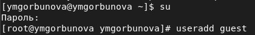
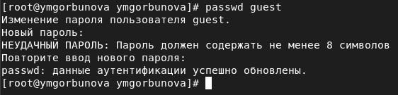
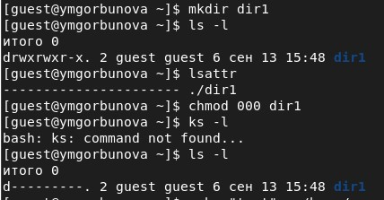
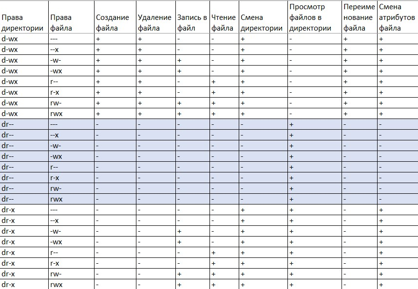
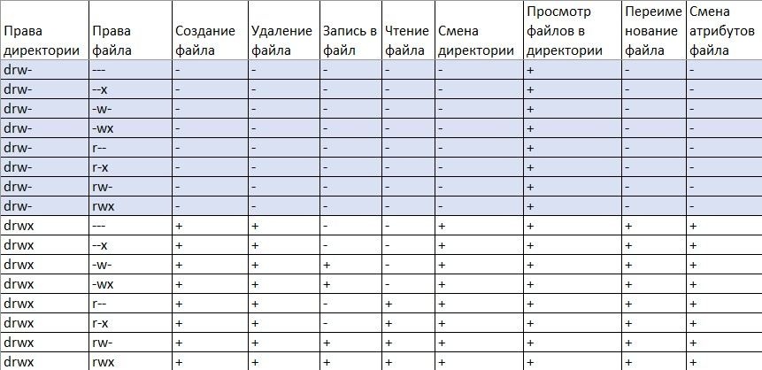

---
# Front matter
title: "Информационная безопасность. Отчет по лабораторной работе № 2"
subtitle: "Дискреционное разграничение прав в Linux. Основные атрибуты"
author: "Горбунова Ярослава Михайловна"
group: NFIbd-01-19
institute: RUDN University, Moscow, Russian Federation

# Generic otions
lang: ru-RU
toc-title: "Содержание"

# Bibliography
csl: pandoc/csl/gost-r-7-0-5-2008-numeric.csl

# Pdf output format
toc: true # Table of contents
toc_depth: 2
lof: true # List of figures
lot: true # List of tables
fontsize: 12pt
linestretch: 1.5
papersize: a4
documentclass: scrreprt
### Fonts
mainfont: PT Serif
romanfont: PT Serif
sansfont: PT Sans
monofont: PT Mono
mainfontoptions: Ligatures=TeX
romanfontoptions: Ligatures=TeX
sansfontoptions: Ligatures=TeX,Scale=MatchLowercase
monofontoptions: Scale=MatchLowercase,Scale=0.9
## Biblatex
biblatex: true
biblio-style: "gost-numeric"
biblatexoptions:
  - parentracker=true
  - backend=biber
  - hyperref=auto
  - language=auto
  - autolang=other*
  - citestyle=gost-numeric
## Misc options
indent: true
header-includes:
  - \linepenalty=10 # the penalty added to the badness of each line within a paragraph (no associated penalty node) Increasing the value makes tex try to have fewer lines in the paragraph.
  - \interlinepenalty=0 # value of the penalty (node) added after each line of a paragraph.
  - \hyphenpenalty=50 # the penalty for line breaking at an automatically inserted hyphen
  - \exhyphenpenalty=50 # the penalty for line breaking at an explicit hyphen
  - \binoppenalty=700 # the penalty for breaking a line at a binary operator
  - \relpenalty=500 # the penalty for breaking a line at a relation
  - \clubpenalty=150 # extra penalty for breaking after first line of a paragraph
  - \widowpenalty=150 # extra penalty for breaking before last line of a paragraph
  - \displaywidowpenalty=50 # extra penalty for breaking before last line before a display math
  - \brokenpenalty=100 # extra penalty for page breaking after a hyphenated line
  - \predisplaypenalty=10000 # penalty for breaking before a display
  - \postdisplaypenalty=0 # penalty for breaking after a display
  - \floatingpenalty = 20000 # penalty for splitting an insertion (can only be split footnote in standard LaTeX)
  - \raggedbottom # or \flushbottom
  - \usepackage{float} # keep figures where there are in the text
  - \floatplacement{figure}{H} # keep figures where there are in the text

---

# Цель работы
Получение практических навыков работы в консоли с атрибутами файлов, закрепление теоретических основ дискреционного разграничения доступа в современных системах с открытым кодом на базе ОС Linux [1].

# Выполнение лабораторной работы
Постарайтесь последовательно выполнить все пункты, занося ваши ответы на поставленные вопросы и замечания в отчёт [2].

1. В установленной при выполнении предыдущей лабораторной работы
операционной системе создайте учётную запись пользователя guest (использую учётную запись администратора) (@fig:1): useradd guest

{#fig:1 width=100%}

2. Задайте пароль для пользователя guest (использую учётную запись администратора) (@fig:2): passwd guest

{#fig:2 width=100%}

3. Войдите в систему от имени пользователя guest (@fig:3_4).

4. Определите директорию, в которой вы находитесь, командой pwd. Сравните её с приглашением командной строки. Определите, является ли она
вашей домашней директорией? Если нет, зайдите в домашнюю директорию (@fig:3_4). --Дирректория, в которой мы находимся совпадает с приглашением командной строки, но не является домашней дирректорией, поэтому переходим в домашний каталог.

{#fig:3_4 width=100%}

5. Уточните имя вашего пользователя командой whoami (@fig:5_6).

6. Уточните имя вашего пользователя, его группу, а также группы, куда входит пользователь, командой id. Выведенные значения uid, gidи др. запомните. Сравните вывод idс выводом команды groups (@fig:5_6). -- Вывод команды id дает больше информации о пользователе, в то время как команда groups дает информацию только о группах.

{#fig:5_6 width=100%}

7. Сравните полученную информацию об имени пользователя с данными,
выводимыми в приглашении командной строки. -- В приглашении командной строки фигурирует то же имя пользователя, которое получено при просмотре вывода команды id.

8. Просмотрите файл /etc/passwd командой: 

cat /etc/passwd

Найдите в нём свою учётную запись. Определите uid пользователя.
Определите gid пользователя. Сравните найденные значения с полученными в предыдущих пунктах  (@fig:8). -- Найденные значения полностью совпадают с полученными на предыдущих шагах.

Замечание: в случае, когда вывод команды не умещается на одном
экране монитора, используйте прокрутку вверх–вниз (удерживая клавишу shift, нажимайте page up и page down) либо программу grep в качестве фильтра для вывода только строк, содержащих определённые буквенные сочетания:

cat /etc/passwd | grep guest

{#fig:8 width=100%}

9. Определите существующие в системе директории командой (@fig:9)

ls -l /home/

Удалось ли вам получить список поддиректорий директории /home? Какие права установлены на директориях? -- Удалось получить список поддиректорий. На обеих установлены полные права для пользователя, не установлены права для остальных пользователей. 

{#fig:9 width=100%}

10. Проверьте, какие расширенные атрибуты установлены на поддиректориях, находящихся в директории /home (@fig:10), командой:

lsattr /home

Удалось ли вам увидеть расширенные атрибуты директории? Удалось ли вам увидеть расширенные атрибуты директорий других пользователей? -- Есть возможность увидеть расширенные атрибуты директории guest, но не удается увидеть расширенные атрибуты директорий других пользователей.

{#fig:10 width=100%}

11. Создайте в домашней директории поддиректорию dir1 командой

mkdir dir1

Определите командами ls -l и lsattr, какие права доступа и расширенные атрибуты были выставлены на директорию dir1 (@fig:11_12). -- На дирректорию были выставлены полные права доступа для пользователя и членов группы и права на чтение, исполнение для остальных пользователей. Никакие расширенные атрибуты не были выставлены.

12. Снимите с директории dir1 все атрибуты командой

chmod 000 dir1

и проверьте с её помощью правильность выполнения команды (@fig:11_12)

ls -l

{#fig:11_12 width=100%}

13. Попытайтесь создать в директории dir1 файл file1 командой

echo "test" > /home/guest/dir1/file1

Объясните, почему вы получили отказ в выполнении операции по созданию файла?
Оцените, как сообщение об ошибке отразилось на создании файла? -- Отказ получен в силу того, что всем пользователям, даже обладателя, ограничены действия по чтению, записи, исполнению с дирректорией. Файл действительно не был создан.

Проверьте командой

ls -l /home/guest/dir1

действительно ли файл file1 не находится внутри директории dir1 (@fig:13).

{#fig:13 width=100%}

14. Заполните таблицу 2.1 «Установленные права и разрешённые действия», выполняя действия от имени владельца директории (файлов), определив опытным путём, какие операции разрешены, а какие нет.
Если операция разрешена, занесите в таблицу знак «+», если не разрешена, знак «-» (@fig:14 - @fig:16).

Замечание 1: при заполнении табл. 2.1 рассматриваются не все атрибуты файлов и директорий, а лишь «первые три»: г, w, х, для «владельца».
Остальные атрибуты также важны (особенно при использовании доступа от имени разных пользователей, входящих в те или иные группы).
Проверка всех атрибутов при всех условиях значительно увеличила бы
таблицу: так 9 атрибутов на директорию и 9 атрибутов на файл дают
218 строк без учёта дополнительных атрибутов, плюс таблица была бы
расширена по количеству столбцов, так как все приведённые операции
необходимо было бы повторить ещё как минимум для двух пользователей: входящего в группу владельца файла и не входящего в неё.
После полного заполнения табл. 2.1 и анализа полученных данных нам
удалось бы выяснить, что заполнение её в таком виде излишне. Можно разделить большую таблицу на несколько малых независимых таблиц.
В данном примере предлагается рассмотреть 3+3атрибута, т.е. 26 = 64
варианта.

Замечание 2: в ряде действий при выполнении команды удаления файла
вы можете столкнуться с вопросом: «удалить защищённый от записи пустой обычный файл dir1/file1?» Обратите внимание, что наличие этого
вопроса не позволяет сделать правильный вывод о том, что файл можно удалить. В ряде случаев, при ответе «y» (да) на указанный вопрос,
возможно получить другое сообщение: «невозможно удалить dirl /file1:
Отказано в доступе».

{#fig:14 width=100%}

{#fig:15 width=100%}

{#fig:16 width=100%}

15. На основании заполненной таблицы определите те или иные минимально необходимые права для выполнения операций внутри директории
dir1, заполните табл. 2.2 (@fig:17).

{#fig:17  width=100%}

# Выводы
Получены практические навыки работы в консоли с атрибутами файлов, закреплены теоретические основы дискреционного разграничения доступа в современных системах с открытым кодом на базе ОС Linux.

# Список литературы
1. Задание к лабораторной работе № 2
2. Методические материалы курса
