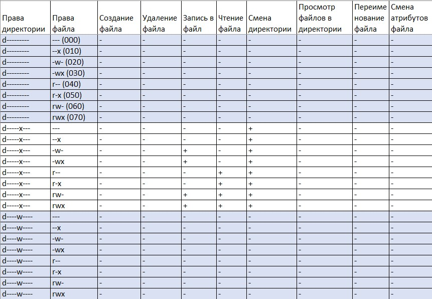

---
## Front matter
lang: ru-RU
title: Информационная безопасность. Лабораторная работа № 3 на тему "Дискреционное разграничение прав в Linux. Два пользователя"
author: Горбунова Ярослава Михайловна
group: NFIbd-01-19
institute: RUDN University, Moscow, Russian Federation

## Formatting
toc: false
slide_level: 2
theme: metropolis
header-includes: 
 - \metroset{progressbar=frametitle,sectionpage=progressbar,numbering=fraction}
 - '\makeatletter'
 - '\beamer@ignorenonframefalse'
 - '\makeatother'
aspectratio: 43
section-titles: true
---

# Содержание
* Цели и задачи
* Выполнение
* Результаты
* Список литературы

# Цели и задачи
Получение практических навыков работы в консоли с атрибутами файлов для групп пользователей

# Выполнение
## Выполнение

## Выполнение

## Выполнение

## Выполнение

## Выполнение

## Выполнение

## Выполнение

## Выполнение

# Результаты
Получены практические навыки работы в консоли с атрибутами файлов для групп пользователей

# Список литературы
1. Задание к лабораторной работе № 3
2. Методические материалы курса