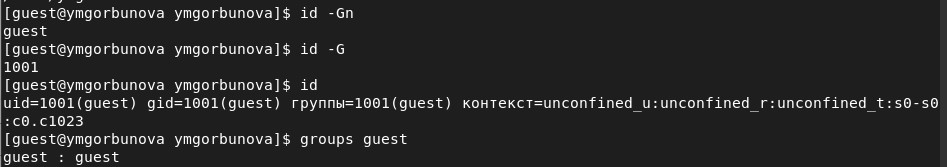
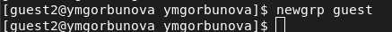
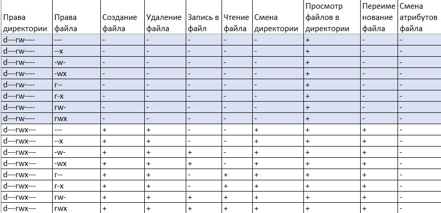

---
# Front matter
title: "Информационная безопасность. Отчет по лабораторной работе № 3"
subtitle: "Дискреционное разграничение прав в Linux. Два пользователя"
author: "Горбунова Ярослава Михайловна"
group: NFIbd-01-19
institute: RUDN University, Moscow, Russian Federation

# Generic otions
lang: ru-RU
toc-title: "Содержание"

# Bibliography
csl: pandoc/csl/gost-r-7-0-5-2008-numeric.csl

# Pdf output format
toc: true # Table of contents
toc_depth: 2
lof: true # List of figures
lot: true # List of tables
fontsize: 12pt
linestretch: 1.5
papersize: a4
documentclass: scrreprt
### Fonts
mainfont: PT Serif
romanfont: PT Serif
sansfont: PT Sans
monofont: PT Mono
mainfontoptions: Ligatures=TeX
romanfontoptions: Ligatures=TeX
sansfontoptions: Ligatures=TeX,Scale=MatchLowercase
monofontoptions: Scale=MatchLowercase,Scale=0.9
## Biblatex
biblatex: true
biblio-style: "gost-numeric"
biblatexoptions:
  - parentracker=true
  - backend=biber
  - hyperref=auto
  - language=auto
  - autolang=other*
  - citestyle=gost-numeric
## Misc options
indent: true
header-includes:
  - \linepenalty=10 # the penalty added to the badness of each line within a paragraph (no associated penalty node) Increasing the value makes tex try to have fewer lines in the paragraph.
  - \interlinepenalty=0 # value of the penalty (node) added after each line of a paragraph.
  - \hyphenpenalty=50 # the penalty for line breaking at an automatically inserted hyphen
  - \exhyphenpenalty=50 # the penalty for line breaking at an explicit hyphen
  - \binoppenalty=700 # the penalty for breaking a line at a binary operator
  - \relpenalty=500 # the penalty for breaking a line at a relation
  - \clubpenalty=150 # extra penalty for breaking after first line of a paragraph
  - \widowpenalty=150 # extra penalty for breaking before last line of a paragraph
  - \displaywidowpenalty=50 # extra penalty for breaking before last line before a display math
  - \brokenpenalty=100 # extra penalty for page breaking after a hyphenated line
  - \predisplaypenalty=10000 # penalty for breaking before a display
  - \postdisplaypenalty=0 # penalty for breaking after a display
  - \floatingpenalty = 20000 # penalty for splitting an insertion (can only be split footnote in standard LaTeX)
  - \raggedbottom # or \flushbottom
  - \usepackage{float} # keep figures where there are in the text
  - \floatplacement{figure}{H} # keep figures where there are in the text

---

# Цель работы
Получение практических навыков работы в консоли с атрибутами файлов для групп пользователей [1].

# Выполнение лабораторной работы
1. В установленной операционной системе создайте учётную запись пользователя guest (использую учётную запись администратора): useradd guest. Пользователь был создан в ходе лабораторной работы 2 [2].

2. Задайте пароль для пользователя guest (использую учётную запись ад-
министратора): passwd guest. Пароль пользователя был задан в ходе лабораторной работы 2.

3. Аналогично создайте второго пользователя guest2 (@fig:3).

{#fig:3 width=100%}

4. Добавьте пользователя guest2 в группу guest (@fig:4):

gpasswd -a guest2 guest

{#fig:4 width=100%}

5. Осуществите вход в систему от двух пользователей на двух разных консолях: guest на первой консоли и guest2 на второй консоли (@fig:5_1- @fig:5_2).

{#fig:5_1 width=100%}

{#fig:5_2 width=100%}

6. Для обоих пользователей командой pwd определите директорию, в которой вы находитесь (@fig:6_1- @fig:6_2). Сравните её с приглашениями командной строки. -- Выводы команды совпадают с приглашениями командной строки.

{#fig:6_1 width=100%}

{#fig:6_2 width=100%}

7. Уточните имя вашего пользователя, его группу, кто входит в неё
и к каким группам принадлежит он сам. Определите командами
groups guest и groups guest2, в какие группы входят пользователи guest и guest2 (@fig:7_1- @fig:7_2). Сравните вывод команды groups с выводом команд id -Gnи id -G. -- Выводы команды groups совпадают с выводами команд id -Gnи id -G. Для guest2 команда groups дает более полную информацию.

{#fig:7_1 width=100%}

{#fig:7_2 width=100%}

8. Сравните полученную информацию с содержимым файла /etc/group (@fig:8_1- @fig:8_2).
Просмотрите файл командой cat /etc/group

{#fig:8_1 width=100%}

{#fig:8_2 width=100%}

Полученная на предыдущих шагах информация совпадает с содержимым файла /etc/group.

9. От имени пользователя guest2 выполните регистрацию пользователя
guest2 в группе guest командой newgrp guest (@fig:9).

{#fig:9 width=100%}

10. От имени пользователя guest измените права директории /home/guest,
разрешив все действия для пользователей группы (@fig:10): chmod g+rwx /home/guest

{#fig:10 width=100%}

11. От имени пользователя guest снимите с директории /home/guest/dir1
все атрибуты командой 

chmod 000 dirl

и проверьте правильность снятия атрибутов (@fig:11).

{#fig:11 width=100%}

Меняя атрибуты у директории dir1 и файла file1 от имени пользователя guest и делая проверку от пользователя guest2, заполните табл. 3.1 (@fig:12-@fig:14),
определив опытным путём, какие операции разрешены, а какие нет. Если операция разрешена, занесите в таблицу знак «+», если не разрешена, знак «-».

{#fig:12 width=100%}

{#fig:13 width=100%}

{#fig:14 width=100%}

Сравните табл. 2.1 (из лабораторной работы № 2) и табл. 3.1. -- Таблицы практически полностью совпадают за исключением столбцов "Смена атрибутов файла". Для пользователя, входящего в группу, для действия получаем сообщение либо "Отказано в доступе", либо "Оерация не позволена" в зависимости от установленых прав на дирректорию для группы.

На основании заполненной таблицы определите те или иные минимально необходимые права для выполнения пользователем guest2 операций внутри директории dir1 и заполните табл. 3.2 (@fig:15).

{#fig:15  width=100%}

# Выводы
Получены практические навыки работы в консоли с атрибутами файлов для групп пользователей.

# Список литературы
1. Задание к лабораторной работе № 3
2. Методические материалы курса
