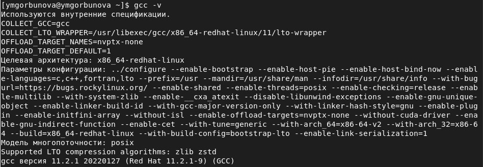
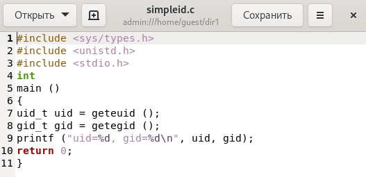
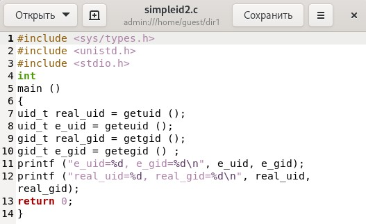
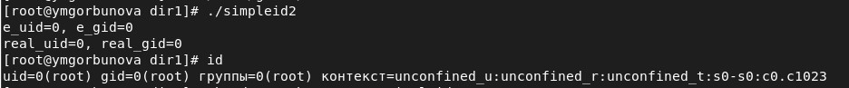
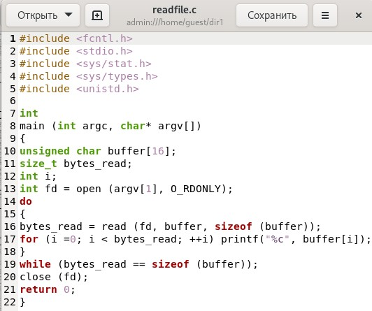
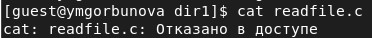
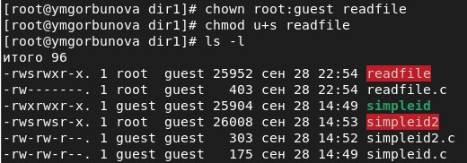
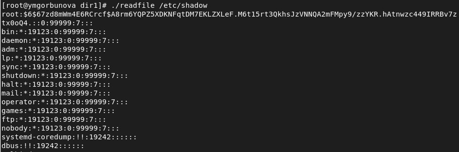
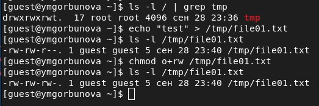

---
## Front matter
lang: ru-RU
title: Информационная безопасность. Лабораторная работа № 5 на тему "Дискреционное разграничение прав в Linux. Исследование влияния дополнительных атрибутов"
author: Горбунова Ярослава Михайловна
group: NFIbd-01-19
institute: RUDN University, Moscow, Russian Federation

## Formatting
toc: false
slide_level: 2
theme: metropolis
header-includes: 
 - \metroset{progressbar=frametitle,sectionpage=progressbar,numbering=fraction}
 - '\makeatletter'
 - '\beamer@ignorenonframefalse'
 - '\makeatother'
aspectratio: 43
section-titles: true
---

# Содержание
* Цели и задачи
* Выполнение
* Результаты
* Список литературы

# Цели и задачи
Изучение механизмов изменения идентификаторов, применения SetUID- и Sticky-битов. Получение практических навыков работы в консоли с дополнительными атрибутами. Рассмотрение работы механизма смены идентификатора процессов пользователей, а также влияние бита Sticky на запись и удаление файлов 

# Выполнение
## Выполнение

## Выполнение

## Выполнение

## Выполнение

## Выполнение
{#fig:simpleid2 width=100%}

## Выполнение

## Выполнение

## Выполнение

## Выполнение

## Выполнение

## Выполнение

## Выполнение

## Выполнение

## Выполнение

## Выполнение

## Выполнение

## Выполнение

# Результаты
Изучены механизмы изменения идентификаторов, применения
SetUID- и Sticky-битов. Получены практические навыки работы в консоли с дополнительными атрибутами. Рассмотрена работа механизма
смены идентификатора процессов пользователей, а также влияние бита
Sticky на запись и удаление файлов.

# Список литературы
1. Методические материалы курса