---
# Front matter
title: "Информационная безопасность. Отчет по лабораторной работе № 5" 
subtitle: "Дискреционное разграничение прав в Linux. Исследование влияния дополнительных атрибутов"
author: "Горбунова Ярослава Михайловна"
group: NFIbd-01-19
institute: RUDN University, Moscow, Russian Federation

# Generic otions
lang: ru-RU
toc-title: "Содержание"

# Bibliography
csl: pandoc/csl/gost-r-7-0-5-2008-numeric.csl

# Pdf output format
toc: true # Table of contents
toc_depth: 2
lof: true # List of figures
lot: true # List of tables
fontsize: 12pt
linestretch: 1.5
papersize: a4
documentclass: scrreprt
### Fonts
mainfont: PT Serif
romanfont: PT Serif
sansfont: PT Sans
monofont: PT Mono
mainfontoptions: Ligatures=TeX
romanfontoptions: Ligatures=TeX
sansfontoptions: Ligatures=TeX,Scale=MatchLowercase
monofontoptions: Scale=MatchLowercase,Scale=0.9
## Biblatex
biblatex: true
biblio-style: "gost-numeric"
biblatexoptions:
  - parentracker=true
  - backend=biber
  - hyperref=auto
  - language=auto
  - autolang=other*
  - citestyle=gost-numeric
## Misc options
indent: true
header-includes:
  - \linepenalty=10 # the penalty added to the badness of each line within a paragraph (no associated penalty node) Increasing the value makes tex try to have fewer lines in the paragraph.
  - \interlinepenalty=0 # value of the penalty (node) added after each line of a paragraph.
  - \hyphenpenalty=50 # the penalty for line breaking at an automatically inserted hyphen
  - \exhyphenpenalty=50 # the penalty for line breaking at an explicit hyphen
  - \binoppenalty=700 # the penalty for breaking a line at a binary operator
  - \relpenalty=500 # the penalty for breaking a line at a relation
  - \clubpenalty=150 # extra penalty for breaking after first line of a paragraph
  - \widowpenalty=150 # extra penalty for breaking before last line of a paragraph
  - \displaywidowpenalty=50 # extra penalty for breaking before last line before a display math
  - \brokenpenalty=100 # extra penalty for page breaking after a hyphenated line
  - \predisplaypenalty=10000 # penalty for breaking before a display
  - \postdisplaypenalty=0 # penalty for breaking after a display
  - \floatingpenalty = 20000 # penalty for splitting an insertion (can only be split footnote in standard LaTeX)
  - \raggedbottom # or \flushbottom
  - \usepackage{float} # keep figures where there are in the text
  - \floatplacement{figure}{H} # keep figures where there are in the text

---

# Цель работы
Изучение механизмов изменения идентификаторов, применения SetUID- и Sticky-битов. Получение практических навыков работы в консоли с дополнительными атрибутами. Рассмотрение работы механизма смены идентификатора процессов пользователей, а также влияние бита Sticky на запись и удаление файлов [1].  

# Теоретическое введение
## Подготовка лабораторного стенда
Помимо прав администратора для выполнения части заданий потребуются средства разработки приложений. В частности, при подготовке стенда
следует убедиться, что в системе установлен компилятор gcc (для этого, например, можно ввести команду gcc -v (@fig:1)). Если же gcc не установлен, то его
необходимо установить, например, командой

yum install gcc

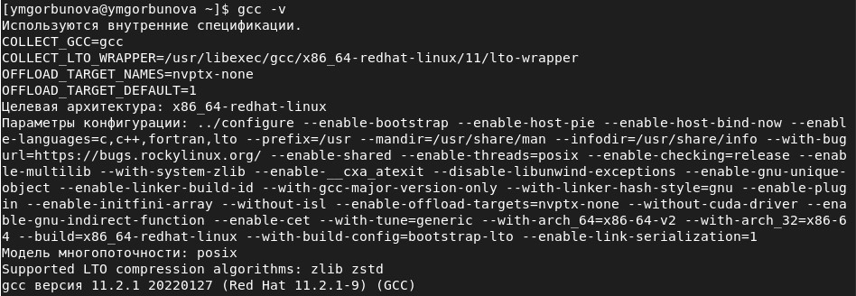{#fig:1 width=100%}

которая определит зависимости и установит следующие пакеты: gcc, cloogppl, срр, glibc-devel, glibc-headers, kernel-headers, libgomp, ppl, cloog-ppl,
срр, gcc, glibc-devel, glibc-headers, kernel-headers, libgomp, libstdc++-devel,
mpfr, ppl, glibc, glibc-common, libgcc, libstdc++.

Файловая система, где располагаются домашние директории и файлы
пользователей (в частности, пользователя guest), не должна быть смонтирована с опцией nosuid.

Так как программы с установленным битом SetUID могут представлять
большую брешь в системе безопасности, в современных системах используются дополнительные механизмы защиты. Проследите, чтобы система
защиты SELinux не мешала выполнению заданий работы. Если вы не знаете, что это такое, просто отключите систему запретов до очередной перезагрузки системы командой

setenforce 0

После этого команда getenforce должна выводить Permissive (@fig:2). В этой
работе система SELinux рассматриваться не будет.

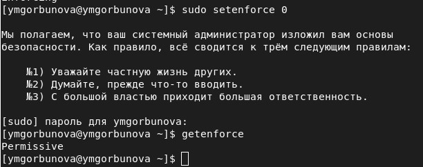{#fig:2 width=100%}

## Компилирование программ
Для выполнения четвёртой части задания вам потребуются навыки программирования, а именно, умение компилировать простые программы, написанные на языке С (С++), используя интерфейс CLI.

Само по себе создание программ не относится к теме, по которой выполняется работа, а является вспомогательной частью, позволяющей увидеть, как реализуются на практике те или иные механизмы дискреционного
разграничения доступа. Если при написании (или исправлении существующих) скриптов на bash-e у большинства системных администраторов не
возникает проблем, то процесс компилирования, как показывает практика,
вызывает необоснованные затруднения.

Компиляторы, доступные в Linux-системах, являются частью коллекции GNU-компиляторов, известной как GCC (GNU Compiller Collection,
подробнее см. http://gcc.gnu.org). В неё входят компиляторы языков
С, С++, Java, Objective-C, Fortran и Chill. Будем использовать лишь первые
два.

Компилятор языка С называется gcc. Компилятор языка С++ называется
g++ и запускается с параметрами почти так же, как gcc.
Проверить это можно следующими командами:

whereis gcc
whereis g++

Первый шаг заключается в превращении исходных файлов в объектный
код:
gcc -c file.с

В случае успешного выполнения команды (отсутствие ошибок в коде)
полученный объектный файл будет называться file.о.

Объектные файлы невозможно запускать и использовать, поэтому после
компиляции для получения готовой программы объектные файлы необходимо скомпоновать. Компоновать можно один или несколько файлов. В случае использования хотя бы одного из файлов, написанных на С++, компоновка производится с помощью компилятора g++. Строго говоря, это тоже
не вполне верно. Компоновка объектного кода, сгенерированного чем бы то
ни было (хоть вручную), производится линкером ld, g++ его просто вызывает изнутри. Если же все файлы написаны на языке С, нужно использовать
компилятор gcc.

Например, так:
gcc -o program file.o

В случае успешного выполнения команды будет создана программа
program (исполняемый файл формата ELF с установленным атрибутом +х).

Компилирование — это процесс. Компилятор gcc (g++) имеет множество параметров, влияющих на процесс компиляции. Он поддерживает различные режимы оптимизации, выбор платформы назначения и пр.

Также возможно использование make-файлов (Makefile) с помощью
утилиты make для упрощения процесса компиляции.

Такое решение подойдёт лишь для простых случаев. Если говорить про
пример выше, то компилирование одного файла из двух шагов можно сократить вообще до одного, например:
gcc file.c

В этом случае готовая программа будет иметь называние a.out.

Механизм компилирования программ в данной работе не мог быть не
рассмотрен потому, что использование программ, написанных на bash, для
изучения SetUID- и SetGID- битов, не представляется возможным. Связано
это с тем, что любая bash-программа интерпретируется в процессе своего
выполнения, т.е. существует сторонняя программа-интерпретатор, которая
выполняет считывание файла сценария и выполняет его последовательно.
Сам интерпретатор выполняется с правами пользователя, его запустившего,
а значит, и выполняемая программа использует эти права.

При этом интерпретатору абсолютно всё равно, установлены SetUID-,
SetGID-биты у текстового файла сценария, атрибут разрешения запуска «x»
или нет. Важно, чтобы был установлен лишь атрибут, разрешающий чтение
«r».

Также не важно, был ли вызван интерпретатор из командной строки
(запуск файла, как bash file1.sh), либо внутри файла была указана строчка
#!/bin/bash.

Логично спросить: если установление SetUID- и SetGID- битов на сценарий не приводит к нужному результату как с исполняемыми файлами,
то что мешает установить эти биты на сам интерпретатор? Ничего не мешает, только их установление приведёт к тому, что, так как владельцем
/bin/bash является root:
ls -l /bin/bash
все сценарии, выполняемые с использованием /bin/bash, будут иметь возможности суперпользователя — совсем не тот результат, который хотелось
бы видеть.

Если сомневаетесь в выше сказанном, создайте простой файл progl.sh
следующего содержания:
#!/bin/bash
/usr/bin/id /usr/bin/whoami
и попробуйте поменять его атрибуты в различных конфигурациях.

Подход вида: сделать копию /bin/bash, для нее chown user:users и
потом SUID также плох, потому что это позволит запускать любые команды
от пользователя user.

# Выполнение лабораторной работы
## Создание программы
1. Войдите в систему от имени пользователя guest.

2. Создайте программу simpleid.c (@fig:2_5, @fig:simpleid):

        #include <sys/types.h>

        #include <unistd.h>

        #include <stdio.h>

        int

        main ()

        {

        uid_t uid = geteuid ();

        gid_t gid = getegid ();

        printf ("uid=%d, gid=%d\n", uid, gid);

        return 0;

        }

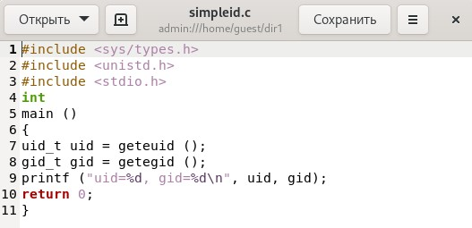{#fig:simpleid width=100%}

3. Скомплилируйте программу и убедитесь, что файл программы создан (@fig:2_5):
gcc simpleid.c -o simpleid

4. Выполните программу simpleid (@fig:2_5):
./simpleid

5. Выполните системную программу id (@fig:2_5):
id и сравните полученный вами результат с данными предыдущего пункта
задания.

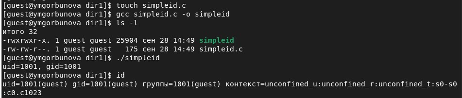{#fig:2_5 width=100%}

6. Усложните программу, добавив вывод действительных идентификаторов (@fig:6_7,  @fig:simpleid2):

        #include <sys/types.h>

        #include <unistd.h>

        #include <stdio.h>

        int

        main ()

        {

        uid_t real_uid = getuid ();

        uid_t e_uid = geteuid ();

        gid_t real_gid = getgid ();

        gid_t e_gid = getegid () ;

        printf ("e_uid=%d, e_gid=%d\n", e_uid, e_gid);

        printf ("real_uid=%d, real_gid=%d\n", real_uid, real_gid);

        return 0;

        }

Получившуюся программу назовите simpleid2.c.

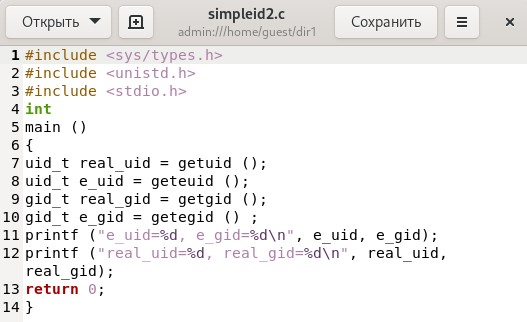{#fig:simpleid2 width=100%}

7. Скомпилируйте и запустите simpleid2.c (@fig:6_7):

gcc simpleid2.c -o simpleid2

./simpleid2

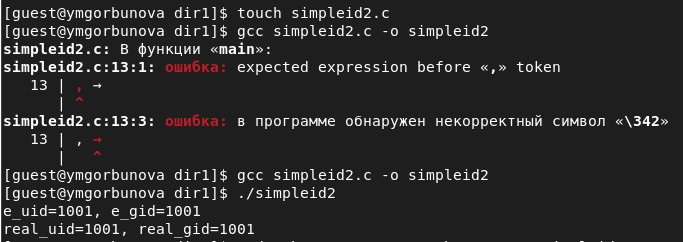{#fig:6_7 width=100%}

8. От имени суперпользователя выполните команды (@fig:8_10):

chown root:guest /home/guest/simpleid2

chmod u+s /home/guest/simpleid2

9. Используйте sudo или повысьте временно свои права с помощью su.
Поясните, что делают эти команды (@fig:8_10). -- Первая команда меняет владельца файла на root, вторая - устанавливает UID-бит.

10. Выполните проверку правильности установки новых атрибутов и смены
владельца файла simpleid2 (@fig:8_10):
ls -l simpleid2

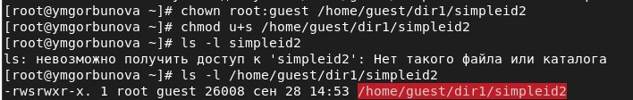{#fig:8_10 width=100%}

11. Запустите simpleid2 и id (@fig:11):

./simpleid2

id

Сравните результаты. -- Результаты полностью совпали.

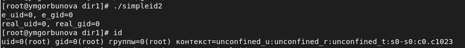{#fig:11 width=100%}

12. Проделайте тоже самое относительно SetGID-бита (@fig:12).

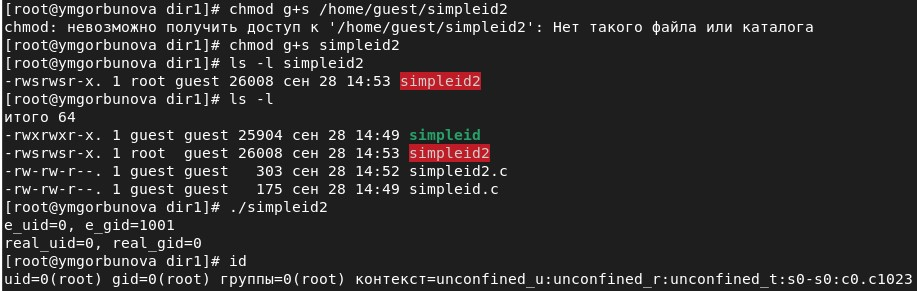{#fig:12 width=100%}

13. Создайте программу readfile.c (@fig:readfile):

        #include <fcntl.h>

        #include <stdio.h>

        #include <sys/stat.h>

        #include <sys/types.h>

        #include <unistd.h>

        int

        main (int argc, char* argv[])

        {

        unsigned char buffer[16];

        size_t bytes_read;

        int i;

        int fd = open (argv[1], O_RDONLY);

        do

        {

        bytes_read = read (fd, buffer, sizeof (buffer));

        for (i =0; i < bytes_read; ++i) printf("%c", buffer[i]);

        }

        while (bytes_read == sizeof (buffer));

        close (fd);

        return 0;

        }

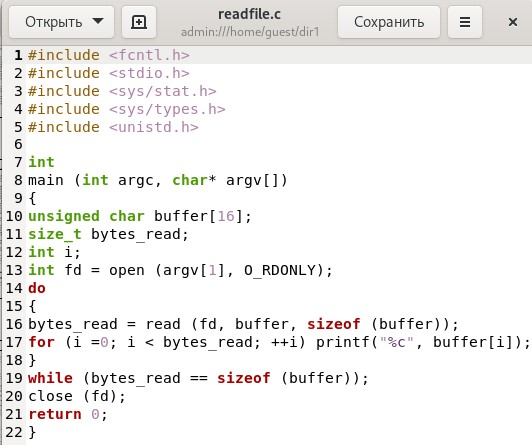{#fig:readfile width=100%}

14. Откомпилируйте её (@fig:14).
gcc readfile.c -o readfile

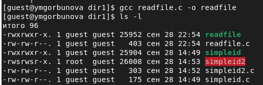{#fig:14 width=100%}

15. Смените владельца у файла readfile.c (или любого другого текстового
файла в системе) и измените права так, чтобы только суперпользователь
(root) мог прочитать его, a guest не мог (@fig:15).

{#fig:15 width=100%}

16. Проверьте, что пользователь guest не может прочитать файл readfile.c (@fig:16).

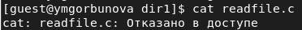{#fig:16 width=100%}

17. Смените у программы readfile владельца и установите SetU’D-бит (@fig:17).

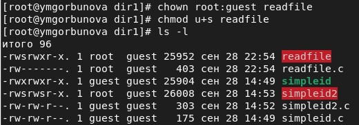{#fig:17 width=100%}

18. Проверьте, может ли программа readfile прочитать файл readfile.c (@fig:18)? -- Программа может прочитать файл.

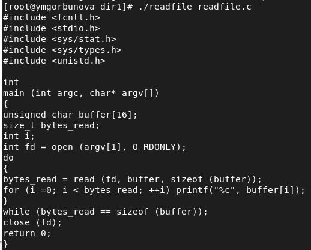{#fig:18 width=100%}

19. Проверьте, может ли программа readfile прочитать файл /etc/shadow (@fig:19)? -- Программа может прочитать файл.
Отразите полученный результат и ваши объяснения в отчёте.

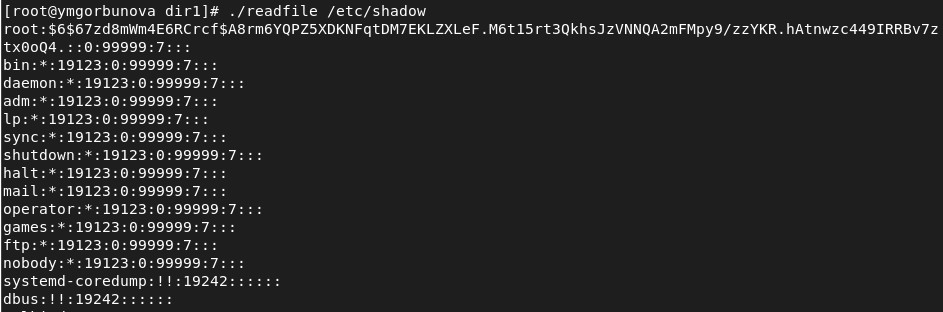{#fig:19 width=100%}

## Исследование Sticky-бита
1. Выясните, установлен ли атрибут Sticky на директории /tmp, для чего
выполните команду (@fig:s1_3)
ls -l / | grep tmp

2. От имени пользователя guest создайте файл file01.txt в директории /tmp
со словом test (@fig:s1_3):
echo "test" > /tmp/file01.txt

3. Просмотрите атрибуты у только что созданного файла и разрешите чтение и запись для категории пользователей «все остальные» (@fig:s1_3):

ls -l /tmp/file01.txt

chmod o+rw /tmp/file01.txt

ls -l /tmp/file01.txt

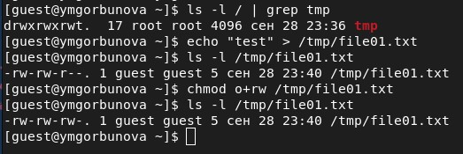{#fig:s1_3 width=100%}

4. От пользователя guest2 (не являющегося владельцем) попробуйте прочитать файл /tmp/file01.txt (@fig:s4_8):
cat /tmp/file01.txt

5. От пользователя guest2 попробуйте дозаписать в файл
/tmp/file01.txt слово test2 командой (@fig:s4_8)

echo "test2" >> /tmp/file01.txt

Удалось ли вам выполнить операцию? -- Удалось.

6. Проверьте содержимое файла командой (@fig:s4_8)
cat /tmp/file01.txt

7. От пользователя guest2 попробуйте записать в файл /tmp/file01.txt
слово test3, стерев при этом всю имеющуюся в файле информацию командой (@fig:s4_8)

echo "test3" > /tmp/file01.txt

Удалось ли вам выполнить операцию? -- Удалось.

8. Проверьте содержимое файла командой (@fig:s4_8)
cat /tmp/file01.txt

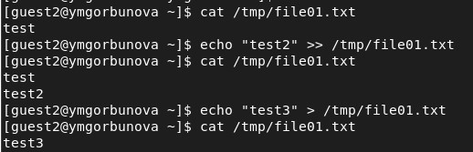{#fig:s4_8 width=100%}

9. От пользователя guest2 попробуйте удалить файл /tmp/file01.txt командой (@fig:s9_14)
rm /tmp/file01.txt

Удалось ли вам удалить файл? -- Не удалось.

10. Повысьте свои права до суперпользователя следующей командой (@fig:s9_14)
su -
и выполните после этого команду, снимающую атрибут t(Sticky-бит) с
директории /tmp:
chmod -t /tmp

11. Покиньте режим суперпользователя командой (@fig:s9_14)
exit

12. От пользователя guest2 проверьте, что атрибута t у директории /tmp
нет (@fig:s9_14):
ls -l / | grep tmp

13. Повторите предыдущие шаги (@fig:s9_14). Какие наблюдаются изменения? -- Удается выполнить удаление файла.

14. Удалось ли вам удалить файл от имени пользователя, не являющегося
его владельцем? Ваши наблюдения занесите в отчёт (@fig:s9_14). -- Удается выполнить удаление файла.

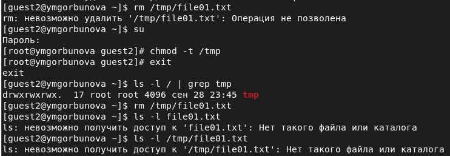{#fig:s9_14 width=100%}

15. Повысьте свои права до суперпользователя и верните атрибут t на директорию /tmp (@fig:s15):

su -

chmod +t /tmp

exit

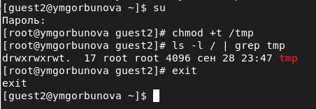{#fig:s15 width=100%}

# Выводы
Изучены механизмы изменения идентификаторов, применения
SetUID- и Sticky-битов. Получены практические навыки работы в консоли с дополнительными атрибутами. Рассмотрена работа механизма
смены идентификатора процессов пользователей, а также влияние бита
Sticky на запись и удаление файлов.

# Список литературы
1. Методические материалы курса
