---
## Front matter
lang: ru-RU
title: Информационная безопасность. Лабораторная работа № 6 на тему "Мандатное разграничение прав в Linux"
author: Горбунова Ярослава Михайловна
group: NFIbd-01-19
institute: RUDN University, Moscow, Russian Federation

## Formatting
toc: false
slide_level: 2
theme: metropolis
header-includes: 
 - \metroset{progressbar=frametitle,sectionpage=progressbar,numbering=fraction}
 - '\makeatletter'
 - '\beamer@ignorenonframefalse'
 - '\makeatother'
aspectratio: 43
section-titles: true
---

# Содержание
* Цели и задачи
* Выполнение
* Результаты
* Список литературы

# Цели и задачи
Развить навыки администрирования ОС Linux. Получить первое практическое знакомство с технологией SELinux.
Проверить работу SELinx на практике совместно с веб-сервером
Apache

# Выполнение
## Выполнение
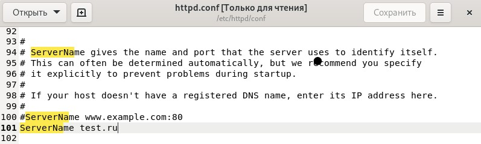

## Выполнение
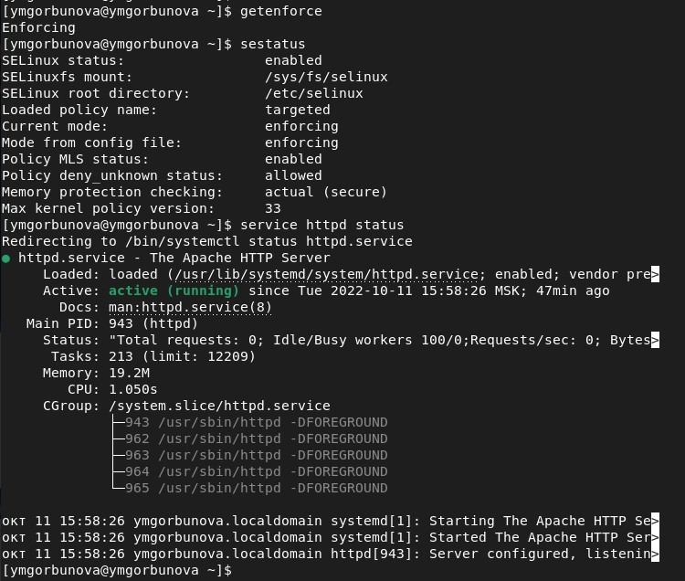

## Выполнение

## Выполнение
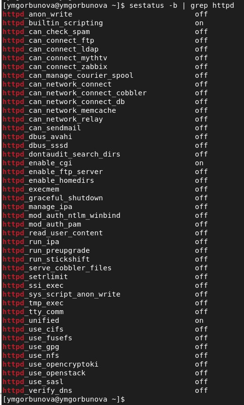

## Выполнение
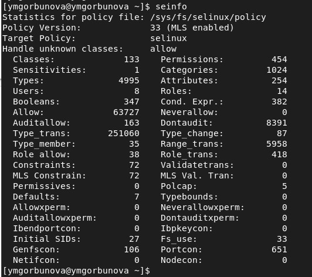

## Выполнение
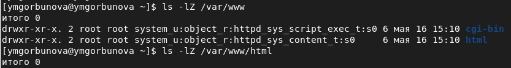

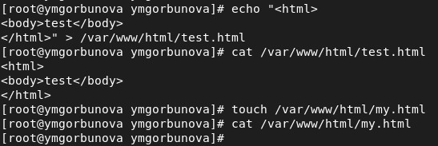

## Выполнение
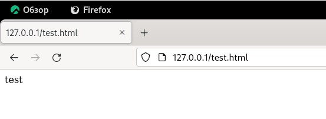

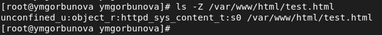

## Выполнение
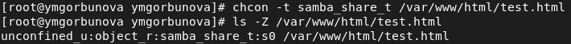

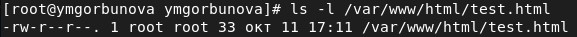

## Выполнение
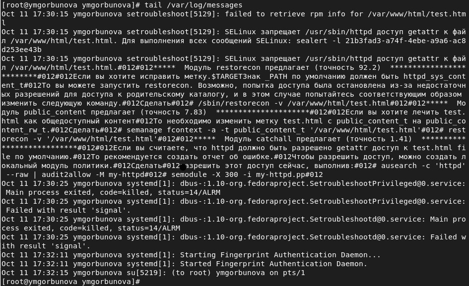

## Выполнение
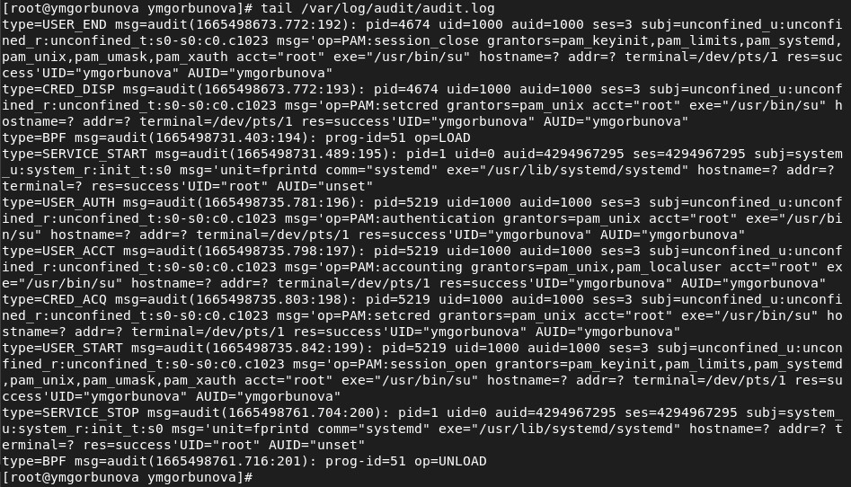

## Выполнение
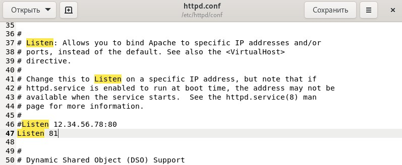

## Выполнение
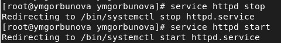

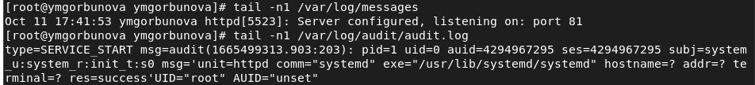

## Выполнение
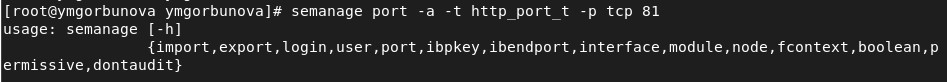

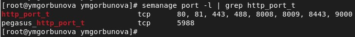

## Выполнение
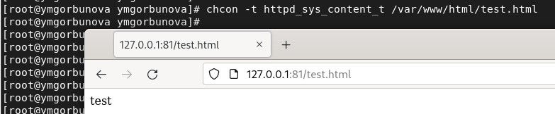

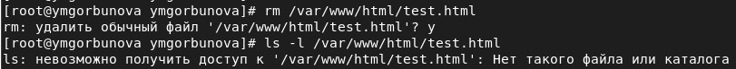

# Результаты
Развиты навыки администрирования ОС Linux. Получено первое практическое знакомство с технологией SELinux.
Проверена работа SELinx на практике совместно с веб-сервером
Apache

# Список литературы
1. Методические материалы курса