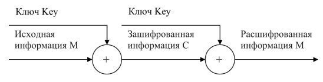
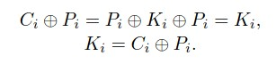
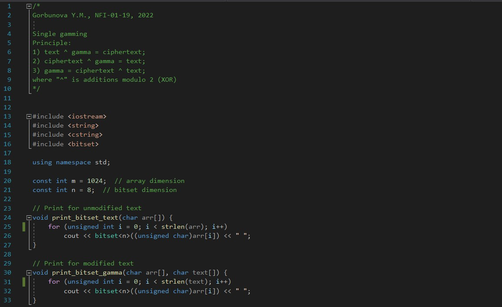
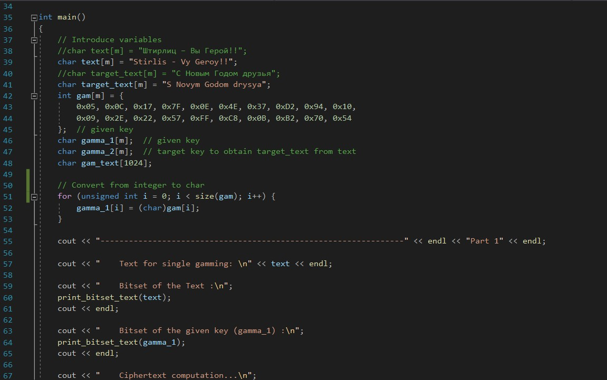
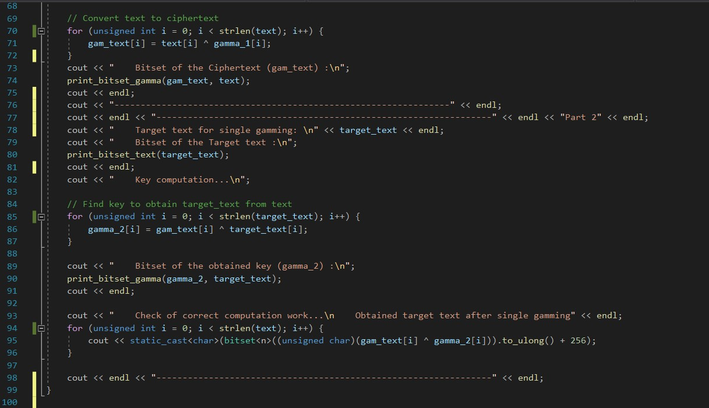
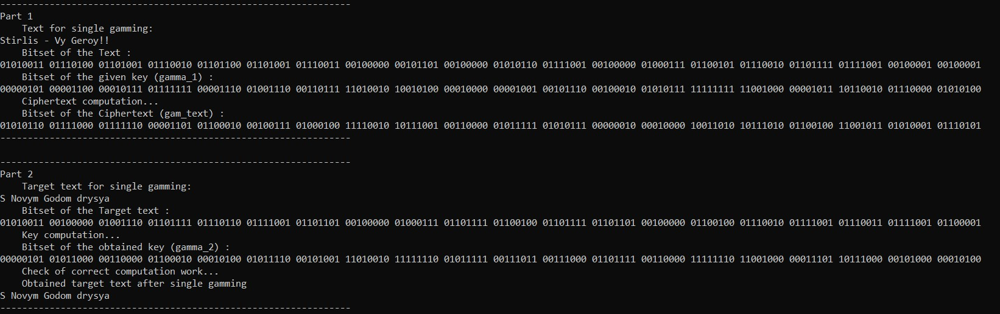

---
## Front matter
lang: ru-RU
title: Информационная безопасность. Лабораторная работа № 7 на тему "Элементы криптографии. Однократное гаммирование"
author: Горбунова Ярослава Михайловна
group: NFIbd-01-19
institute: RUDN University, Moscow, Russian Federation

## Formatting
toc: false
slide_level: 2
theme: metropolis
header-includes: 
 - \metroset{progressbar=frametitle,sectionpage=progressbar,numbering=fraction}
 - '\makeatletter'
 - '\beamer@ignorenonframefalse'
 - '\makeatother'
aspectratio: 43
section-titles: true
---

# Содержание
* Цели и задачи
* Выполнение
* Результаты
* Список литературы

# Цели и задачи
Освоить на практике применение режима однократного гаммирования

# Выполнение
## Выполнение

## Выполнение

где C_i — i-й символ получившегося зашифрованного послания, P_i — i-й
символ открытого текста, K_i — i-й символ ключа, i = 1, m. Размерности
открытого текста и ключа должны совпадать, и полученный шифротекст
будет такой же длины

## Выполнение
{#fig:1 width=100%}

## Выполнение
{#fig:2 width=100%}

## Выполнение
{#fig:3 width=100%}

## Выполнение
{#fig:4 width=100%}

# Результаты
Освоено на практике применение режима однократного гаммирования

# Список литературы
1. Методические материалы курса
