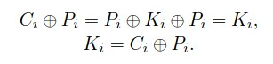
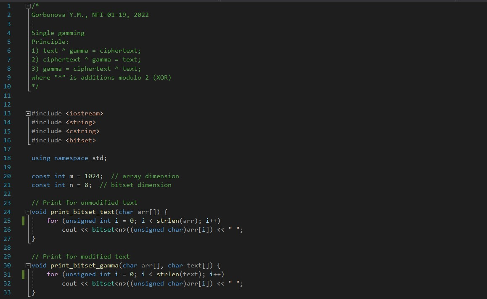
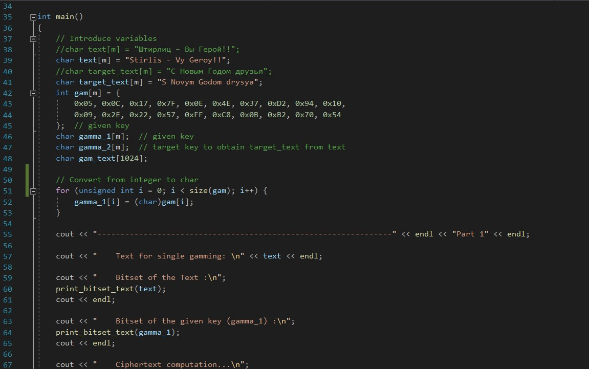
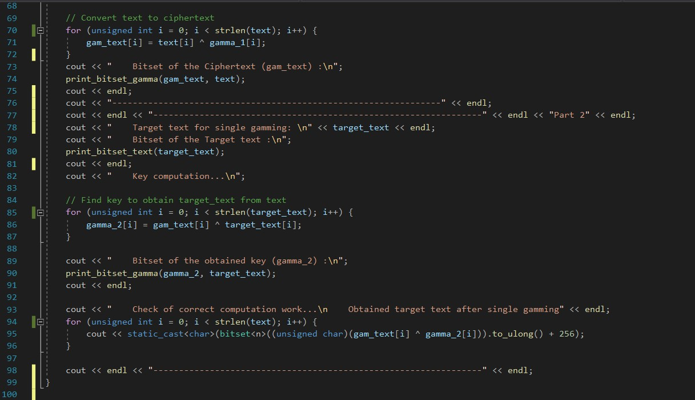

---
# Front matter
title: "Информационная безопасность. Отчет по лабораторной работе №7"
subtitle: "Элементы криптографии. Однократное гаммирование"
author: "Горбунова Ярослава Михайловна"
group: NFIbd-01-19
institute: RUDN University, Moscow, Russian Federation

# Generic otions
lang: ru-RU
toc-title: "Содержание"

# Bibliography
csl: pandoc/csl/gost-r-7-0-5-2008-numeric.csl

# Pdf output format
toc: true # Table of contents
toc_depth: 2
lof: true # List of figures
lot: true # List of tables
fontsize: 12pt
linestretch: 1.5
papersize: a4
documentclass: scrreprt
### Fonts
mainfont: PT Serif
romanfont: PT Serif
sansfont: PT Sans
monofont: PT Mono
mainfontoptions: Ligatures=TeX
romanfontoptions: Ligatures=TeX
sansfontoptions: Ligatures=TeX,Scale=MatchLowercase
monofontoptions: Scale=MatchLowercase,Scale=0.9
## Biblatex
biblatex: true
biblio-style: "gost-numeric"
biblatexoptions:
  - parentracker=true
  - backend=biber
  - hyperref=auto
  - language=auto
  - autolang=other*
  - citestyle=gost-numeric
## Misc options
indent: true
header-includes:
  - \linepenalty=10 # the penalty added to the badness of each line within a paragraph (no associated penalty node) Increasing the value makes tex try to have fewer lines in the paragraph.
  - \interlinepenalty=0 # value of the penalty (node) added after each line of a paragraph.
  - \hyphenpenalty=50 # the penalty for line breaking at an automatically inserted hyphen
  - \exhyphenpenalty=50 # the penalty for line breaking at an explicit hyphen
  - \binoppenalty=700 # the penalty for breaking a line at a binary operator
  - \relpenalty=500 # the penalty for breaking a line at a relation
  - \clubpenalty=150 # extra penalty for breaking after first line of a paragraph
  - \widowpenalty=150 # extra penalty for breaking before last line of a paragraph
  - \displaywidowpenalty=50 # extra penalty for breaking before last line before a display math
  - \brokenpenalty=100 # extra penalty for page breaking after a hyphenated line
  - \predisplaypenalty=10000 # penalty for breaking before a display
  - \postdisplaypenalty=0 # penalty for breaking after a display
  - \floatingpenalty = 20000 # penalty for splitting an insertion (can only be split footnote in standard LaTeX)
  - \raggedbottom # or \flushbottom
  - \usepackage{float} # keep figures where there are in the text
  - \floatplacement{figure}{H} # keep figures where there are in the text

---

# Цель работы
Освоить на практике применение режима однократного гаммирования [1].

# Указание к работе
Предложенная Г. С. Вернамом так называемая «схема однократного использования (гаммирования)» (@fig:scheme) является простой, но надёжной схемой шифрования данных.
Гаммирование представляет собой наложение (снятие) на открытые (зашифрованные) данные последовательности элементов других данных, полученной с помощью некоторого криптографического алгоритма, для получения зашифрованных (открытых) данных. Иными словами, наложение
гаммы — это сложение её элементов с элементами открытого (закрытого)
текста по некоторому фиксированному модулю, значение которого представляет собой известную часть алгоритма шифрования.
В соответствии с теорией криптоанализа, если в методе шифрования используется однократная вероятностная гамма (однократное гаммирование)
той же длины, что и подлежащий сокрытию текст, то текст нельзя раскрыть.
Даже при раскрытии части последовательности гаммы нельзя получить информацию о всём скрываемом тексте.
Наложение гаммы по сути представляет собой выполнение операции
сложения по модулю 2 (XOR) (обозначаемая знаком ⊕) между элементами
гаммы и элементами подлежащего сокрытию текста. Напомним, как работает операция XOR над битами: 0⊕0 = 0, 0⊕1 = 1, 1⊕0 = 1, 1⊕1 = 0.
Такой метод шифрования является симметричным, так как двойное прибавление одной и той же величины по модулю 2 восстанавливает исходное

{#fig:scheme width=100%}

значение, а шифрование и расшифрование выполняется одной и той же программой.
Если известны ключ и открытый текст, то задача нахождения шифротекста заключается в применении к каждому символу открытого текста следующего правила (@fig:71):

{#fig:71 width=100%}

где C_i — i-й символ получившегося зашифрованного послания, P_i — i-й
символ открытого текста, K_i — i-й символ ключа, i = 1, m. Размерности
открытого текста и ключа должны совпадать, и полученный шифротекст
будет такой же длины.
Если известны шифротекст и открытый текст, то задача нахождения
ключа решается также в соответствии с (@fig:71), а именно, обе части равенства необходимо сложить по модулю 2 с P_i (@fig:72):

{#fig:72 width=100%}

Открытый текст имеет символьный вид, а ключ — шестнадцатеричное
представление. Ключ также можно представить в символьном виде, воспользовавшись таблицей ASCII-кодов.

К. Шеннон доказал абсолютную стойкость шифра в случае, когда однократно используемый ключ, длиной, равной длине исходного сообщения,
является фрагментом истинно случайной двоичной последовательности с
равномерным законом распределения. Криптоалгоритм не даёт никакой информации об открытом тексте: при известном зашифрованном сообщении
C все различные ключевые последовательности K возможны и равновероятны, а значит, возможны и любые сообщения P .

Необходимые и достаточные условия абсолютной стойкости шифра:
– полная случайность ключа;
– равенство длин ключа и открытого текста;
– однократное использование ключа.

Рассмотрим пример.

Ключ Центра:

05 0C 17 7F 0E 4E 37 D2 94 10 09 2E 22 57 FF C8 0B B2 70 54

Сообщение Центра:

Штирлиц – Вы Герой!!

D8 F2 E8 F0 EB E8 F6 20 2D 20 C2 FB 20 C3 E5 F0 EE E9 21 21

Зашифрованный текст, находящийся у Мюллера:

DD FE FF 8F E5 A6 C1 F2 B9 30 CB D5 02 94 1A 38 E5 5B 51 75

Дешифровальщики попробовали ключ:

05 0C 17 7F 0E 4E 37 D2 94 10 09 2E 22 55 F4 D3 07 BB BC 54

и получили текст:

D8 F2 E8 F0 EB E8 F6 20 2D 20 C2 FB 20 C1 EE EB E2 E0 ED 21

Штирлиц - Вы Болван!

Другие ключи дадут лишь новые фразы, пословицы, стихотворные
строфы, словом, всевозможные тексты заданной длины.

# Выполнение лабораторной работы
Нужно подобрать ключ, чтобы получить сообщение «С Новым Годом,
друзья!». Требуется разработать приложение, позволяющее шифровать и
дешифровать данные в режиме однократного гаммирования. Приложение
должно:
1. Определить вид шифротекста при известном ключе и известном открытом тексте.
2. Определить ключ, с помощью которого шифротекст может быть преобразован в некоторый фрагмент текста, представляющий собой один из
возможных вариантов прочтения открытого текста.

Для выполнения работы была написана программа (@fig:1 - @fig:4) с помощью языка программирования С++, которая получает на вход открытый текст "Stirlis - Vy Geroy!!" и ключ "05 0C 17 7F 0E 4E 37 D2 94 10 09 2E 22 57 FF C8 0B B2 70 54", затем шифрует открытый текст методом однократного гаммирования и получает шифротекст. После этого методом сложения по модулю 2 или дешифровки методом однократного гаммирования определяет ключ, с помощью которого из полученного шифротекста можно получить целевой фрагмент текста, указанный в задании, "S Novym Godom drysya" (в данном сообщении были убраны запятая и восклицательный знак, чтобы добиться одинаковой размерности открытого и целевого текста, также сообщения транскрипированы на латиницу).

{#fig:1 width=100%}

{#fig:2 width=100%}

{#fig:3 width=100%}

{#fig:4 width=100%}

## Контрольные вопросы
1. Поясните смысл однократного гаммирования. -- Дан открытый текст и ключ для шифрования открытого текста, с помощью клуча можно как шифровать открытый текст для получения шифротекста, так и дешифровать шифротекст для получения открытого текста.

2. Перечислите недостатки однократного гаммирования. -- Необходимость иметь огромные объемы данных, которые можно было бы использовать в качестве гаммы.

3. Перечислите преимущества однократного гаммирования. -- В соответствии с теорией криптоанализа, если в методе шифрования используется однократная вероятностная гамма (однократное гаммирование)
той же длины, что и подлежащий сокрытию текст, то текст нельзя раскрыть.
Даже при раскрытии части последовательности гаммы нельзя получить информацию о всём скрываемом тексте.

4. Почему длина открытого текста должна совпадать с длиной ключа? -- Потому что в данном методе для каждого символа открытого текста предполагается символ ключа, наложение которорого приводит к шифровке символа открытого текста.

5. Какая операция используется в режиме однократного гаммирования, назовите её особенности? -- Сложения по модулю 2 (XOR). Метод шифрования является симметричным, так как двойное при-
бавление одной и той же величины по модулю 2 восстанавливает исходное значение, а шифрование и расшифрование выполняется одной и той же программой.

6. Как по открытому тексту и ключу получить шифротекст? -- Шифротекст = открытый текст XOR ключ.

7. Как по открытому тексту и шифротексту получить ключ? -- Ключ = открытый текст XOR шифротекст.

8. В чем заключаются необходимые и достаточные условия абсолютной стойкости шифра? -- Необходимые и достаточные условия абсолютной стойкости шифра: полная случайность ключа; равенство длин ключа и открытого текста; однократное использование ключа.

# Выводы
Освоено на практике применение режима однократного гаммирования.

# Список литературы
1. Методические материалы курса
