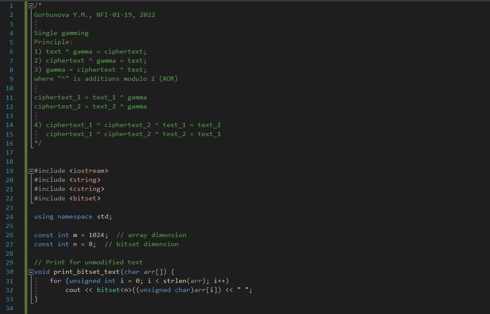
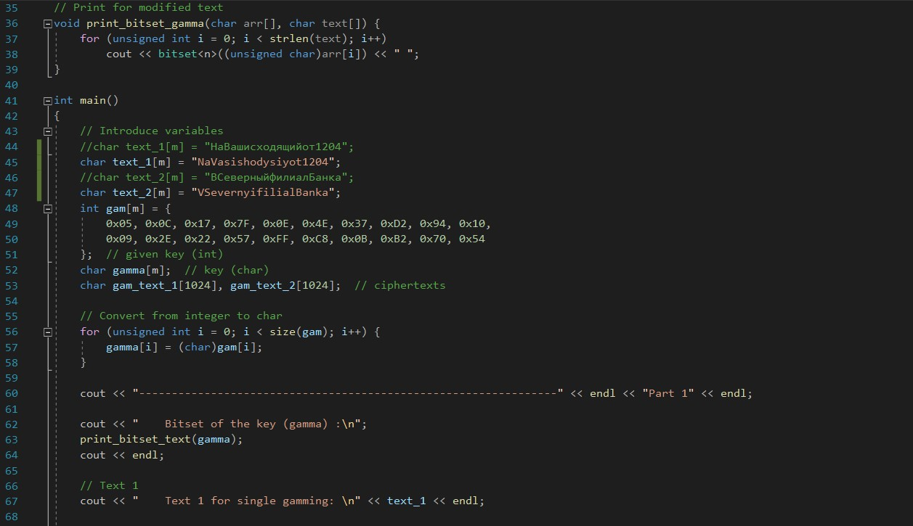
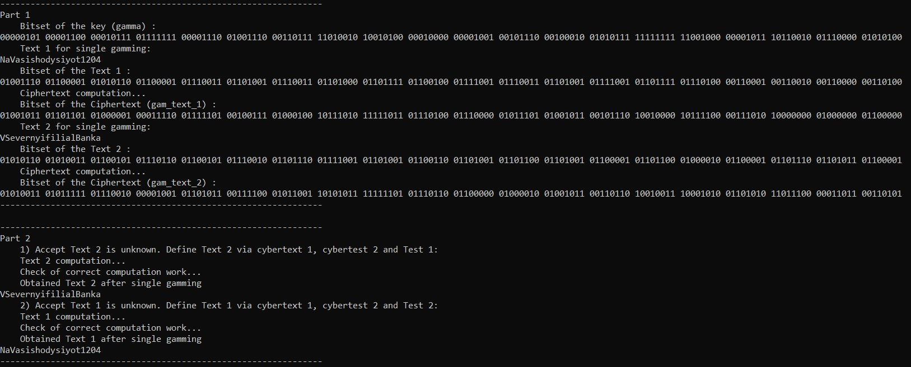

---
## Front matter
lang: ru-RU
title: Информационная безопасность. Лабораторная работа № 8 на тему "Элементы криптографии. Шифрование (кодирование) различных исходных текстов одним ключом"
author: Горбунова Ярослава Михайловна
group: NFIbd-01-19
institute: RUDN University, Moscow, Russian Federation

## Formatting
toc: false
slide_level: 2
theme: metropolis
header-includes: 
 - \metroset{progressbar=frametitle,sectionpage=progressbar,numbering=fraction}
 - '\makeatletter'
 - '\beamer@ignorenonframefalse'
 - '\makeatother'
aspectratio: 43
section-titles: true
---

# Содержание
* Цели и задачи
* Выполнение
* Результаты
* Список литературы

# Цели и задачи
Освоить на практике применение режима однократного гаммирования
на примере кодирования различных исходных текстов одним ключом

# Выполнение
## Выполнение
{#fig:form1 width=100%}

## Выполнение
C1 = P1 ⊕ K

C2 = P2 ⊕ K (8.1)

C1 ⊕C2 = P1 ⊕K ⊕P2 ⊕K = P1 ⊕P2

C1 ⊕C2 ⊕P1 = P1 ⊕P2 ⊕P1 = P2 (8.3)

## Выполнение

## Выполнение

## Выполнение

## Выполнение

## Выполнение

# Результаты
Освоено на практике применение режима однократного гаммирования
на примере кодирования различных исходных текстов одним ключом

# Список литературы
1. Методические материалы курса