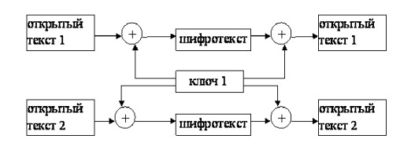
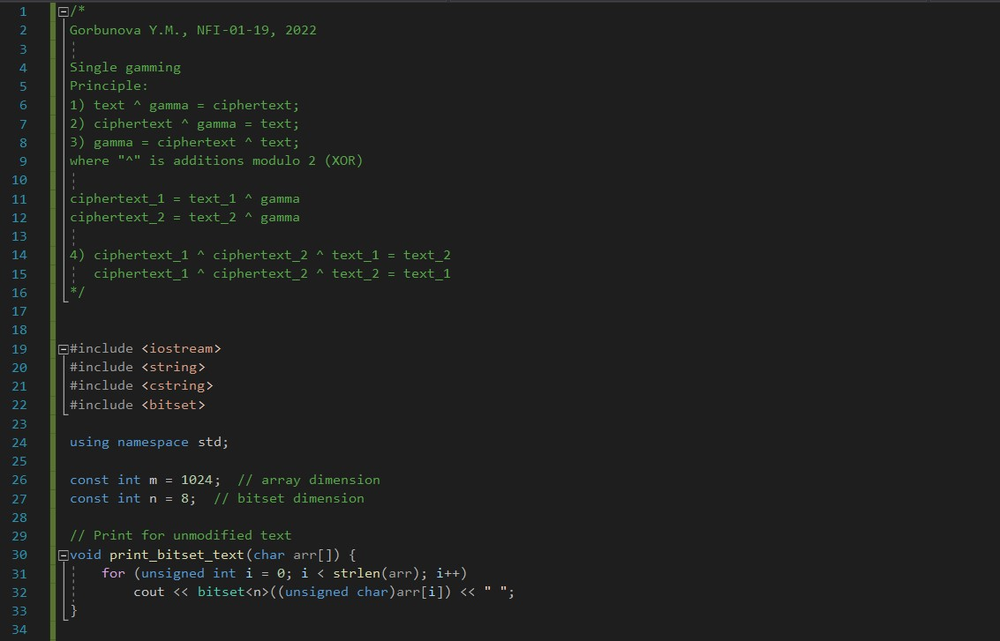
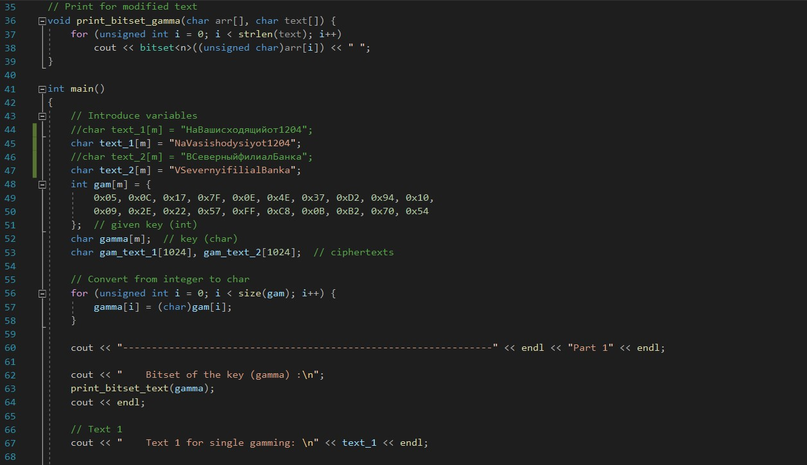
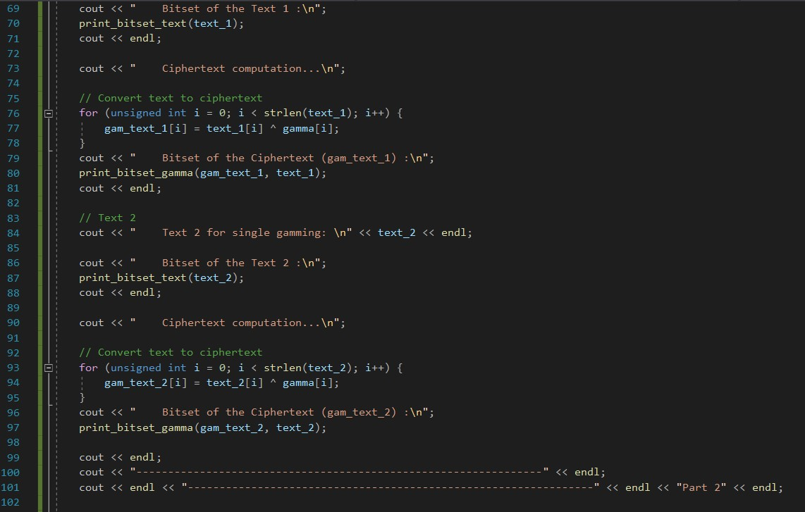
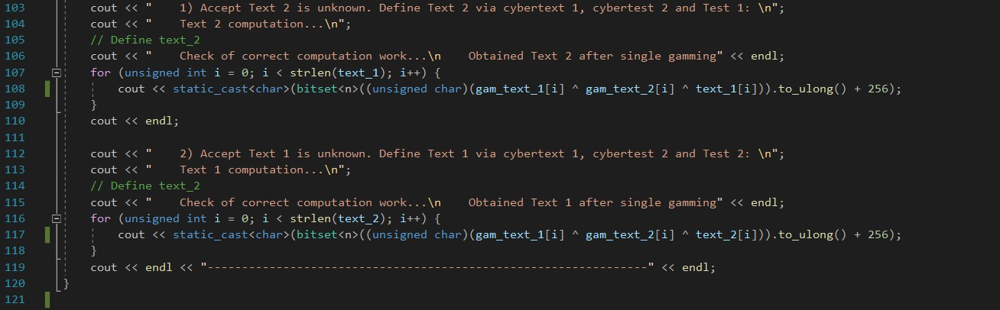
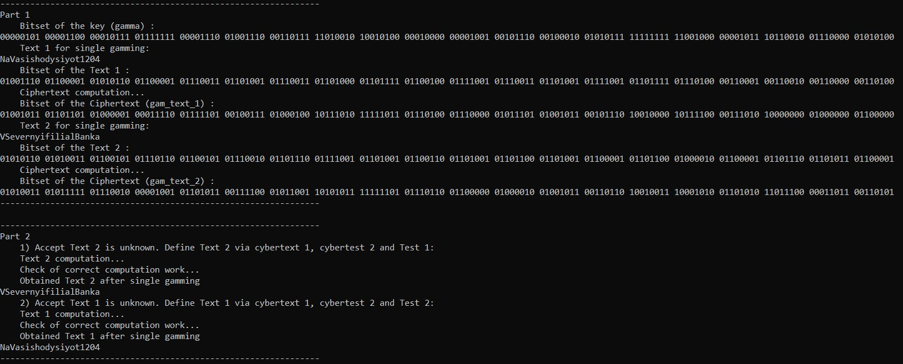

---
# Front matter
title: "Информационная безопасность. Отчет по лабораторной работе № 8"
subtitle: "Элементы криптографии. Шифрование (кодирование) различных исходных текстов одним ключом"
author: "Горбунова Ярослава Михайловна"
group: NFIbd-01-19
institute: RUDN University, Moscow, Russian Federation

# Generic otions
lang: ru-RU
toc-title: "Содержание"

# Bibliography
csl: pandoc/csl/gost-r-7-0-5-2008-numeric.csl

# Pdf output format
toc: true # Table of contents
toc_depth: 2
lof: true # List of figures
lot: true # List of tables
fontsize: 12pt
linestretch: 1.5
papersize: a4
documentclass: scrreprt
### Fonts
mainfont: PT Serif
romanfont: PT Serif
sansfont: PT Sans
monofont: PT Mono
mainfontoptions: Ligatures=TeX
romanfontoptions: Ligatures=TeX
sansfontoptions: Ligatures=TeX,Scale=MatchLowercase
monofontoptions: Scale=MatchLowercase,Scale=0.9
## Biblatex
biblatex: true
biblio-style: "gost-numeric"
biblatexoptions:
  - parentracker=true
  - backend=biber
  - hyperref=auto
  - language=auto
  - autolang=other*
  - citestyle=gost-numeric
## Misc options
indent: true
header-includes:
  - \linepenalty=10 # the penalty added to the badness of each line within a paragraph (no associated penalty node) Increasing the value makes tex try to have fewer lines in the paragraph.
  - \interlinepenalty=0 # value of the penalty (node) added after each line of a paragraph.
  - \hyphenpenalty=50 # the penalty for line breaking at an automatically inserted hyphen
  - \exhyphenpenalty=50 # the penalty for line breaking at an explicit hyphen
  - \binoppenalty=700 # the penalty for breaking a line at a binary operator
  - \relpenalty=500 # the penalty for breaking a line at a relation
  - \clubpenalty=150 # extra penalty for breaking after first line of a paragraph
  - \widowpenalty=150 # extra penalty for breaking before last line of a paragraph
  - \displaywidowpenalty=50 # extra penalty for breaking before last line before a display math
  - \brokenpenalty=100 # extra penalty for page breaking after a hyphenated line
  - \predisplaypenalty=10000 # penalty for breaking before a display
  - \postdisplaypenalty=0 # penalty for breaking after a display
  - \floatingpenalty = 20000 # penalty for splitting an insertion (can only be split footnote in standard LaTeX)
  - \raggedbottom # or \flushbottom
  - \usepackage{float} # keep figures where there are in the text
  - \floatplacement{figure}{H} # keep figures where there are in the text

---

# Цель работы
Освоить на практике применение режима однократного гаммирования
на примере кодирования различных исходных текстов одним ключом [1].

# Указание к работе
Исходные данные.
Две телеграммы Центра:

P1 = НаВашисходящийот1204
P2 = ВСеверныйфилиалБанка

Ключ Центра длиной 20 байт:

K = 05 0C 17 7F 0E 4E 37 D2 94 10 09 2E 22 57 FF C8 OB B2 70 54

Режим шифрования однократного гаммирования одним ключом двух
видов открытого текста реализуется в соответствии со схемой, приведённой на @fig:form1.

{#fig:form1 width=100%}

Шифротексты обеих телеграмм можно получить по формулам режима
однократного гаммирования:

C1 = P1 ⊕ K,
C2 = P2 ⊕ K. (8.1)

Открытый текст можно найти в соответствии с (8.1), зная шифротекст
двух телеграмм, зашифрованных одним ключом. Для это оба равенства (8.1) складываются по модулю 2. Тогда с учётом свойства операции XOR

1⊕1 = 0, 1⊕0 = 1 (8.2)

получаем:

C1 ⊕C2 = P1 ⊕K ⊕P2 ⊕K = P1 ⊕P2.

Предположим, что одна из телеграмм является шаблоном — т.е. имеет текст фиксированный формат, в который вписываются значения полей.
Допустим, что злоумышленнику этот формат известен. Тогда он получает
достаточно много пар C1 ⊕C2 (известен вид обеих шифровок). Тогда зная
P1 и учитывая (8.2), имеем:

C1 ⊕C2 ⊕P1 = P1 ⊕P2 ⊕P1 = P2. (8.3)

Таким образом, злоумышленник получает возможность определить те
символы сообщения P2, которые находятся на позициях известного шаблона сообщения P1. В соответствии с логикой сообщения P2, злоумышленник имеет реальный шанс узнать ещё некоторое количество символов сообщения P2. Затем вновь используется (8.3) с подстановкой вместо P1 полученных на предыдущем шаге новых символов сообщения P2. И так далее.
Действуя подобным образом, злоумышленник даже если не прочитает оба
сообщения, то значительно уменьшит пространство их поиска.

# Выполнение лабораторной работы
Два текста кодируются одним ключом (однократное гаммирование).
Требуется не зная ключа и не стремясь его определить, прочитать оба текста. Необходимо разработать приложение, позволяющее шифровать и дешифровать тексты P1 и P2 в режиме однократного гаммирования. Приложение должно определить вид шифротекстов C1 и C2 обоих текстов P1 и
P2 при известном ключе ; Необходимо определить и выразить аналитически способ, при котором злоумышленник может прочитать оба текста, не
зная ключа и не стремясь его определить.

Для выполнения работы была написана программа (@fig:1 - @fig:5) с помощью языка программирования С++, которая получает на вход два открытых текста "NaVasishodysiyot1204", "VSevernyifilialBanka" и ключ "05 0C 17 7F 0E 4E 37 D2 94 10 09 2E 22 57 FF C8 0B B2 70 54", затем шифрует открытые тексты методом однократного гаммирования и получает два шифротекста. После этого предполагаем два случая. В первом неизвестен открытый текст 2, во втором - открытый текст 1. Методом сложения по модулю 2, однократного гаммирования,  определяется открытый текст 2 и текст 1 для случаев соответственно. Определение открытых текстов происходит без ключа, не осуществляются попытки его определения.

{#fig:1 width=100%}

{#fig:2 width=100%}

{#fig:3 width=100%}

{#fig:4 width=100%}

{#fig:5 width=100%}

## Контрольные вопросы
1. Как, зная один из текстов (P1 или P2), определить другой, не зная при
этом ключа? -- По формулам: C1 ⊕ C2 ⊕ P1 = P2, C1 ⊕C2 ⊕ P2 = P1.

2. Что будет при повторном использовании ключа при шифровании текста? -- Расшифровка текста.

3. Как реализуется режим шифрования однократного гаммирования одним
ключом двух открытых текстов? -- Ключ применяется к каждому из текстов в отдельности, получаются два различных шифротекста.

4. Перечислите недостатки шифрования одним ключом двух открытых
текстов. -- При наличии минимум двух шифротекстов и хотябы одного открытого текста можно получить другой открытый текст даже не имея ключа.

5. Перечислите преимущества шифрования одним ключом двух открытых
текстов. -- Нет необходимости в хранении двух последовательностей символов ключа.

# Выводы
Освоено на практике применение режима однократного гаммирования
на примере кодирования различных исходных текстов одним ключом. 

# Список литературы
1. Методические материалы курса
