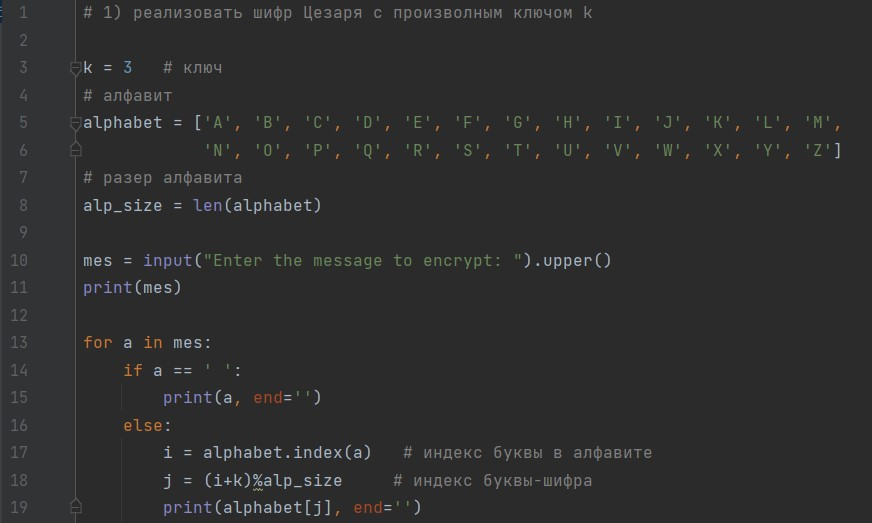
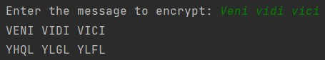
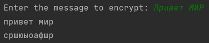

---
## Front matter
lang: ru-RU
title: Математические основы защиты информации и информационной безопасности. Лабораторная работа № 1 на тему "Шифры простой замены"
author: Лубышева Ярослава Михайловна
group: NFImd-01-23
institute: RUDN University, Moscow, Russian Federation

## Formatting
toc: false
slide_level: 2
theme: metropolis
header-includes: 
 - \metroset{progressbar=frametitle,sectionpage=progressbar,numbering=fraction}
 - '\makeatletter'
 - '\beamer@ignorenonframefalse'
 - '\makeatother'
aspectratio: 43
section-titles: true
---

# Содержание
* Прагматика
* Цели работы
* Выполнение
* Результаты
* Список литературы

# Прагматика
## Прагматика
Шифр Цезаря, также известный как шифр сдвига, код Цезаря — один из самых простых и наиболее широко известных методов шифрования. Это вид шифра подстановки, в котором каждый символ в открытом тексте заменяется символом, находящимся на некотором постоянном числе позиций левее или правее него в алфавите. Например, в шифре со сдвигом вправо на 3, А была бы заменена на Г, Б станет Д, и так далее. 

## Прагматика
Шифр Атбаш является шифром сдвига на всю длину алфавита. Для алфавита, состоящего только из русских букв и пробела, будет иметь следущи вид:

А Б В Г Д Е Ж З И Й К Л М Н О П Р С Т У Ф Х Ц Ч Ш Щ Ъ Ы Ь Э Ю Я -

- Я Ю Э Ь Ы Ъ Щ Ш Ч Ц Х Ф У Т С Р П О Н М Л К Й И З Ж Е Д Г В Б А

# Цели и задачи
Выполнить задание к лабораторной работе № 1 [1]

# Выполнение
## Выполнение

## Выполнение

## Выполнение

## Выполнение

# Результаты
Выполнено задание к лабораторной работе № 1

# Список литературы
1. Методические материалы курса