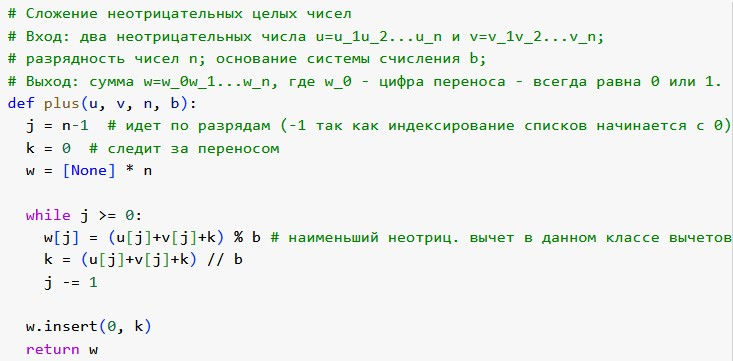
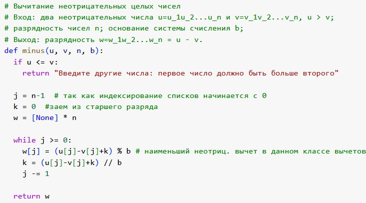
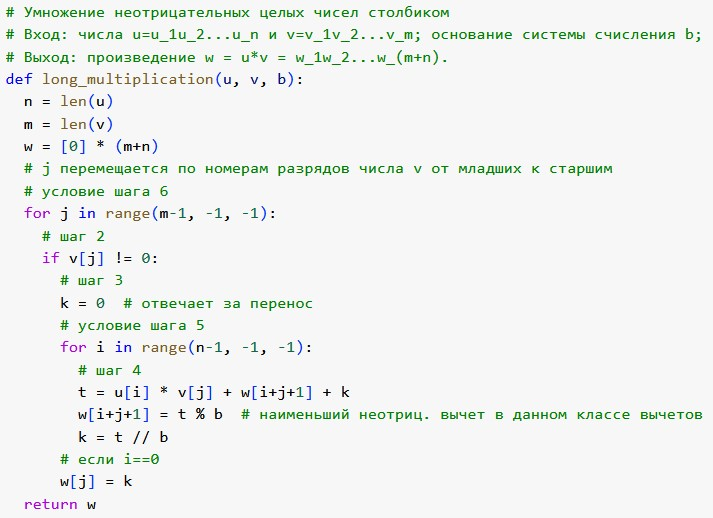
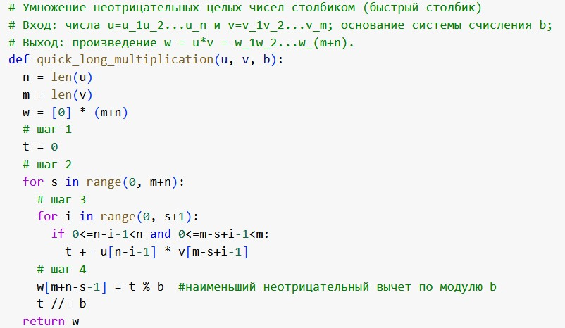
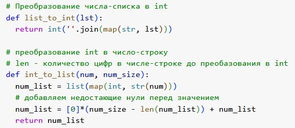
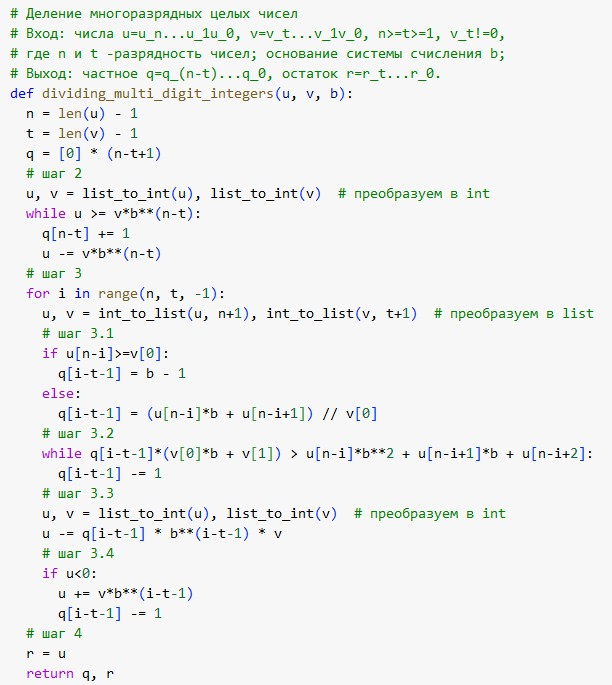
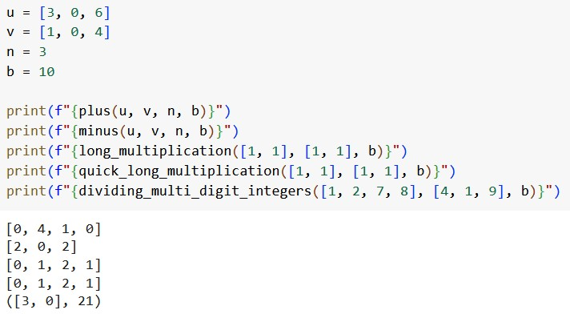

---
## Front matter
lang: ru-RU
title: Математические основы защиты информации и информационной безопасности. Лабораторная работа № 8 на тему "Целочисленная арифметика многократной точности"
author: Лубышева Ярослава Михайловна
group: NFImd-01-23
institute: RUDN University, Moscow, Russian Federation

## Formatting
toc: false
slide_level: 2
theme: metropolis
header-includes: 
 - \metroset{progressbar=frametitle,sectionpage=progressbar,numbering=fraction}
 - '\makeatletter'
 - '\beamer@ignorenonframefalse'
 - '\makeatother'
aspectratio: 43
section-titles: true
---

# Содержание
* Цели и задачи
* Выполнение
* Результаты
* Список литературы

# Цели и задачи
Выполнить задание к лабораторной работе № 8:

1. Ознакомиться с алгоритмами: сложение неотрицательных целых чисел, вычитание неотрицательных целых чисел, умножение неотрицательных целых чисел столбиком, умножение неотрицательных целых чисел столбиком (быстрый столбик), деление многоразрядных целых чисел
2. Реализовать алгоритмы программно

# Выполнение
## Выполнение

## Выполнение

## Выполнение

## Выполнение

## Выполнение

## Выполнение

## Выполнение

# Результаты
Выполнено задание к лабораторной работе № 8

# Список литературы
1. Методические материалы курса